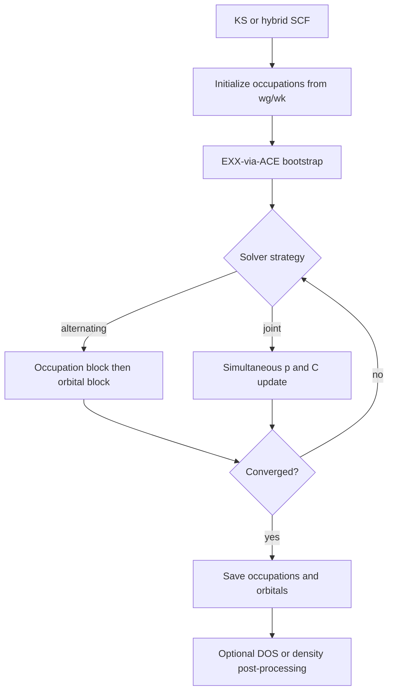
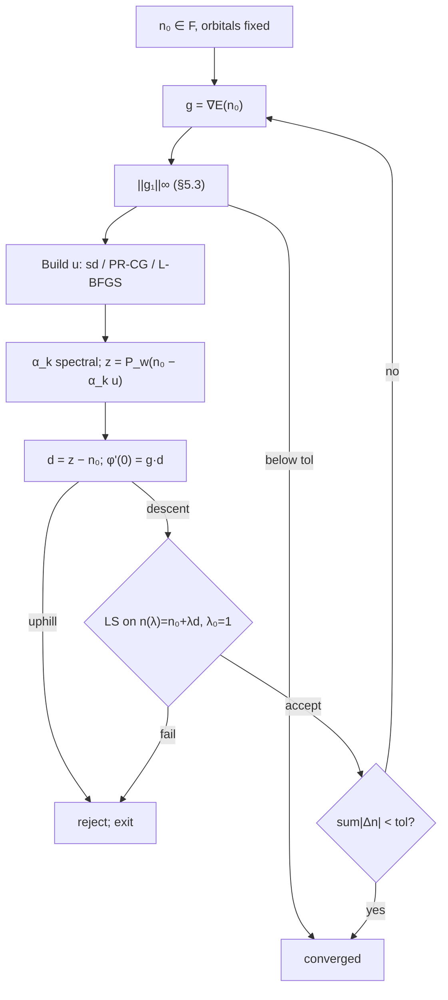
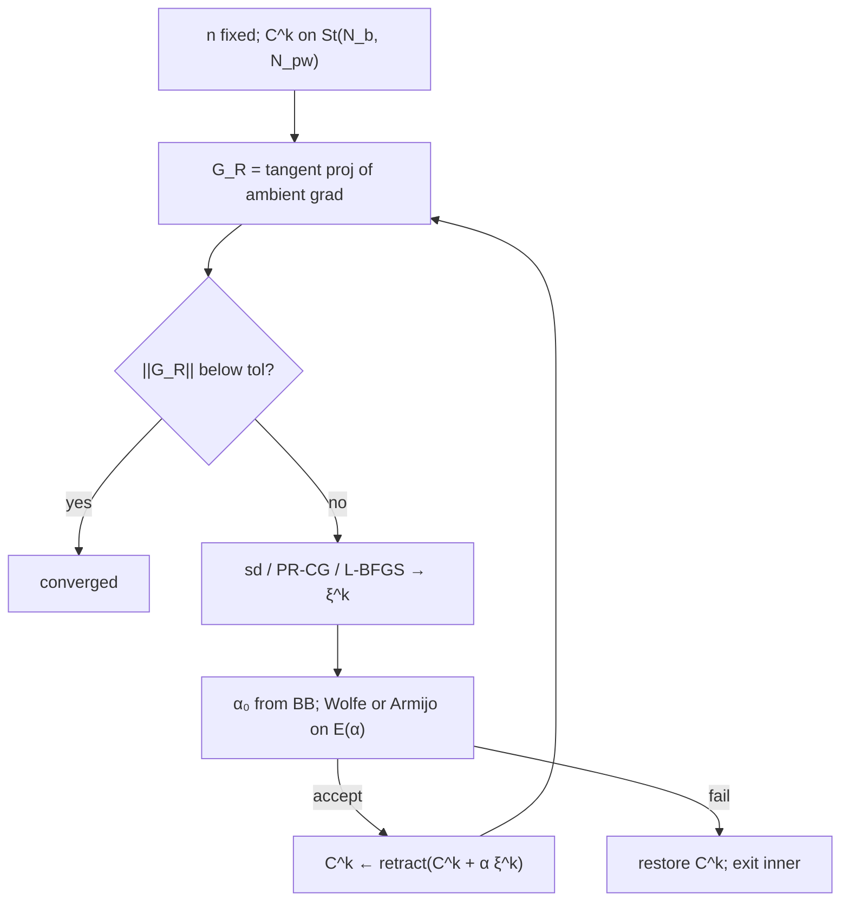

# Reduced Density Matrix Functional Theory in Quantum ESPRESSO PWscf

This document describes the RDMFT calculation as implemented in the PWscf post-SCF optimizer. It is written for inclusion in a computational-methods section of a scientific manuscript. All display equations use standard LaTeX notation and can be copied directly into a LaTeX source file.

**Document map**

| Part | Sections | Content |
|---|---|---|
| I — Model | 1–4 | Workflow, 1-RDM, total energy, XC functionals and ACE |
| II — Optimization | 5–8 | Constraints, solver strategies, occupation optimization (SPG, GD, EBI), Stiefel geometry and orbital optimization |
| III — Derivatives | 9 | Analytic occupation and orbital gradients |
| IV — Reference | 10–13 | Input keywords, DOS post-processing, bibliography, LaTeX notes |

**Companion:** [`rdmft_implementation.md`](rdmft_implementation.md) — Fortran module layout, PWscf hooks, energy/gradient call chains, and theory↔code index.

---

## 1. Introduction and computational workflow

Reduced Density Matrix Functional Theory (RDMFT) extends Kohn–Sham density functional theory by relaxing the idempotency constraint on the one-body reduced density matrix (1-RDM). In the PWscf implementation, RDMFT is a **post-SCF variational minimization**: after a converged Kohn–Sham (or hybrid exact-exchange) self-consistent field calculation, the solver optimizes the natural occupation numbers $n_{i\mathbf{k}}$ and natural orbitals $\psi_{i\mathbf{k}}$ to minimize the RDMFT total energy subject to box and electron-count constraints.

The computational workflow is:



During the RDMFT solve, the semilocal exchange–correlation potential is set to zero; all exchange enters through the RDMFT XC functional, which is evaluated by reusing the existing PWscf **EXX-via-ACE** machinery with channel-specific modified density matrices.

---

## 2. One-body reduced density matrix

The 1-RDM in spectral (natural orbital) representation is

$$\gamma(\mathbf{r}, \mathbf{r}') = \sum_{\mathbf{k}} w_{\mathbf{k}} \sum_{i=1}^{N_b} n_{i\mathbf{k}}\, \psi_{i\mathbf{k}}(\mathbf{r})\, \psi_{i\mathbf{k}}^*(\mathbf{r}'),$$

where $n_{i\mathbf{k}} \in [0,1]$ are natural occupation numbers, $\psi_{i\mathbf{k}}$ are natural orbitals expanded in plane waves, and $w_{\mathbf{k}}$ are Brillouin-zone integration weights. For a closed-shell system ($n_{\mathrm{spin}} = 1$), QE incorporates the spin degeneracy into $w_{\mathbf{k}}$ so that $\sum_{\mathbf{k}} w_{\mathbf{k}} = 2$ and each $n_{i\mathbf{k}}$ is a per-spin occupation in $[0,1]$. For spin-polarized LSDA, each spin channel carries its own $w_{\mathbf{k}}$ and occupation.

The particle density derived from $\gamma$ is

$$\rho(\mathbf{r}) = \gamma(\mathbf{r}, \mathbf{r}) = \sum_{\mathbf{k}} w_{\mathbf{k}} \sum_i n_{i\mathbf{k}}\, |\psi_{i\mathbf{k}}(\mathbf{r})|^2.$$

Natural orbitals are stored as coefficient matrices $C^{\mathbf{k}}$ (QE's `evc`). Their orthonormality constraint and all Stiefel-manifold geometry used in orbital optimization are defined in Section 8.

### 2.1 Optional: `pp.x` density diagnostics

**Physical pair density and XC hole.** The RDMFT exchange–correlation energy (Sections 3.2 and 4) is defined through **pair kernels** $f(n_i, n_j)$ on natural-orbital products, not through a bare subtraction of $\rho(\mathbf{r})\,\rho(\mathbf{r}')$ from $\gamma(\mathbf{r}, \mathbf{r}')$. In the standard hole picture, the spin-resolved two-particle density is related to an **exchange–correlation hole** $\rho_{xc}^{\mathrm{hole}}$ by

$$\Gamma(\mathbf{x}_1, \mathbf{x}_2) = \tfrac{1}{2}\,\rho(\mathbf{x}_1)\,\bigl[\rho(\mathbf{x}_2) - \rho_{xc}^{\mathrm{hole}}(\mathbf{x}_1, \mathbf{x}_2)\bigr].$$

For the Müller functional, $\rho_{xc}^{\mathrm{hole}}$ is tied to the **hole amplitude** $|\gamma(\mathbf{x}_1, \mathbf{x}_2)/\sqrt{\rho(\mathbf{x}_1)}|^2$ (Buijse–Baerends / Gritsenko et al.), which depends on the chosen $f(n_i,n_j)$ and differs from a Hartree product subtraction.

**What is not the XC hole.** The quantity

$$g(\mathbf{r}, \mathbf{r}') = \gamma(\mathbf{r}, \mathbf{r}') - \rho(\mathbf{r})\,\rho(\mathbf{r}')$$

must **not** be identified with the RDMFT or Hartree–Fock exchange–correlation hole. It removes the uncorrelated Hartree product of one-body densities from the off-diagonal 1-RDM. For fractional natural occupations ($n_{i\mathbf{k}} \notin \{0,1\}$) it does not satisfy the conventional hole sum rule $\int \rho_{xc}^{\mathrm{hole}}(\mathbf{x}_1, \mathbf{x}_2)\,\mathrm{d}\mathbf{x}_2 = -\rho(\mathbf{x}_1)$, and it does **not** enter the energy or analytic gradients (Sections 3 and 9). Older drafts and some log labels call $g$ an “exchange-hole density”; that naming is **misleading** and is avoided here.

**`pp.x` diagnostic fields** (optional post-processing via `rdmft_density.f90`; `plot_num` 126–128). These build $\gamma$ from the saved **physical** occupations $w_{\mathbf{k}} n_{i\mathbf{k}}$, not from the modified channel weights $w_t(n)$ used in ACE (Section 4.6):

| `plot_num` | Quantity | Definition |
|---|---|---|
| 126 | Particle density | $\rho(\mathbf{r}) = \gamma(\mathbf{r}, \mathbf{r})$ |
| 127 | 1-RDM coherency slice | $h(\mathbf{r}_0, \mathbf{r}) = \gamma(\mathbf{r}_0, \mathbf{r}) - \rho(\mathbf{r}_0)\,\rho(\mathbf{r})$ at reference grid point $\mathbf{r}_0$ (`rdmft_xhole_origin`; auto = max-$\rho$ grid index) |
| 128 | On-site 1-RDM diagnostic | $h(\mathbf{r}, \mathbf{r}) = \rho(\mathbf{r}) - \rho(\mathbf{r})^2 = \gamma(\mathbf{r}, \mathbf{r}) - \rho(\mathbf{r})^2$ |

Plot 127 is a **fixed-reference slice** $h(\mathbf{r}_0, \mathbf{r})$, not the full two-point function $g(\mathbf{r}, \mathbf{r}')$ with $\rho(\mathbf{r}')$ evaluated at the second argument. Plot 128 equals $\sum_{i\mathbf{k}} w_{\mathbf{k}}\, n_{i\mathbf{k}}(1 - n_{i\mathbf{k}})\, |\psi_{i\mathbf{k}}(\mathbf{r})|^2$ only when a **single** natural orbital contributes at $\mathbf{r}$; with many overlapping orbitals it is merely $\rho(1-\rho)$.

Functional-dependent XC holes from $f(n_i,n_j)$ are **not** exported by the current `pp.x` interface; obtaining them would require reconstructing the pair density with the active RDMFT kernel.

---

## 3. Total energy functional

The RDMFT total energy minimized by the solver is

$$E[n, C] = E_{\mathrm{one}} + E_H[\rho] + E_{xc}[\gamma] + E_{\mathrm{ent}} + E_{\mathrm{Ewald}}.$$

### 3.1 One-body energy

$$E_{\mathrm{one}} = \sum_{\mathbf{k}} w_{\mathbf{k}} \sum_i n_{i\mathbf{k}}\, h_{ii}^{\mathbf{k}},$$

where the one-body diagonal is

$$h_{ii}^{\mathbf{k}} = \langle \psi_{i\mathbf{k}} | T + V_{\mathrm{loc}} + V_{\mathrm{NL}} | \psi_{i\mathbf{k}} \rangle.$$

The Hartree energy $E_H[\rho]$ is evaluated self-consistently from the RDMFT density $\rho(\mathbf{r})$. The semilocal KS $V_{xc}$ is excluded from $h_{ii}^{\mathbf{k}}$ to avoid double counting with the RDMFT exchange channels.

### 3.2 Exchange–correlation via channel decomposition

Non-separable RDMFT XC functionals are decomposed into a sum of modified Hartree–Fock (EXX) channels:

$$E_{xc} = \sum_t c_t \cdot \tfrac{1}{2} \sum_{\mathbf{k},i} w_{\mathbf{k}}\, w_t(n_{i\mathbf{k}})\, \langle \psi_{i\mathbf{k}} | V_x^{(t)} | \psi_{i\mathbf{k}} \rangle,$$

where $V_x^{(t)}$ is the Fock operator built from a modified density matrix with per-band weight $w_t(n_{i\mathbf{k}})$ (standard HF EXX when $w_t(n)=n$; Section 4.0). Each channel is constructed via PWscf's ACE (adaptively compressed exchange) machinery: the global occupation array `wg` is temporarily set to $w_{\mathbf{k}}\, w_t(n_{i\mathbf{k}})$, and `aceinit` / `vexxace` return the exchange action on each orbital.

In compact separable form, $w_t(n) = g(n)$ where $g(n)$ is the coupling function defined in Section 4.1. Section 4.0 records standard periodic HF EXX; Section 4.2 derives the RDMFT pair-kernel representation; Section 4.3 explains how non-separable functionals are expanded into multiple channels; Section 4.4–4.6 cover the multi-$\mathbf{k}$ Brillouin-zone structure, the EXX $\mathbf{q}$-mesh, and ACE; Section 4.7 summarises cost and acceleration options.

### 3.3 HF entropy (optional)

For `rdmft_functional = 'hf'` with `rdmft_temp > 0`, a binary-entropy regularization is added:

$$E_{\mathrm{ent}} = k_B T \sum_{\mathbf{k}} w_{\mathbf{k}} \sum_i \bigl[ n_{i\mathbf{k}} \ln n_{i\mathbf{k}} + (1 - n_{i\mathbf{k}}) \ln(1 - n_{i\mathbf{k}}) \bigr],$$

with $k_B$ in Ry/K (QE's `K_BOLTZMANN_RY`). Setting `rdmft_temp = 0` (default) disables this term.

### 3.4 GU on-site diagonal

The `gu` functional adds an on-site diagonal correction beyond the Müller-type off-diagonal exchange:

$$E_{\mathrm{GU,diag}} = \tfrac{1}{2} \sum_{\mathbf{k}} w_{\mathbf{k}}^2 \sum_i (n_{i\mathbf{k}}^2 - n_{i\mathbf{k}})\, J_{ii}^{\mathbf{k}},$$

where $J_{ii}^{\mathbf{k}} = \langle \psi_{i\mathbf{k}} | V_x[\gamma] | \psi_{i\mathbf{k}} \rangle$ is evaluated from the same ACE channel. The occupation gradient includes the term $\tfrac{1}{2} w_{\mathbf{k}}^2 (2n_{i\mathbf{k}} - 1)\, J_{ii}^{\mathbf{k}}$ with $J_{ii}$ held fixed.

---

## 4. Exchange–correlation functionals

Ten RDMFT XC functionals are available via `rdmft_functional`. Table 1 summarizes their channel structure and per-band weights $w_t(n)$.

**Table 1.** RDMFT XC functionals.

| Functional | Structure | Channels | Channel weights $w_t(n)$ and coefficients $c_t$ |
|---|---|---|---|
| `hf` | $\alpha = 1$ | 1 | $w = n$, $c = 1$ |
| `muller` | $\alpha = 0.5$ | 1 | $w = g(n;\, 0.5)$, $c = 1$ |
| `power` | user $\alpha$ (default 0.656) | 1 | $w = g(n;\, \alpha)$, $c = 1$ |
| `gu` | $\alpha = 0.5$ + on-site diag | 1 | $w = g(n;\, 0.5)$, $c = 1$ |
| `chf` | 2 channels | 2 | $c_1 = \tfrac{1}{2}$, $w_1 = n$; $c_2 = \tfrac{1}{2}$, $w_2 = \sqrt{n(1-n)}$ |
| `cga` | 2 channels | 2 | $c_1 = \tfrac{1}{4}$, $w_1 = n$; $c_2 = \tfrac{1}{4}$, $w_2 = \sqrt{n(2-n)}$ |
| `geo` | 3 channels | 3 | $c_1 = \tfrac{1}{4}$, $w_1 = g(n;1)$; $c_2 = \tfrac{1}{4}$, $w_2 = g(n;0.5)$; $c_3 = \tfrac{1}{2}$, $w_3 = g(n;0.75)$ |
| `hybopt` | 2 channels | 2 | $c_1 = 0.0617$, $w_1 = n$; $c_2 = 0.9383$, $w_2 = g(n;\, 0.541)$ |
| `bow` | pair kernel | 0 | non-separable Baldsiefen kernel $f(n_i,n_j)$, evaluated on the exact pair path |
| `bowmod` | 4 channels | 4 | separable BOW approximation: $c_1 n + c_2 g(n;\alpha) + c_3 g(1-n;\alpha) + c_4 [n(1-n)]^\beta$, with fixed coefficients |

### 4.0 Standard Hartree–Fock EXX (periodic, multiple $\mathbf{k}$)

RDMFT reuses PWscf's **exact exchange (EXX)** engine for hybrid functionals. This subsection records the standard multi-$\mathbf{k}$ Hartree–Fock (HF) exchange before RDMFT modifies occupations (Sections 4.2–4.3). Spin indices are suppressed; sum over spin channels in spin-polarised or noncollinear runs. Ry atomic units throughout.

**k-point weights.** Bloch states $\psi_{n\mathbf{k}}(\mathbf{r})$ are normalised on the simulation cell; $f_{n\mathbf{k}} \in [0,1]$ are band occupations (for closed-shell HF, $f_{n\mathbf{k}} \in \{0,1\}$); $w_{\mathbf{k}}$ are Monkhorst–Pack weights with $\sum_{\mathbf{k}} w_{\mathbf{k}} = 1$ (symmetry-reduced points carry star multiplicities).

#### 4.0.1 Pair form over $\mathbf{k}$ and $\mathbf{k}'$

Exchange is a **two-electron** term coupling orbitals at two crystal momenta. The standard HF exchange energy is

$$E_x^{\mathrm{HF}} = \frac{1}{2} \sum_{\mathbf{k}, \mathbf{k}'} w_{\mathbf{k}}\, w_{\mathbf{k}'} \sum_{n,m} f_{n\mathbf{k}}\, f_{m\mathbf{k}'} \iint \psi_{n\mathbf{k}}^*(\mathbf{r})\, \psi_{m\mathbf{k}'}^*(\mathbf{r}')\, v_{ee}(\mathbf{r}, \mathbf{r}')\, \psi_{n\mathbf{k}}(\mathbf{r}')\, \psi_{m\mathbf{k}'}(\mathbf{r})\, \mathrm{d}\mathbf{r}\, \mathrm{d}\mathbf{r}',$$

with $v_{ee}(\mathbf{r},\mathbf{r}') = 1/|\mathbf{r}-\mathbf{r}'|$ (regularised in reciprocal space at long wavelength). The **two factors** $w_{\mathbf{k}}\, w_{\mathbf{k}'}$ discretise the double Brillouin-zone integral $\int_{\mathrm{BZ}}\!\!\int_{\mathrm{BZ}} \mathrm{d}^3k\,\mathrm{d}^3k'$. The prefactor $\tfrac{1}{2}$ is the usual Slater exchange normalisation; PWscf absorbs the overall sign into the definition of $V_x$ in `vexx` (Section 4.0.4).

#### 4.0.2 Plane-wave / $\mathbf{G}$-space form

With $\psi_{n\mathbf{k}}(\mathbf{r}) = \Omega^{-1/2} \sum_{\mathbf{G}} c_{n\mathbf{k}}(\mathbf{k}+\mathbf{G})\, e^{i(\mathbf{k}+\mathbf{G})\cdot\mathbf{r}}$ and $v_{ee}(\mathbf{r},\mathbf{r}') = \Omega^{-1}\sum_{\mathbf{G}} v(\mathbf{G})\, e^{i\mathbf{G}\cdot(\mathbf{r}-\mathbf{r}')}$,

$$E_x^{\mathrm{HF}} = \frac{1}{2} \sum_{\mathbf{k}, \mathbf{k}'} w_{\mathbf{k}}\, w_{\mathbf{k}'} \sum_{n,m} f_{n\mathbf{k}}\, f_{m\mathbf{k}'} \sum_{\mathbf{G}\mathbf{G}'} v(\mathbf{k}-\mathbf{k}'+\mathbf{G})\, c_{n\mathbf{k}}^*(\mathbf{k}+\mathbf{G})\, c_{m\mathbf{k}'}^*(\mathbf{k}'+\mathbf{G}')\, c_{n\mathbf{k}}(\mathbf{k}+\mathbf{G}')\, c_{m\mathbf{k}'}(\mathbf{k}'+\mathbf{G}'),$$

where $v(\mathbf{q}+\mathbf{G}) = 4\pi e^2 / |\mathbf{q}+\mathbf{G}|^2$ for $\mathbf{q}+\mathbf{G}\ne\mathbf{0}$ and the $\mathbf{G}=\mathbf{0}$ divergence is treated by Gygi–Baldereschi regularisation (`exxdiv`, Section 4.5.6). Crystal momentum conservation links $\mathbf{G}'$ to $\mathbf{k}-\mathbf{k}'$ and $\mathbf{G}$.

#### 4.0.3 Fock-operator (trace) form

Equivalently, define the one-particle density matrix and nonlocal Fock operator

$$\gamma = \sum_{\mathbf{k}'} w_{\mathbf{k}'} \sum_m f_{m\mathbf{k}'} \, |\psi_{m\mathbf{k}'}\rangle\langle \psi_{m\mathbf{k}'}|, \qquad (V_x \psi_{n\mathbf{k}})(\mathbf{r}) = -\int \gamma(\mathbf{r},\mathbf{r}')\, v_{ee}(\mathbf{r},\mathbf{r}')\, \psi_{n\mathbf{k}}(\mathbf{r}')\, \mathrm{d}\mathbf{r}',$$

or, as a sum over partner k-points (Section 4.5.3),

$$(V_x \psi_{n\mathbf{k}})(\mathbf{r}) = -\sum_{\mathbf{k}'} \sum_m f_{m\mathbf{k}'} \iint \psi_{m\mathbf{k}'}^*(\mathbf{r}')\, \psi_{n\mathbf{k}}(\mathbf{r}')\, v_{ee}(\mathbf{r}, \mathbf{r}')\, \psi_{m\mathbf{k}'}(\mathbf{r})\, \mathrm{d}\mathbf{r}'.$$

The exchange energy is a **single** BZ sum (one explicit $w_{\mathbf{k}}$):

$$E_x^{\mathrm{HF}} = \frac{1}{2} \sum_{\mathbf{k}, n} w_{\mathbf{k}}\, f_{n\mathbf{k}}\, \big\langle \psi_{n\mathbf{k}} \big| V_x \big| \psi_{n\mathbf{k}} \big\rangle.$$

The partner weight $w_{\mathbf{k}'}$ and the sum over $\mathbf{k}'$ are **inside** $V_x$ through $\gamma$; they are not written again in front of the trace. Sections 4.4.2 and 4.5.3 explain how PWscf splits this between `x_occupation` (occupations only) and the $\mathbf{q}$-grid (partner integration).

#### 4.0.4 PWscf conventions (`wg`, `x_occupation`, `exxenergy`)

Standard hybrid / RDMFT drivers in PWscf use:

$$\texttt{wg}(n,\mathbf{k}) = w_{\mathbf{k}}\, f_{n\mathbf{k}}, \qquad x_\mathrm{occupation}(n,\mathbf{k}) = \frac{\texttt{wg}(n,\mathbf{k})}{w_{\mathbf{k}}} = f_{n\mathbf{k}}.$$

The Fock build (`vexx`, ACE) reads **`x_occupation`** only. The k-point weight is reinserted in the energy trace:

$$E_x^{\mathrm{HF}} = \frac{1}{2} \sum_{\mathbf{k}, n} \texttt{wg}(n,\mathbf{k})\, \big\langle \psi_{n\mathbf{k}} \big| V_x \big| \psi_{n\mathbf{k}} \big\rangle,$$

as implemented in `exxenergy` / `rdmft_xc_channel_energy_term`. Cross-$\mathbf{k}'$ couplings are evaluated inside `vexx` via the discrete $\mathbf{q}$-mesh (Section 4.5).

#### 4.0.5 Relation to RDMFT

RDMFT generalises Section 4.0 by replacing $f_{n\mathbf{k}}$ with channel weights $w_t(n_{n\mathbf{k}})$ (Table 1) and, for non-separable kernels, pair functions $f(n_i, n_j)$ (Sections 4.2–4.3). The **`hf`** functional with `rdmft_functional = 'hf'` and integer occupations $n_{i\mathbf{k}} \in \{0,1\}$ reduces to standard HF exchange up to the RDMFT occupation optimisation. The EXX/q-grid/ACE machinery is unchanged; only the weights passed to `wg` / `x_occupation` differ.

### 4.1 Power regularization

For functionals with $\alpha \lt 1$, the coupling function $g(n)$ uses piecewise regularization controlled by `rdmft_reg_eps` $= \varepsilon$:

$$g(n) = \begin{cases} n^\alpha & n \ge \varepsilon \\ \varepsilon^\alpha + \alpha\,\varepsilon^{\alpha-1}(n - \varepsilon) & n \lt \varepsilon \end{cases}$$

$$g'(n) = \alpha\,\max(n, \varepsilon)^{\alpha-1}.$$

This ensures $g(0) = (1-\alpha)\varepsilon^\alpha$ is finite and $|g'(0)| = \alpha\,\varepsilon^{\alpha-1}$ is bounded. Default $\varepsilon = 10^{-8}$.

### 4.2 Separable pair-kernel form

Many RDMFT exchange functionals are defined first as **pair kernels** $f(n_i, n_j)$ acting on natural-orbital occupation pairs. Section 4.0 gives the standard HF case $f(n_i,n_j) = f_i f_j$ with $f_i \equiv f_{i\mathbf{k}}$; RDMFT replaces these with $n_{i\mathbf{k}}$ or general kernels. In the spectral representation, the exchange energy can be written as

$$E_x[\gamma] = \tfrac{1}{2} \sum_{\mathbf{k}, \mathbf{k}'} w_{\mathbf{k}}\, w_{\mathbf{k}'} \sum_{i,j} f(n_{i\mathbf{k}}, n_{j\mathbf{k}'}) \int\!\!\int \psi_{i\mathbf{k}}^*(\mathbf{r})\, \psi_{j\mathbf{k}'}^*(\mathbf{r}')\, v_{ee}(\mathbf{r}, \mathbf{r}')\, \psi_{i\mathbf{k}}(\mathbf{r}')\, \psi_{j\mathbf{k}'}(\mathbf{r})\, \mathrm{d}\mathbf{r}\, \mathrm{d}\mathbf{r}',$$

where $v_{ee}$ is the Coulomb interaction. A kernel is **separable** when it factorises as a product of single-occupation functions:

$$f(n_i, n_j) = g(n_i)\, g(n_j).$$

Examples implemented in the code (`rdmft_xc_is_separable`):

| Functional | Pair kernel $f(n_i, n_j)$ | Coupling $g(n)$ |
|---|---|---|
| `hf` | $n_i n_j$ | $g(n) = n$ |
| `muller`, `power` | $n_i^\alpha n_j^\alpha$ | $g(n) = g(n;\alpha)$ (Section 4.1) |
| `bowmod` (approx.) | sum of four separable channels | mixed (Table 1) |

For a separable kernel, define the **modified density matrix of channel $t=1$** with per-band weight $w(n) = g(n)$:

$$\gamma^{(1)} = \sum_{\mathbf{k}} w_{\mathbf{k}} \sum_i g(n_{i\mathbf{k}})\, |\psi_{i\mathbf{k}}\rangle\langle \psi_{i\mathbf{k}}|.$$

The exchange energy reduces to a single modified Hartree–Fock (EXX) evaluation:

$$E_x = \tfrac{1}{2} \sum_{\mathbf{k},i} w_{\mathbf{k}}\, g(n_{i\mathbf{k}})\, \langle \psi_{i\mathbf{k}} | V_x[\gamma^{(1)}] | \psi_{i\mathbf{k}} \rangle,$$

which is the $c_1 = 1$, $w_1(n) = g(n)$ case of Section 3.2. The occupation gradient (Section 9.2) is $w_{\mathbf{k}}\, g'(n_{i\mathbf{k}})\, D_{ii}^{\mathbf{k}}$; the implicit $\delta V_x / \delta n$ piece is **automatically** captured by the single contraction $D_\alpha = -(Kg)_\alpha$ because $E_x[\gamma^{(1)}]$ is a symmetric quadratic form in $g(\mathbf{n})$, so no separate response sum is required (see Section 9.2.1).

### 4.3 Channel decomposition of non-separable functionals

When $f(n_i, n_j)$ is **not** separable, the implementation expands it into a sum of separable products, each evaluated as an independent EXX channel:

$$f(n_i, n_j) = \sum_t c_t\, w_t(n_i)\, w_t(n_j), \qquad E_{xc} = \sum_t c_t\, E_x^{HF}[\gamma_t],$$

where channel $t$ uses the modified DM

$$\gamma_t = \sum_{\mathbf{k}} w_{\mathbf{k}} \sum_i w_t(n_{i\mathbf{k}})\, |\psi_{i\mathbf{k}}\rangle\langle \psi_{i\mathbf{k}}|.$$

Each triplet $(c_t,\, w_t(n),\, w_t'(n))$ is returned by `rdmft_xc_channel(it, n, coef, w, dw)` for channel index `it`. The number of channels is `rdmft_xc_n_channels()` (1 for HF/Müller/power/GU; 2 for CHF/CGA/HybOpt; 3 for GEO; 4 for bowmod; 0 for `bow`).

**Example — CHF.** The Coulomb–Hartree–Fock kernel decomposes as

$$f^{\mathrm{CHF}}(n_i, n_j) = \tfrac{1}{2}\, n_i n_j + \tfrac{1}{2}\, \sqrt{n_i(1-n_i)}\, \sqrt{n_j(1-n_j)},$$

so $c_1 = c_2 = \tfrac{1}{2}$, $w_1(n) = n$, $w_2(n) = \sqrt{n(1-n)}$.

**Example — GEO.** Three power-regularised channels with distinct exponents ($\alpha = 1, 0.5, 0.75$) and coefficients $(\tfrac{1}{4}, \tfrac{1}{4}, \tfrac{1}{2})$ approximate the Goedecker–Teter GEO kernel.

**Example — HybOpt.** A small HF-like channel ($c_1 \approx 0.062$, $w_1 = n$) plus a dominant power channel ($c_2 \approx 0.938$, $w_2 = g(n; 0.541)$).

**Example — GU.** Uses the Müller channel ($w = g(n;0.5)$) for off-diagonal exchange and adds a separate on-site diagonal energy (Section 3.4) that is **not** part of the channel sum.

**Non-separable — BOW.** The Baldsiefen `bow` functional uses the exact pair kernel

$$f^{\mathrm{BOW}}(n_i, n_j) = g(u;\alpha) - \alpha u + \alpha - \alpha\,(1-u)^{1/\alpha}, \qquad u = n_i n_j,$$

evaluated on the **pair path** (`XC_EVAL_PAIR`): no channel decomposition; each energy/gradient call builds a full Fock operator from physical occupations $w_{\mathbf{k}} n_{i\mathbf{k}}$ and contracts with $\partial f / \partial n_i$. The separable `bowmod` approximation replaces this with four channels (Table 1) at lower cost.

### 4.4 Multi-$\mathbf{k}$ exchange structure

RDMFT exchange is evaluated on the same Brillouin-zone mesh as the preceding PWscf SCF run (Section 4.0). Two layers of $\mathbf{k}$-point summation appear: an **outer** RDMFT layer with DOS weights $w_{\mathbf{k}}$, and an **inner** PWscf Fock layer that contracts orbitals at different crystal momenta through the EXX $\mathbf{q}$-mesh (Section 4.5.3).

#### 4.4.1 Pair-kernel form over $\mathbf{k}$ and $\mathbf{k}'$

Section 4.2 writes the exchange energy as a double sum over $\mathbf{k}$ and $\mathbf{k}'$. In the spectral (natural-orbital) basis,

$$E_x[\gamma] = \tfrac{1}{2} \sum_{\mathbf{k}, \mathbf{k}'} w_{\mathbf{k}}\, w_{\mathbf{k}'} \sum_{i,j} f\!\bigl(n_{i\mathbf{k}}, n_{j\mathbf{k}'}\bigr)\, \mathcal{I}_{ij}^{\mathbf{k}\mathbf{k}'},$$

$$\mathcal{I}_{ij}^{\mathbf{k}\mathbf{k}'} = \iint \psi_{i\mathbf{k}}^*(\mathbf{r})\, \psi_{j\mathbf{k}'}^*(\mathbf{r}')\, v_{ee}(\mathbf{r}, \mathbf{r}')\, \psi_{i\mathbf{k}}(\mathbf{r}')\, \psi_{j\mathbf{k}'}(\mathbf{r})\, \mathrm{d}\mathbf{r}\, \mathrm{d}\mathbf{r}'.$$

In a plane-wave representation $\psi_{i\mathbf{k}}(\mathbf{r}) = \Omega^{-1/2} \sum_{\mathbf{G}} c_{i\mathbf{k}}(\mathbf{k}+\mathbf{G})\, e^{i(\mathbf{k}+\mathbf{G})\cdot\mathbf{r}}$, the pair integral becomes a reciprocal-space sum (spin indices suppressed):

$$\mathcal{I}_{ij}^{\mathbf{k}\mathbf{k}'} = \sum_{\mathbf{G}\mathbf{G}'} c_{i\mathbf{k}'}^*(\mathbf{k}'+\mathbf{G}')\, c_{j\mathbf{k}}^*(\mathbf{k}+\mathbf{G})\, v_{ee}(\mathbf{k}-\mathbf{k}'+\mathbf{G}-\mathbf{G}')\, c_{j\mathbf{k}}(\mathbf{k}+\mathbf{G})\, c_{i\mathbf{k}'}(\mathbf{k}'+\mathbf{G}'),$$

with the Coulomb kernel $v_{ee}(\mathbf{q}+\mathbf{G}) = 4\pi e^2 / |\mathbf{q}+\mathbf{G}|^2$ (Ry atomic units, $\Omega$ factored into the FFT convention used by PWscf). The $\mathbf{G}=\mathbf{0}$ divergence is removed by the Gygi–Baldereschi (`exxdiv`) or related regularisation computed in the first `exxinit` call.

For a **separable** channel $t$ with $f = c_t\, w_t(n_i)\, w_t(n_j)$, the double sum factorises. Define the channel modified density matrix

$$\gamma_t = \sum_{\mathbf{k}} w_{\mathbf{k}} \sum_i w_t(n_{i\mathbf{k}})\, |\psi_{i\mathbf{k}}\rangle\langle \psi_{i\mathbf{k}}|,$$

and the channel Fock operator $V_x^{(t)}[\gamma_t]$ acting on any orbital at $\mathbf{k}$. Then

$$E_x^{(t)} = \tfrac{c_t}{2} \sum_{\mathbf{k},i} w_{\mathbf{k}}\, w_t(n_{i\mathbf{k}})\, \big\langle \psi_{i\mathbf{k}} \big| V_x^{(t)}[\gamma_t] \big| \psi_{i\mathbf{k}} \big\rangle = \tfrac{c_t}{2} \sum_{\mathbf{k},i,j} w_{\mathbf{k}}\, w_t(n_{i\mathbf{k}})\, \big\langle \psi_{j\mathbf{k}} \big| V_x^{(t)} \big| \psi_{j\mathbf{k}} \big\rangle \,\delta_{ij}.$$

Equivalently, with $D_{j\mathbf{k}}^{(t)} \equiv \langle \psi_{j\mathbf{k}} | V_x^{(t)} | \psi_{j\mathbf{k}} \rangle$ (the exchange diagonal returned by ACE/`vexx`),

$$E_x^{(t)} = \tfrac{c_t}{2} \sum_{\mathbf{k},j} w_{\mathbf{k}}\, w_t(n_{j\mathbf{k}})\, D_{j\mathbf{k}}^{(t)}.$$

The **cross-$\mathbf{k}$** content of $\mathcal{I}_{ij}^{\mathbf{k}\mathbf{k}'}$ for $\mathbf{k} \ne \mathbf{k}'$ is not stored as a dense $(\mathbf{k},\mathbf{k}')$ tensor; PWscf contracts it through the discrete $\mathbf{q}$-sum derived in Section 4.5.3.

#### 4.4.2 Weights passed into PWscf EXX

Three occupation-like arrays must be distinguished:

| Array | Definition | Role |
|---|---|---|
| `rdmft_n(ib, ik)` | Natural occupations $n_{i\mathbf{k}}$ | RDMFT degrees of freedom; enters $w_t(n)$ |
| `wg(ib, ik)` | $w_{\mathbf{k}}\, w_t(n_{i\mathbf{k}})$ per channel | Channel-weighted DM for `sum_band` / Hartree refresh |
| `x_occupation(ib, ik)` | `wg(ib, ik) / wk(ik)` $= w_t(n_{i\mathbf{k}})$ | Per-band weight inside the Fock sum (`exx_base`) |

**Code mapping for channel $t$.** Before each EXX build,

$$\texttt{wg}(i,\mathbf{k}) = w_{\mathbf{k}}\, w_t(n_{i\mathbf{k}}), \qquad x_\mathrm{occupation}(i,\mathbf{k}) = w_t(n_{i\mathbf{k}}).$$

The channel energy term accumulated in `rdmft_xc_channel_energy_term` is

$$E_x^{(t)} = \frac{c_t}{2} \sum_{\mathbf{k},i} \texttt{wg}(i,\mathbf{k})\, D_{i\mathbf{k}}^{(t)} = \frac{c_t}{2} \sum_{\mathbf{k},i} w_{\mathbf{k}}\, w_t(n_{i\mathbf{k}})\, \big\langle \psi_{i\mathbf{k}} \big| V_x^{(t)} \big| \psi_{i\mathbf{k}} \big\rangle,$$

matching Section 3.2. The Fock operator itself sees only $x_\mathrm{occupation}$ (the $w_{\mathbf{k}}$ factor is factored out of `vexx` and restored in the energy sum via `wg`).

Before each channel build, `rdmft_xc_set_wg_for_channel` fills `wg`; `rdmft_xc_refresh_x_occupation` divides by $w_{\mathbf{k}}$ on each pool's local $\mathbf{k}$-slice and **`poolcollect`**s the result onto the global list of length `nkstot`. The highest band index with $|x_\mathrm{occupation}| > 10^{-8}$ sets `x_nbnd_occ`, which sizes the ACE projector (`nbndproj` in `exxinit`).

For `exxinit` **buffer sizing** before the main loop, `rdmft_xc_set_exx_wg` uses the channel-wise maximum $\texttt{wg}(i,\mathbf{k}) = w_{\mathbf{k}} \max_t w_t(n_{i\mathbf{k}})$ so `exxbuff` is wide enough for every channel support.

#### 4.4.3 MPI k-pools and symmetry

Under k-point pooling (`-npool`), each MPI pool owns a subset of the **symmetry-reduced** $\mathbf{k}$-list (`nks` local, `nkstot` global). Wavefunctions live in pool-local buffers; any quantity that enters a global Fock contraction (notably `x_occupation` and, for the `bow` pair path, `rdmft_n`) is gathered with `poolcollect` before EXX.

Crystal symmetry reduces the number of **stored** $\mathbf{k}$-points (irreducible wedge), but the printed **q-point mesh** can remain the full Monkhorst–Pack dimensions — e.g. a cubic $2\times2\times2$ SCF mesh may report `number of k points = 3` while `EXX: q-point mesh: 2 2 2`. The DOS weights $w_{\mathbf{k}}$ already include star multiplicities; RDMFT does not disable symmetry.

### 4.5 EXX $\mathbf{q}$-mesh and Fock contraction

PWscf evaluates the nonlocal Fock operator through precomputed **$\mathbf{k}+\mathbf{q}$** tables set up once at RDMFT entry.

#### 4.5.1 Bootstrap (`setup_exx`)

If the preceding SCF used a non-hybrid functional (e.g. PBE), QE never called `setup_exx`; `rdmft_run` invokes it when `exx_grid_initialized` is false (guarded so hybrid runs that already initialised the grid are not double-initialised). This runs `exx_grid_init`, which builds the auxiliary mesh and indexing arrays in `exx_base`. The first `exxinit` (from `rdmft_xc_exxinit_once` or the first channel evaluation) activates EXX and computes the Gygi–Baldereschi divergence correction; `start_exx()` is **not** called in `rdmft_run` so that activation stays on the `exxinit` first-time path.

#### 4.5.2 q-grid parameters

The discrete $\mathbf{q}$-sum uses input integers `nq1`, `nq2`, `nq3` (PWscf `&input` / hybrid section). When any is unset ($\le 0$), `exx_grid_init` defaults to the SCF k-mesh `nk1`, `nk2`, `nk3`:

$$n_q = n_{q1} n_{q2} n_{q3}, \qquad \text{default } n_{qi} = n_{ki}.$$

The Monkhorst–Pack $\mathbf{q}$-points (in crystal coordinates) are

$$\mathbf{q}_{\mathbf{n}} = \frac{n_1}{n_{q1}}\,\mathbf{b}_1 + \frac{n_2}{n_{q2}}\,\mathbf{b}_2 + \frac{n_3}{n_{q3}}\,\mathbf{b}_3, \qquad n_i = 0, 1, \ldots, n_{qi}-1,$$

with $\mathbf{b}_i$ the reciprocal lattice vectors. For a $\Gamma$-only single-$\mathbf{k}$ run (`nkstot = nspin`), the code forces $n_{q1}=n_{q2}=n_{q3}=1$.

#### 4.5.3 Derivation: from $\mathbf{k}'$ sum to $\mathbf{q}$-grid quadrature

This subsection derives the Fock formulas implemented in `vexx_std_k` / `aceinit_k`. We work in one spin channel; spin and channel coefficient $c_t$ are restored at the end.

**Step 1 — modified Fock operator.** Section 4.0.3 gives the standard HF operator; for RDMFT channel $t$, let $f_{m\mathbf{k}'} \equiv w_t(n_{m\mathbf{k}'})$ denote the occupation weight entering the Fock build (`x_occupation`). The operator $V_x^{(t)}$ defined by the modified DM $\gamma_t$ of Section 4.4 acts on a target orbital at $\mathbf{k}$ as

$$(V_x^{(t)} \psi_{n\mathbf{k}})(\mathbf{r}) = -\sum_{\mathbf{k}'} \sum_m f_{m\mathbf{k}'}\, \iint \psi_{m\mathbf{k}'}^*(\mathbf{r}')\, \psi_{n\mathbf{k}}(\mathbf{r}')\, v_{ee}(\mathbf{r}, \mathbf{r}')\, \psi_{m\mathbf{k}'}(\mathbf{r})\, \mathrm{d}\mathbf{r}'.$$

The exchange energy is the weighted diagonal trace (Section 4.4):

$$E_x^{(t)} = \frac{c_t}{2} \sum_{\mathbf{k},n} w_{\mathbf{k}}\, w_t(n_{n\mathbf{k}})\, \big\langle \psi_{n\mathbf{k}} \big| V_x^{(t)} \big| \psi_{n\mathbf{k}} \big\rangle.$$

**Step 2 — plane waves and Coulomb in $\mathbf{G}$-space.** With Bloch orbitals $\psi_{n\mathbf{k}}(\mathbf{r}) = \Omega^{-1/2} \sum_{\mathbf{G}} c_n(\mathbf{k}+\mathbf{G})\, e^{i(\mathbf{k}+\mathbf{G})\cdot\mathbf{r}}$ and periodic Coulomb $v_{ee}(\mathbf{r},\mathbf{r}') = \Omega^{-1} \sum_{\mathbf{G}} v(\mathbf{G})\, e^{i\mathbf{G}\cdot(\mathbf{r}-\mathbf{r}')}$, the $\mathbf{r}'$ integral enforces crystal momentum conservation. One obtains the standard reciprocal-space exchange contraction (Ry units, $e^2=2$ absorbed into $v$ as in PWscf):

$$\big\langle \psi_{n\mathbf{k}} \big| V_x^{(t)} \big| \psi_{n\mathbf{k}} \big\rangle = -\sum_{\mathbf{k}'} \sum_m f_{m\mathbf{k}'} \sum_{\mathbf{G}\mathbf{G}'} v\!\bigl(\mathbf{k}-\mathbf{k}'+\mathbf{G}\bigr)\, c_m^*(\mathbf{k}'+\mathbf{G}')\, c_n^*(\mathbf{k}+\mathbf{G})\, c_m(\mathbf{k}'+\mathbf{G}')\, c_n(\mathbf{k}+\mathbf{G}),$$

where $v(\mathbf{q}+\mathbf{G}) = 4\pi e^2/|\mathbf{q}+\mathbf{G}|^2$ for $\mathbf{q}+\mathbf{G}\ne\mathbf{0}$ and $v(\mathbf{0})$ is replaced by the regularised divergence (`exxdiv`, Section 4.5.6).

**Step 3 — change of variables $\mathbf{k}' = \mathbf{k} + \mathbf{q} - \mathbf{G}_0$.** For fixed target $\mathbf{k}$, every partner momentum in the first Brillouin zone can be written as

$$\mathbf{k}' = \mathbf{k} + \mathbf{q} - \mathbf{G}_0(\mathbf{k},\mathbf{q}), \qquad \mathbf{q} \in \mathrm{BZ},$$

with $\mathbf{G}_0$ a reciprocal lattice vector that folds $\mathbf{k}+\mathbf{q}$ back to the SCF k-list. Substituting $\mathbf{q} = \mathbf{k}' - \mathbf{k} + \mathbf{G}_0$ in the Coulomb argument,

$$\mathbf{k} - \mathbf{k}' + \mathbf{G} = \mathbf{q} - \mathbf{G}_0 + \mathbf{G} \equiv \mathbf{q} + \mathbf{G}',$$

so the kernel depends on the **momentum transfer** $\mathbf{q}$, not separately on $\mathbf{k}'$. The double sum over $(\mathbf{k}, \mathbf{k}')$ becomes a sum over $(\mathbf{k}, \mathbf{q})$ plus a map from $(\mathbf{k}, \mathbf{q})$ to the stored partner index $\mathbf{k}'(\mathbf{k}, \mathbf{q})$.

**Step 4 — Brillouin-zone quadrature.** In the thermodynamic limit,

$$\frac{1}{N_k}\sum_{\mathbf{k}'} \;\longrightarrow\; \frac{\Omega}{(2\pi)^3}\int_{\mathrm{BZ}} \mathrm{d}^3 q, \qquad N_k = n_{k1} n_{k2} n_{k3}.$$

PWscf approximates this integral by uniform Monkhorst–Pack quadrature on the same mesh as the q-grid (`exx_qgrid_init` in `exx_base.f90`):

$$\frac{\Omega}{(2\pi)^3}\int_{\mathrm{BZ}} f(\mathbf{q})\, \mathrm{d}^3 q \;\approx\; \frac{1}{n_q} \sum_{\mathbf{n}=1}^{n_q} f(\mathbf{q}_{\mathbf{n}}), \qquad n_q = n_{q1} n_{q2} n_{q3}.$$

When $n_{qi}=n_{ki}$ (the default), the k- and q-meshes are **commensurate** and this rule is consistent with the SCF k-point weights $w_{\mathbf{k}}$ already used in the outer RDMFT sum. The factor $1/n_q$ appears explicitly in `vexx_std_k` as `x_occupation(ib,ik) / nqs`.

**Step 5 — discrete exchange energy.** Combining Steps 2–4, the channel exchange energy can be written as

$$E_x^{(t)} = -\frac{c_t}{2} \sum_{\mathbf{k},n} w_{\mathbf{k}}\, w_t(n_{n\mathbf{k}}) \sum_{\mathbf{n}=1}^{n_q} \frac{1}{n_q} \sum_{\mathbf{k}' = \mathcal{M}(\mathbf{k}, \mathbf{q}_{\mathbf{n}})} \sum_m f_{m\mathbf{k}'} \sum_{\mathbf{G}\mathbf{G}'} v\!\bigl(\mathbf{q}_{\mathbf{n}}+\mathbf{G}'\bigr)\, c_m^*(\mathbf{k}'+\mathbf{G}')\, c_n^*(\mathbf{k}+\mathbf{G})\, c_m(\mathbf{k}'+\mathbf{G}')\, c_n(\mathbf{k}+\mathbf{G}),$$

where $\mathcal{M}(\mathbf{k}, \mathbf{q})$ is the **partner map** implemented by `index_xkq` / `index_xk`: for each SCF k-point $\mathbf{k}$ and q-index $\mathbf{n}$, it returns the unique $\mathbf{k}'$ in the stored list whose orbitals carry momentum $\mathbf{k}+\mathbf{q}_{\mathbf{n}}$ modulo symmetry and a reciprocal vector (Section 4.5.4).

**Step 6 — real-space Fock action (PWscf `vexx` route).** The same $\mathbf{q}$-sum can be reorganised as an FFT convolution at each $(\mathbf{k}, \mathbf{n})$. Define the pair density at partner $\mathbf{k}' = \mathcal{M}(\mathbf{k}, \mathbf{q}_{\mathbf{n}})$:

$$\rho_{m n}^{\mathbf{k}\mathbf{k}'}(\mathbf{r}) = \psi_{m\mathbf{k}'}^*(\mathbf{r})\, \psi_{n\mathbf{k}}(\mathbf{r}).$$

Its $\mathbf{G}$-transform is $\tilde{\rho}(\mathbf{k}-\mathbf{kq}+\mathbf{G}) = \tilde{\rho}(\mathbf{q}_{\mathbf{n}}+\mathbf{G}'')$ with $\mathbf{kq} = \mathbf{k}+\mathbf{q}_{\mathbf{n}}$ (stored in `xkq_collect`). The Coulomb potential in $\mathbf{G}$-space is $V(\mathbf{G}) = v(\mathbf{q}_{\mathbf{n}}+\mathbf{G})\, \tilde{\rho}(\mathbf{G}) \times f_{m\mathbf{k}'}/n_q$. Inverse FFT and multiplication by $\psi_{m\mathbf{k}'}(\mathbf{r})$ yields the contribution to $(V_x^{(t)} \psi_{n\mathbf{k}})(\mathbf{r})$ from partner $(m, \mathbf{k}')$. Summing over $\mathbf{n}$, $m$, and $\mathbf{k}'$ gives the full Fock action; the exchange diagonal is

$$D_{n\mathbf{k}}^{(t)} = \big\langle \psi_{n\mathbf{k}} \big| V_x^{(t)} \big| \psi_{n\mathbf{k}} \big\rangle, \qquad E_x^{(t)} = \frac{c_t}{2} \sum_{\mathbf{k},n} w_{\mathbf{k}}\, w_t(n_{n\mathbf{k}})\, D_{n\mathbf{k}}^{(t)}.$$

This is the formula evaluated in code: outer weights $w_{\mathbf{k}} w_t(n)$ via `wg`, inner Fock weights $f_{m\mathbf{k}'} = w_t(n_{m\mathbf{k}'})$ via `x_occupation`, and $\mathbf{q}$-quadrature via the loop `DO iq = 1, nqs` with division by `nqs`.

#### 4.5.4 Auxiliary $\mathbf{k}+\mathbf{q}$ mesh and partner map $\mathcal{M}$

`exx_grid_init` constructs the partner map $\mathcal{M}$ of Step 5:

- **`xkq_collect(3, nkqs)`** — distinct auxiliary momenta $\mathbf{kq} = \mathbf{k} + \mathbf{q}_{\mathbf{n}}$ (crystal coords, then Cartesian), including symmetry images;
- **`index_xkq(ik, iq)`** — for SCF k-point `ik` and q-index `iq` $\in \{1,\ldots,n_q\}$, the row in `xkq_collect`;
- **`index_xk(ikq)`** — partner index $\mathbf{k}' = \mathcal{M}(\mathbf{k}, \mathbf{q}_{\mathbf{n}})$: the SCF k-point whose orbitals $\psi_{m\mathbf{k}'}$ enter the contraction.

Explicitly, for target $\mathbf{k}$ and q-index $\mathbf{n}$,

$$\mathbf{kq}(\mathbf{k}, \mathbf{n}) = \mathbf{k} + \mathbf{q}_{\mathbf{n}} \;\; (\mathrm{mod}\ \mathbf{G}), \qquad \mathbf{k}'(\mathbf{k}, \mathbf{n}) = \mathcal{M}(\mathbf{k}, \mathbf{q}_{\mathbf{n}}),$$

implemented as `xkq_collect(:, index_xkq(ik,iq))` and `index_xk(index_xkq(ik,iq))`. PWscf's comment in `exx_base.f90` records the symmetry relation $\mathbf{k} + \mathbf{q} = \mathbf{kq} = S\,\mathbf{k}' + \mathbf{G}$ for a crystal symmetry operation $S$. The auxiliary list length `nkqs` is in general $\ge n_q$ because inequivalent $(\mathbf{k}, \mathbf{q})$ pairs can share the same $\mathbf{kq}$ modulo symmetry.

#### 4.5.5 Fock operator in the PWscf `vexx` implementation

For channel $t$, Step 6 is implemented in `vexx_std_k` as a loop over $\mathbf{n} = 1, \ldots, n_q$. At fixed target $(n, \mathbf{k})$, let $\mathbf{k}' = \mathcal{M}(\mathbf{k}, \mathbf{q}_{\mathbf{n}})$ and $f_m^{(t)} \equiv w_t(n_{m\mathbf{k}'})$. With pair density $\rho_{m n}^{\mathbf{k}\mathbf{k}'}(\mathbf{r}) = \psi_{m\mathbf{k}'}^*(\mathbf{r})\, \psi_{n\mathbf{k}}(\mathbf{r})$,

$$\delta(V_x^{(t)} \psi_{n\mathbf{k}})(\mathbf{r}) = -\sum_{m} \frac{f_m^{(t)}}{n_q}\, \mathcal{F}^{-1}\!\left[ v\!\bigl(\mathbf{q}_{\mathbf{n}}+\mathbf{G}\bigr)\, \mathcal{F}\bigl[\rho_{m n}^{\mathbf{k}\mathbf{k}'}(\mathbf{r})\bigr] \right](\mathbf{r})\, \psi_{m\mathbf{k}'}(\mathbf{r}) + \text{(US/PAW)},$$

where $\mathcal{F}$ is the charge-density FFT and $v(\mathbf{q}+\mathbf{G})$ is returned by `g2_convolution` at $\mathbf{k}-\mathbf{kq}+\mathbf{G}$ with $\mathbf{kq} = \mathbf{k}+\mathbf{q}_{\mathbf{n}}$:

$$v(\mathbf{q}+\mathbf{G}) = \frac{4\pi e^2}{|\mathbf{q}+\mathbf{G}|^2} \times \eta(\mathbf{G}), \qquad \mathbf{q}+\mathbf{G} \ne \mathbf{0},$$

with optional modifiers (`gau_scrlen`, `yukawa`, `use_coulomb_vcut_ws`, …). At $\mathbf{q}+\mathbf{G}=\mathbf{0}$, $v$ is replaced by $-\texttt{exxdiv}$ (Gygi–Baldereschi, Step 2 footnote) plus model-specific corrections. With `x_gamma_extrapolation = .true.`, $\eta = 8/7$ on G-vectors off the doubled q-grid (`grid_factor`).

Summing $\mathbf{n}$ and $m$ gives $V_x^{(t)}|\psi_{n\mathbf{k}}\rangle$; the diagonal used in the energy is

$$D_{n\mathbf{k}}^{(t)} = \Re \sum_{\mathbf{G}} c_n^*(\mathbf{k}+\mathbf{G})\, \big[ V_x^{(t)} \psi_{n\mathbf{k}} \big](\mathbf{k}+\mathbf{G}),$$

with a $\Gamma$-only correction when `gamma_only` and `gstart == 2` (same as `exxenergy`).

#### 4.5.6 Gygi–Baldereschi regularisation and RDMFT energy assembly

The $\mathbf{G}=\mathbf{0}$ divergence of $v(\mathbf{q}+\mathbf{G})$ is treated by splitting the Coulomb kernel into a singular part (handled analytically via `exxdiv = exx_divergence()`) and a regular remainder; the first `exxinit` call computes this constant. This completes the discretisation of Step 2.

Combining the derivation above with Section 4.4, the full channel exchange energy in code is

$$E_x^{(t)} = \frac{c_t}{2} \sum_{\mathbf{k}, m} w_{\mathbf{k}}\, w_t(n_{m\mathbf{k}})\, D_{m\mathbf{k}}^{(t)},$$

where $D_{n\mathbf{k}}^{(t)}$ contains all cross-$\mathbf{k}'$ couplings reachable through $\mathcal{M}(\mathbf{k}, \mathbf{q}_{\mathbf{n}})$ on the q-grid. The outer RDMFT weight $w_{\mathbf{k}}$ enters only via `wg`, not inside `x_occupation`.

### 4.6 ACE evaluation workflow

Each separable channel is evaluated through PWscf's **EXX-via-ACE** (adaptively compressed exchange) pipeline. ACE replaces repeated full `vexx` calls — each costing $\mathcal{O}(n_q \times N_b \times \mathrm{FFT})$ per target k-point — with one expensive **build** plus cheap **applications**.

#### 4.6.1 End-to-end channel call (`rdmft_xc_compute_exchange_channels`)

1. **Set weights** — `rdmft_xc_set_wg_for_channel`: `wg(ib, ik) = wk(ik) * w_t(n_{ib,ik})`.
2. **Refresh Fock occupations** — `rdmft_xc_refresh_x_occupation` $\to$ `x_occupation`; grow/reinit `exxbuff` via `rdmft_xc_reinit_exxbuff` if `x_nbnd_occ` increased.
3. **Build ACE projectors** — `aceinit(.FALSE., e_t)` loops local $\mathbf{k}$ and, at each point, calls `aceinit_k` (or `aceinit_gamma`).
4. **Apply exchange** — `vexxace_k` / `vexxace_gamma` on each local $\mathbf{k}$ returns $V_x^{(t)}|\psi\rangle$ and diagonals $\langle \psi | V_x^{(t)} | \psi \rangle$.

Steps 3–4 dominate cost: roughly $\mathcal{O}(N_k \times n_q \times N_b \times \mathrm{FFT})$ for the build and $\mathcal{O}(N_k \times N_b \times N_{\mathrm{proj}} \times N_{\mathrm{pw}})$ for each application (BLAS-heavy).

#### 4.6.2 What `aceinit` stores in `xi`

At k-point $\mathbf{k}$, `aceinit_k` uses the first `nbndproj` orbitals $|\phi_a\rangle \equiv |\psi_{a\mathbf{k}}\rangle$ ($a = 1, \ldots, N_{\mathrm{proj}}$) as an ACE basis.

**Step 1 — raw exchange vectors.** Apply the full `vexx` operator (Section 4.5.4) to each basis orbital:

$$|\chi_a\rangle = V_x^{(t)} |\phi_a\rangle, \qquad a = 1, \ldots, N_{\mathrm{proj}}.$$

**Step 2 — exchange metric.** Form the $N_{\mathrm{proj}} \times N_{\mathrm{proj}}$ Hermitian matrix (lower triangle stored)

$$M_{ab} = \langle \phi_a | V_x^{(t)} | \phi_b \rangle, \qquad M_{ab} = M_{ba}^*.$$

**Step 3 — Cholesky compression (`aceupdate_k`).** Let $L$ be the lower Cholesky factor of $-M$ (code: `rmexx = -M`, `MatChol`, `MatInv` on $L$). The compressed ACE vectors are

$$|\xi_a\rangle = \sum_{b=1}^{N_{\mathrm{proj}}} |\chi_b\rangle\, \bigl[ L^{-1} \bigr]_{ba}, \qquad \texttt{xi}(:,\,a,\,\mathbf{k}) = |\xi_a\rangle.$$

The global array `xi(npwx*npol, nbndproj, nks)` holds $|\xi_a\rangle$ for all local k-points. **`nbndproj`** defaults to `nbnd` but must satisfy $\texttt{x\_nbnd\_occ} \le \texttt{nbndproj} \le \texttt{nbnd}$ — only bands with nonzero channel weight enter the metric. Optional **SCDM localisation** (`DoLoc = .TRUE.`, `local_thr > 0`) replaces step 1 with `vexx_loc` on spatially localised orbitals.

The ACE build energy returned by `aceinit` is

$$E_{\mathrm{ACE}}^{(t)}(\mathbf{k}) = -\tfrac{1}{2}\operatorname{Tr}\, M = -\tfrac{1}{2} \sum_{a,b} M_{ab} \langle \phi_a | \phi_b \rangle \;\; \text{(evaluated via \texttt{matcalc\_k})},$$

summed over k-points and combined with channel coefficients in the driver (consistent with `exxenergy` when $w_t(n)=n$ and `wg = wk * n`).

#### 4.6.3 What `vexxace_k` applies

Given trial orbitals $|\phi_j\rangle$ at the current $\mathbf{k}$, `vexxace_k` returns the ACE approximation to the exchange action:

$$V_x^{\mathrm{ACE}(t)}|\phi_j\rangle = |\phi_j\rangle - \sum_{a=1}^{N_{\mathrm{proj}}} |\xi_{a\mathbf{k}}\rangle\, \langle \xi_{a\mathbf{k}} | \phi_j \rangle,$$

implemented as `vphi = phi - xi * (<xi|phi>)` (`ZGEMM` / `matcalc_k`). The diagonals $D_{j\mathbf{k}}^{(t)} = \Re \langle \phi_j | V_x^{\mathrm{ACE}(t)} | \phi_j \rangle$ feed the channel energy formula of Section 4.5.5. When $M$ is numerically zero (all channel weights vanish at this $\mathbf{k}$), `aceupdate_k` skips Cholesky and sets $|\xi_a\rangle = 0$.

**Consistency.** If $N_{\mathrm{proj}}$ equals the number of occupied bands and $M$ is invertible, $V_x^{\mathrm{ACE}}$ reproduces the action of $V_x^{(t)}$ on $\mathrm{span}\{|\phi_a\rangle\}$; in production runs $N_{\mathrm{proj}} = \texttt{x\_nbnd\_occ}$ and the approximation is exact for the occupied subspace at each $\mathbf{k}$.

#### 4.6.4 `bow` pair path (non-separable kernel)

For `rdmft_functional = 'bow'`, the exchange energy is evaluated directly from the pair kernel $f^{\mathrm{BOW}}$ of Section 4.3. Define the rank-one Fock diagonal

$$\mathcal{J}_{j\mathbf{k}}^{(i\mathbf{k}')} = \big\langle \psi_{j\mathbf{k}} \big| V_x\bigl[\,|\psi_{i\mathbf{k}'}\rangle\langle\psi_{i\mathbf{k}'}|\,\bigr] \big| \psi_{j\mathbf{k}} \big\rangle,$$

built by setting $x_\mathrm{occupation}(i,\mathbf{k}')=1$ (all other entries zero) and calling `vexx` at target $\mathbf{k}$ (`rdmft_xc_compute_exchange_pair`). Then

$$E_x^{\mathrm{BOW}} = \tfrac{1}{2} \sum_{\mathbf{k}, \mathbf{k}'} w_{\mathbf{k}}\, w_{\mathbf{k}'} \sum_{i,j} f^{\mathrm{BOW}}(n_{j\mathbf{k}}, n_{i\mathbf{k}'})\, \mathcal{J}_{j\mathbf{k}}^{(i\mathbf{k}')},$$

and the exchange contribution to the occupation gradient at $(j, \mathbf{k})$ is assembled as

$$\frac{\partial E_x^{\mathrm{BOW}}}{\partial n_{j\mathbf{k}}} \supset \sum_{\mathbf{k}', i} w_{\mathbf{k}'}\, \frac{\partial f^{\mathrm{BOW}}}{\partial n_j}\bigg|_{n_{j\mathbf{k}},\, n_{i\mathbf{k}'}}\, \mathcal{J}_{j\mathbf{k}}^{(i\mathbf{k}')} \quad \text{(frozen Fock: $\mathcal{J}$ not differentiated).}$$

Cost scales as $\mathcal{O}(N_k^2 \times n_q \times N_b)$ per evaluation because every source $(i, \mathbf{k}')$ triggers a full q-loop at each target $\mathbf{k}$.

#### 4.6.5 Caching and alternate paths

| Mechanism | Condition | Effect |
|---|---|---|
| **`exxbuff` reuse** | `rdmft_exxbuff_stale = .false.` and `x_nbnd_occ` unchanged | Skip `exxinit` reallocation |
| **`xi` cache** | Same channel `it`, same `rdmft_n` within $10^{-12}$ (`rdmft_xi_cache_valid`) | Skip `aceinit`, reuse `xi` |
| **`only_k` + direct `vexx`** | TSM probes, some `block_k` gradient calls | Single-k `vexx`; no ACE build ($\mathcal{O}(n_q)$ not $\mathcal{O}(N_k n_q)$) |
| **`ib_only`** | Single-band TSM probe with `only_k` | One band in `vexx`; incompatible with `vxpsi` output |

Channel functionals use the ACE path of Sections 4.6.1–4.6.3; the **`bow`** pair functional uses Section 4.6.4 instead.

### 4.7 Computational cost and acceleration

The dominant cost of an RDMFT outer cycle is the repeated **ACE rebuild** (`aceinit`) and **exchange application** (`vexxace_*`). Rough scaling per full energy + gradient evaluation:

$$\text{cost} \sim N_{\mathrm{ch}} \times \bigl( C_{\mathrm{aceinit}}(N_k, N_b) + N_k \times C_{\mathrm{vexxace}}(N_b, N_{\mathrm{pw}}) \bigr),$$

where $N_{\mathrm{ch}}$ is the number of XC channels (Table 1). Orbital-block gradients (Section 8.2) additionally require one $H|\psi\rangle$ pass per $\mathbf{k}$; the channel-summed $V_x|\psi\rangle$ is precomputed once outside the per-$\mathbf{k}$ projection loop to avoid an $\mathcal{O}(N_k^3)$ factorisation of redundant `aceinit` calls.

#### 4.7.1 Occupation-block fast path (removed)

Earlier revisions provided an occupation-block "fast path" (`rdmft_occ_reuse_orbitals` + `rdmft_frozen_fock`) that, while the orbitals were fixed, precomputed a per-band exchange coupling tensor $\mathcal{K}_{j\mathbf{k},\,i\mathbf{k}'} = \langle \psi_{j\mathbf{k}} | V_x[\,|\psi_{i\mathbf{k}'}\rangle\langle\psi_{i\mathbf{k}'}|\,] | \psi_{j\mathbf{k}} \rangle$ once per block and assembled the channel exchange diagonals $D_{j\mathbf{k}}^{(t)} = \sum_{i,\mathbf{k}'} w_t(n_{i\mathbf{k}'})\,\mathcal{K}_{j\mathbf{k},\,i\mathbf{k}'}$ from it, avoiding a per-trial `aceinit`.

**This fast path has been removed.**  Although the channel exchange energy is bilinear in the channel weights at fixed orbitals (so the assembly reproduces the ACE result in serial), the cached-coupling assembly was **not k-point-pool reproducible** on metallic / fractional-occupation systems: with `npool > 1` (`-nk` / `-npool`) the occupation energy/gradient acquired an `-nk`-dependent spread of order $10^{-4}$ Ry that the SPG occupation loop amplified to the mRy level, whereas the per-trial ACE path is pool-invariant to $\sim 10^{-10}$ Ry.  The occupation block now always rebuilds the exchange via ACE (`rdmft_compute_exchange` → `aceinit` / `vexxace`) at every energy/gradient evaluation.  The occupation XC gradient formula is unchanged: $\partial E_x/\partial n_{j\mathbf{k}} = \sum_t c_t\, w_{\mathbf{k}}\, w_t'(n_{j\mathbf{k}})\, D_{j\mathbf{k}}^{(t)}$ with $D_{j\mathbf{k}}^{(t)} = \langle \psi_{j\mathbf{k}} | V_x^{(t)} | \psi_{j\mathbf{k}} \rangle$ from ACE.

#### 4.7.2 Practical cost levers

| Lever | Effect |
|---|---|
| `rdmft_solver_strategy = 'alternating'` | Separate occ/orb line searches; fewer coupled DOFs per step |
| `rdmft_block_order = 'occ_orb'` | Occupations first; often fewer outer cycles |
| Single-channel functionals (`hf`, `muller`, …) | $N_{\mathrm{ch}} = 1$ |
| Multi-channel (`geo`, `bowmod`) | $N_{\mathrm{ch}} = 3$–$4$ |
| `bow` vs `bowmod` | Exact pair path vs separable approximation |
| Hybrid SCF starter | Better initial $(n,C)$; fewer outer cycles |
| MPI (`-np`), k-pools (`-npool`), OpenMP | See below |

**Parallelism.** Plane-wave MPI splits G-vectors/FFTs; k-point pools partition $\mathbf{k}$ (use `rdmft_orb_strategy = 'block_k'` for pool layout). OpenMP accelerates BLAS/FFTW and ACE assembly. Avoid `-nbnd` band parallelism.

**Post-processing.** Two-step DOS (`pw.x` then `rdmft_dos.x`); k-mesh refinement via `rdmft_source_prefix` / `rdmft_source_outdir`; TSM probes use `ib_only` for $\mathcal{O}(N_b N_k)$ cost.

**Evaluation paths.**

| Path | When | ACE rebuilds per occ. gradient |
|---|---|---|
| Standard (`occ_reuse = .false.`) | Default; all systems | $N_{\mathrm{ch}}$ (full weights) |
| Occ fast (`occ_reuse = .true.`) | All systems (direct-`vexx` precompute) | 0 after precompute ($N_b N_k^{tot}$ unit-source `vexx` builds once) |
| Xi cache hit | Same $\mathbf{n}$, same channel | 0 for that channel |
| Orbital gradient | Alternating ORB block | $N_{\mathrm{ch}}$ (hoisted outside $\mathbf{k}$ loop) |
| `bow` pair path | `rdmft_functional = 'bow'` | 1 full Fock build; no coupling precompute |

---

## 5. Constraints on occupations

### 5.1 Feasible set

The feasible occupation set is the product of box constraints and a single global equality (or, in spin-polarized LSDA with fixed magnetization, two spin-resolved equalities):

$$\mathcal{F} = \left\{ \mathbf{n} : 0 \le n_{i\mathbf{k}} \le 1,\; \sum_{\mathbf{k}} w_{\mathbf{k}} \sum_i n_{i\mathbf{k}} = N_e \right\}.$$

When `tot_magnetization` is set in LSDA ($n_{\mathrm{spin}} = 2$), the solver enforces

$$\sum_{\mathbf{k} \in \uparrow} w_{\mathbf{k}} \sum_i n_{i\mathbf{k}} = N_{\mathrm{up}}, \qquad \sum_{\mathbf{k} \in \downarrow} w_{\mathbf{k}} \sum_i n_{i\mathbf{k}} = N_{\mathrm{down}}$$

independently (each spin channel is projected with its own dual variable).

$\mathcal{F}$ is a convex polytope. The occupation block never uses explicit Lagrange-multiplier updates; instead, every step that might violate the equality is repaired by a **proximal projection** onto $\mathcal{F}$.

### 5.2 KKT conditions

At a constrained minimizer $\mathbf{n}^* \in \mathcal{F}$, the occupation gradient $g_{i\mathbf{k}} = \partial E / \partial n_{i\mathbf{k}}$ (Section 9.4) should be consistent with the box constraints and the electron-count equality. The code **logs** a simple KKT **residual** on the same $g_{i\mathbf{k}}$ returned by `rdmft_grad_n` (`rdmft_pg_kkt_residual`):

$$\mathrm{KKT} = \max\bigl(0,\; V - W\bigr), \quad V = \max_{i\mathbf{k} \in \mathcal{U} \cup \{n=1\}} g_{i\mathbf{k}}, \quad W = \min_{i\mathbf{k} \in \mathcal{U} \cup \{n=0\}} g_{i\mathbf{k}},$$

with $\mathcal{U}$ the set of interior bands ($0 \lt n \lt 1$). The SPG inner loop also logs the BMR stopping map $\|g_1\|_\infty$ (Section 5.3; `rdmft_pg_map_grad_inf`; compare to `rdmft_occ_grad_tol`). Neither KKT nor $\|g_1\|_\infty$ is required for the default inner stop on $\sum|\Delta n|$ (`rdmft_occ_tol`); when $\|g_1\|_\infty \le \texttt{rdmft\_occ\_grad\_tol}$ the SPG block exits without building a chord.

### 5.3 Proximal projectors onto $\mathcal{F}$

Every occupation step that might violate the electron-count equality is repaired by projecting onto $\mathcal{F}$. Two projectors are implemented; both enforce $0 \le n \le 1$ and $\sum_{\mathbf{k}} w_{\mathbf{k}}\sum_i n_{i\mathbf{k}} = N_e$, but they differ in the clip shift and in the metric in which they are orthogonal.

**Uniform-shift projector $P_u$ (auxiliary).** Given $\mathbf{x}$,

$$P_u(\mathbf{x})_{i\mathbf{k}} = \mathrm{clip}\bigl(x_{i\mathbf{k}} - \mu,\, 0,\, 1\bigr),$$

with $\mu$ the root of $F(\mu) = \sum_{\mathbf{k}} w_{\mathbf{k}} \sum_i \mathrm{clip}(x_{i\mathbf{k}} - \mu,\, 0,\, 1) = N_e$ (`rdmft_proximal_project_uniform_occ`). This is orthogonal projection in the BZ-weighted metric $\|\mathbf{n}\|_W^2 = \sum_{i\mathbf{k}} w_{\mathbf{k}}\, n_{i\mathbf{k}}^2$. $P_u$ is retained for experiments but **is not used by SPG**.

**Euclidean projector $P_w$ (SPG, initialization, joint).**

$$P_w(\mathbf{x})_{i\mathbf{k}} = \mathrm{clip}\bigl(x_{i\mathbf{k}} - \lambda\, w_{\mathbf{k}},\, 0,\, 1\bigr),$$

with $\lambda$ from bisection on $G(\lambda) = \sum_{\mathbf{k}} w_{\mathbf{k}} \sum_i \mathrm{clip}(x_{i\mathbf{k}} - \lambda\, w_{\mathbf{k}},\, 0,\, 1) = N_e$ (`rdmft_proximal_project_occ`). This is orthogonal projection in the standard $\ell_2$ metric $\|\mathbf{n}\|_2^2 = \sum_{i\mathbf{k}} n_{i\mathbf{k}}^2$.

| | $P_u$ | $P_w$ |
|---|---|---|
| Clip shift | $x_{i\mathbf{k}} - \mu$ | $x_{i\mathbf{k}} - \lambda\, w_{\mathbf{k}}$ |
| Projection metric | $\sum w_{\mathbf{k}}(x-n)^2$ | $\sum (x-n)^2$ |
| Production use | auxiliary | SPG2, init, joint repair |

**SPG2 stopping map.** With physical gradient $\mathbf{g}$ from `rdmft_grad_n` (Section 9.4; $g_{i\mathbf{k}}$ includes $w_{\mathbf{k}}$) and step $t=1$,

$$\|g_1\|_\infty = \bigl\|P_w(\mathbf{n} - t\,\mathbf{g}) - \mathbf{n}\bigr\|_\infty.$$

If $\|g_1\|_\infty \le \texttt{rdmft\_occ\_grad\_tol}$, the SPG block declares convergence and skips the chord (no spurious occupation updates when bands sit on the box).

**Feasible chord (SPG2).** At inner iterate $\mathbf{n}_0 \in \mathcal{F}$, spectral steplength $\alpha_k > 0$, and preimage direction $\mathbf{u}_k$ ($\mathbf{g}$ for `spg2`; `grad_dir` for `cg`/`lbfgs`; Section 7.2.2),

$$\mathbf{z}_k = P_w(\mathbf{n}_0 - \alpha_k\,\mathbf{u}_k), \qquad \mathbf{d}_k = \mathbf{z}_k - \mathbf{n}_0, \qquad \mathbf{n}(\lambda) = \mathbf{n}_0 + \lambda\,\mathbf{d}_k, \quad \lambda \in [0,1].$$

Because $\mathcal{F}$ is convex, every $\lambda \in [0,1]$ stays feasible without re-projection. The chord slope at the origin uses the **Euclidean** inner product on the same $\mathbf{g}$:

$$\phi'(\lambda) = \sum_{i\mathbf{k}} g_{i\mathbf{k}}(\lambda)\, d_{i\mathbf{k},k}, \qquad \phi'(0) = \mathbf{g}^\top \mathbf{d}_k.$$

For $\lambda > 1$, line-search trials that leave $\mathcal{F}$ are repaired with $P_w$.

**Why SPG2 uses $P_w$.** Birgin–Martínez–Raydan Algorithm 2.2 assumes **Euclidean** projection. With $P_w$, the feasible chord satisfies BMR Lemma 2.1, $\mathbf{u}_k^\top \mathbf{d}_k \le -\|\mathbf{d}_k\|_2^2/\alpha_k$ (proof in Section 7.2.3); for canonical SPG2 ($\mathbf{u}_k=\mathbf{g}$) this yields $\phi'(0)<0$ whenever $\mathbf{d}_k\ne\mathbf{0}$. The same $\mathbf{g}$, Euclidean spectral steplength $\alpha_k$ (`rdmft_spg_spectral_alpha`), chord slopes, and $\|g_1\|_\infty$ then live in one metric. With $P_u$, the analogous bound uses $\langle\cdot,\cdot\rangle_W$ and does not control $\mathbf{g}^\top\mathbf{d}_k$; BMR convergence theory does not apply.

After seeding, a joint Armijo step, or an SPG inner iteration, occupations are projected with $P_w$ when the equality must be restored exactly.

### 5.4 Initialization

Initial occupations are seeded from the converged KS weights: $n_{i\mathbf{k}}^{(0)} = \mathrm{wg}(i,\mathbf{k}) / w_{\mathbf{k}}$, optionally modified by the initialization modes described in Section 10, then projected with $P_w$ onto $\mathcal{F}$.

---

## 6. Solver strategies

Two outer-loop strategies are selected by `rdmft_solver_strategy`. Both minimize the energy of Section 3 subject to the constraints of Section 5; the alternating strategy (default) calls the occupation block (Section 7) and the Stiefel orbital block (Section 8.3) in sequence each outer cycle.

### 6.1 Alternating block optimization (default)

The default strategy (`rdmft_solver_strategy = 'alternating'`) alternates between an occupation block and an orbital block within each outer cycle (up to `rdmft_outer_maxiter` cycles). The block order is `occ_orb` (default) or `orb_occ` (`rdmft_block_order`).

**Outer convergence** is declared when any of the following holds:

1. $|E^{(k)} - E^{(k-1)}| \lt \text{rdmft\_energy\_tol}$ (after the first outer cycle),
2. Both the occupation and orbital inner blocks report convergence,
3. $|E^{(k)} - E^{(k-1)}| = 0$.

### 6.2 Joint product-manifold optimization

The joint strategy (`rdmft_solver_strategy = 'joint'`) optimizes occupations and orbitals simultaneously. The box constraint $0 \le n \le 1$ is enforced by reparameterization:

$$n_{i\mathbf{k}} = \cos^2 p_{i\mathbf{k}}.$$

Each outer iteration:

1. Evaluates the full energy and gradients $(\partial E / \partial n,\; \partial E / \partial C)$.
2. Chain-rules $\partial E / \partial n$ into $\partial E / \partial p$ via $\mathrm{d}n/\mathrm{d}p = -\sin(2p)$.
3. Builds a packed search direction on the **product manifold** $\{p\} \times \prod_{\mathbf{k}} \mathrm{St}(N_b, N_{\mathrm{pw}}; I)$: occupation components use Euclidean SD/CG/L-BFGS (`rdmft_joint_optimizer`); orbital components use the same Stiefel projection, retraction, and inner products as Section 8.
4. Performs **one** Armijo line search coupling a linear update $p \leftarrow p + \alpha\,\mathrm{dir}_p$ with Stiefel retraction $C^{\mathbf{k}} \leftarrow R_{C^{\mathbf{k}}}(\alpha\,\xi^{\mathbf{k}})$ at every $\mathbf{k}$.
5. Applies Euclidean proximal projection $P_w$ (Section 5.3) to restore the electron-count equality.

Before the line search, the joint directional derivative $\langle \nabla_p E, \mathrm{dir}_p \rangle + \sum_{\mathbf{k}} \langle G_R^{\mathbf{k}}, \xi^{\mathbf{k}} \rangle_S$ is checked (Section 8.1); if non-negative, the direction is replaced by packed steepest descent. Stiefel operations are implemented in `rdmft_stiefel.f90`; the driver is `rdmft_run_joint` in `rdmft_solver.f90`.

#### 6.2.1 SPG joint variant (`rdmft_joint_optimizer = 'spg'`)

The cosine-squared reparameterization has Jacobian $\mathrm{d}n/\mathrm{d}p = -\sin(2p)$, which **vanishes at the box boundaries** $n = 0, 1$: bands pinned on a face acquire a near-zero $p$-gradient regardless of the true gradient, slowing the joint step exactly where occupations matter most (metals, strong correlation). The `'spg'` variant instead optimizes occupations in **native $n$-space** with the same canonical SPG2 projected-gradient step used by the alternating occupation block (Section 7.2), so active box faces are handled by projection/KKT rather than a vanishing derivative and BMR Lemma 2.1 applies.

Per outer iteration at $(\mathbf{n}_0, C_0)$ (driver `rdmft_run_joint_spg`):

1. Project $\mathbf{n}_0$ onto $\mathcal{F}$ with $P_w$; assemble $E$, $\mathbf{g}_n = \partial E/\partial n$, and the Stiefel Riemannian gradient $G_C^{\mathbf{k}}$ per $\mathbf{k}$.
2. **Occupation direction** — SPG2 feasible chord $\mathbf{d}_n = P_w(\mathbf{n}_0 - \alpha_n \mathbf{g}_n) - \mathbf{n}_0$ with the BMR spectral steplength $\alpha_n$ (`rdmft_spg_spectral_alpha`, shared with Section 7.2).
3. **Orbital direction** — Stiefel Polak–Ribiere CG with transport-by-reprojection and a steepest-descent descent safeguard.
4. Joint slope $\phi'(0) = \langle \mathbf{g}_n, \mathbf{d}_n \rangle + \sum_{\mathbf{k}} \langle G_C^{\mathbf{k}}, \mathbf{d}_C^{\mathbf{k}} \rangle_S$ (both terms are descent contributions).
5. **One** Armijo line search coupling the feasible chord $\mathbf{n}(\lambda) = \mathbf{n}_0 + \lambda \mathbf{d}_n$ (projection-free for $\lambda \in [0,1]$ by convexity) with the Stiefel retraction $C^{\mathbf{k}}(\lambda) = R_{C_0^{\mathbf{k}}}(\lambda\, \mathbf{d}_C^{\mathbf{k}})$; first trial $\lambda = 1$ (BMR SPG2 convention).

Convergence uses the unified stationarity map $\max(\|g_1\|_\infty, \|G_C\|) \le$ tol (SPG2 occupation stopping map + Stiefel gradient norm, from `rdmft_occ_grad_tol` / `rdmft_orb_grad_tol`) or $|dE| <$ `rdmft_energy_tol`. The shared scalar step $\lambda$ starts at a balanced unit step because the per-block scales are folded into the directions ($\alpha_n$ into $\mathbf{d}_n$; the Stiefel metric into $\mathbf{d}_C$).

---

## 7. Occupation optimization

With natural orbitals fixed, the **occupation block** minimizes the RDMFT total energy $E(\mathbf{n})$ over the feasible polytope $\mathcal{F}$ of Section 5. All drivers share the same occupation gradient (Section 9.4)

$$g_{i\mathbf{k}} \equiv \frac{\partial E}{\partial n_{i\mathbf{k}}}, \qquad \mathbf{g} = \nabla_{\mathbf{n}} E,$$

computed by `rdmft_grad_n` after refreshing $\rho$, $V_H[\rho]$, and the ACE exchange build. KKT and SPG diagnostics (Section 5.2) use this same $\mathbf{g}$.

The keyword **`rdmft_occ_optimizer`** selects the inner-loop driver (`rdmft_solver.f90`):

| Value | Driver | File | Optimizes in |
|---|---|---|---|
| `spg2` (default; `sd` synonym), `cg`, `lbfgs` | SPG2 feasible chord | `rdmft_spg.f90` | $\mathbf{n}\in\mathcal{F}$ via $P_w$ (Section 5.3) |
| `bgd` | ELK box-aware gradient descent | `rdmft_bgd.f90` | $\mathbf{n}\in\mathcal{F}$ on a projection-free segment |
| `ebi` | Explicit-by-implicit erf map | `rdmft_ebi.f90` | unconstrained $\mathbf{x}$, electron count via implicit $\mu$ |

Each driver runs up to **`rdmft_occ_maxiter`** inner iterations per outer alternating cycle. Line-search type (`rdmft_occ_ls_type`), Armijo/Wolfe constants, and nonmonotone references are shared across BGD and EBI (`rdmft_linesearch.f90`); **SPG2** uses monotone Armijo by default (`rdmft_spg_gamma`); set `gll`/`nm_armijo` for the BMR GLL reference (`rdmft_spg_ls_memory`). Initial steplength seeds (`rdmft_occ_ls_init_step`) apply to BGD and EBI only; SPG spectral $\alpha_k$ is separate (Section 7.2).

### 7.1 Common inner-loop structure

At inner iteration $k$, every driver follows the same skeleton:

1. Evaluate $\mathbf{g}_k = \nabla_{\mathbf{n}} E(\mathbf{n}_k)$ with orbitals fixed.
2. Build a search direction $\mathbf{d}_k$ (method-specific; may live in $\mathbf{n}$- or $\mathbf{x}$-space).
3. Compute the line-search slope $\phi_k'(0) = \langle \mathbf{g}_k, \dot{\mathbf{n}}_k(0)\rangle$ (chain rule when $\mathbf{n}$ is reparameterised).
4. Line search along the trial path; accept step size $\alpha_k^* \gt 0$.
5. Test convergence; otherwise set $\mathbf{n}_{k+1}$ and repeat.

**Optional acceleration and preconditioning** (SPG and GD only):

- **ELK diagonal scaling** (`rdmft_occ_precond = .true.`): probe $\partial E/\partial n_{i\mathbf{k}}$ at $n_{i\mathbf{k}}=0.5$ and scale each component before direction assembly (`rdmft_compute_elk_occ_scale`).
- **Occupation-block ACE rebuild:** every occupation energy/gradient evaluation rebuilds the exchange via `aceinit` / `vexxace` at the current $\mathbf{n}$. (The former cached-coupling fast path, Section 4.7.1, was removed because it was not `-nk` reproducible on metals.)

**Shared line-search controls** (`rdmft_occ_ls_type`, `rdmft_occ_ls_init_step`, `rdmft_line_search_*`):

| `rdmft_occ_ls_type` | Acceptance test |
|---|---|
| `auto` (SPG2 default) | Monotone Armijo: $E(\lambda) \le E(0) + \gamma\lambda\phi'(0)$ with $\gamma=\texttt{rdmft\_spg\_gamma}$ |
| `armijo` | Same monotone Armijo as `auto` |
| `gll`, `nm_armijo` | BMR GLL nonmonotone Armijo: $E(\lambda) \le f_{\max} + \gamma\lambda\phi'(0)$ with $f_{\max}=\max\{E(x_{k-j})\mid 0\le j\le \min\{k,M-1\}\}$, $M=\texttt{rdmft\_spg\_ls\_memory}$ |
| `sw`, `strong_wolfe` | Armijo + $|\phi'(\alpha)| \le c_2|\phi'(0)|$ |
| `weak_wolfe`, `wolfe` | Armijo + $\phi'(\alpha) \ge c_2\phi'(0)$ |
| `nm_sw` | Armijo vs Zhang–Hager reference energy (strong Wolfe) |

Initial trial step for **BGD and EBI**: Barzilai–Borwein (default), quadratic fit, or fixed (`rdmft_occ_ls_init_step` / `rdmft_occ_ls_stepsize`); BGD additionally caps the seed by $\tau_{\max}$ (Section 7.3). **SPG** uses a separate BMR spectral steplength $\alpha_k$ for the proximal preimage (Section 7.2) and starts the chord line search at $\lambda_0 = 1$, not `rdmft_occ_ls_init_step`.

---

### 7.2 SPG2: spectral projected gradient (`spg2` / `sd`, `cg`, `lbfgs`)

**Reference.** Birgin, Martínez, and Raydan, *SIAM J. Optim.* **10**, 1196 (2000), Algorithm 2.2 (SPG2). **Implementation:** `rdmft_spg_occ_block`, `rdmft_spg_spectral_alpha`.

Canonical SPG2 (`rdmft_occ_optimizer = 'spg2'`, default; `'sd'` is a synonym) is BMR Algorithm 2.2 with projector $P_w$, stopping map $\|g_1\|_\infty$, and feasible chord $\mathbf{n}(\lambda)=\mathbf{n}_0+\lambda\mathbf{d}_k$ all defined in Section 5.3. Each inner iteration: evaluate $\mathbf{g}=\nabla_{\mathbf{n}} E$ (`rdmft_grad_n`; Section 9.4), optionally exit if $\|g_1\|_\infty$ is below tolerance, build a search direction `grad_dir`, form the chord with spectral steplength $\alpha_k$, and line-search $\lambda$ from $\lambda_0=1$. `'cg'` and `'lbfgs'` substitute an accelerated `grad_dir` into the same chord framework; they are useful extensions but not BMR Algorithm 2.2 verbatim.

#### 7.2.1 Spectral steplength $\alpha_k$ (BMR Step 3)

The steplength that scales the preimage direction in $\mathbf{z}_k = P_w(\mathbf{n}_0 - \alpha_k\,\mathbf{u}_k)$ is computed by `rdmft_spg_spectral_alpha` (not `rdmft_occ_ls_init_step`, which seeds BGD/EBI only).

**First inner iteration** (no accepted history): BMR inverse-norm seed

$$\alpha_k^{(0)} = \frac{1}{\|g_1\|_\infty},$$

clamped to $[\texttt{rdmft\_spg\_alpha\_min},\; \texttt{rdmft\_spg\_alpha\_max}]$.

**Later iterations:** with last accepted $(\mathbf{n}_{k-1}, \mathbf{g}_{k-1})$ and current $(\mathbf{n}_k, \mathbf{g}_k)$, $\mathbf{s}_k = \mathbf{n}_k - \mathbf{n}_{k-1}$, $\mathbf{y}_k = \mathbf{g}_k - \mathbf{g}_{k-1}$,

$$\alpha_k = \mathrm{clamp}\!\left(\frac{\mathbf{s}_k^\top \mathbf{s}_k}{\mathbf{s}_k^\top \mathbf{y}_k}\right),$$

using the same SPG bounds; if $\mathbf{s}_k^\top \mathbf{y}_k \le 0$, fall back to $\alpha_k^{(0)}$. History is stored in `rdmft_bb_record` over flattened $(\mathbf{n}, \mathbf{g})$ pairs.

> **Note.** The Euclidean BB formula in `rdmft_bb_suggest` seeds BGD/EBI Armijo–Wolfe line searches only, not SPG spectral $\alpha_k$.

#### 7.2.2 Search direction (`grad_dir`)

Built by `rdmft_build_occ_grad_dir`; the proximal preimage uses $\mathbf{u}_k$ as below (not always equal to `grad_dir`).

**Steepest descent (`sd` / `spg2`).** `grad_dir` $= \mathbf{g}$ (optionally ELK-scaled when `rdmft_occ_precond = .true.`). Canonical SPG2 sets $\mathbf{u}_k = \mathbf{g}$.

**Polak–Ribière CG (`cg`).**

$$\texttt{grad\_dir}_{k+1} = \mathbf{g}_{k+1} - \beta_k^{\mathrm{PR}}\texttt{grad\_dir}_k, \qquad \beta_k^{\mathrm{PR}} = \max\!\left(0,\; \frac{\mathbf{g}_{k+1}^\top (\mathbf{g}_{k+1} - \mathbf{g}_k)}{\|\texttt{grad\_dir}_k\|^2}\right).$$

Inner products are MPI-reduced over k-point pools. If $\texttt{grad\_dir}^\top\mathbf{g} \le 0$, reset to steepest descent. Proximal preimage: $\mathbf{u}_k = \texttt{grad\_dir}$.

**L-BFGS (`lbfgs`).** Euclidean L-BFGS on flattened `grad_dir` returns $\mathbf{h}_k = H_k\,\texttt{grad\_dir}_k$; SPG uses $\mathbf{u}_k = -\mathbf{h}_k$ (history depth `rdmft_lbfgs_memory`). Non-descent or line-search failure resets to steepest descent.

If $\phi'(0) = \mathbf{g}^\top\mathbf{d}_k \ge 0$ after forming the chord (Section 5.3), proximal clipping flipped the direction; the iteration is rejected and the inner loop exits.

#### 7.2.3 Projection descent lemma (BMR Lemma 2.1)

With $P \equiv P_w$ from Section 5.3, BMR Lemma 2.1 states

$$\mathbf{u}_k^\top \mathbf{d}_k \le -\frac{\|\mathbf{d}_k\|_2^2}{\alpha_k}.$$

For canonical SPG2 ($\mathbf{u}_k = \mathbf{g}$) this implies $\phi'(0) = \mathbf{g}^\top\mathbf{d}_k < 0$ whenever $\mathbf{d}_k \ne \mathbf{0}$. The code checks the inequality at `rdmft_verbose >= 2`.

**Proof.** Let $\mathbf{y} := \mathbf{n}_0 - \alpha_k \mathbf{u}_k$ and $\mathbf{z} := P_w(\mathbf{y}) = \mathbf{n}_0 + \mathbf{d}_k \in \mathcal{F}$. Euclidean projection onto convex $\mathcal{F}$ satisfies $\langle \mathbf{y} - \mathbf{z},\, \mathbf{n}_0 - \mathbf{z} \rangle \le 0$. Substituting $\mathbf{y}-\mathbf{z} = -\alpha_k \mathbf{u}_k - \mathbf{d}_k$ and $\mathbf{n}_0-\mathbf{z} = -\mathbf{d}_k$ gives $\alpha_k \mathbf{u}_k^\top \mathbf{d}_k + \|\mathbf{d}_k\|_2^2 \le 0$, i.e. the boxed inequality above.

> **Why $P_u$ does not give this bound.** With $P_u$, Step 2 holds in $\langle\cdot,\cdot\rangle_W = \sum_{ik} w_{\mathbf{k}} a_{ik} b_{ik}$, yielding $\mathbf{u}_k^\top \mathbf{d}_k \le -\|\mathbf{d}_k\|_W^2/\alpha_k$ — not the same as $\mathbf{g}^\top\mathbf{d}_k = \sum g_{ik} d_{ik}$ unless all active $w_{\mathbf{k}}$ are equal.

**SPG1** backtracks on the curved arc $P_w(\mathbf{n}_0 - \lambda\alpha\,\mathbf{u})$; an earlier in-code SPG1-like path was replaced because it mis-estimated slopes on metallic systems.

#### 7.2.4 Chord line search (`rdmft_spg_ls_eval`)

Each inner iteration builds $\mathbf{d}_k$ once (Section 5.3), then walks $\mathbf{n}(\lambda)=\mathbf{n}_0+\lambda\mathbf{d}_k$.

**Default (`rdmft_occ_ls_type = auto`).** BMR Step 2.3: monotone Armijo

$$E(\lambda) \le E(0) + \gamma\,\lambda\,\phi'(0),$$

with $\gamma = \texttt{rdmft\_spg\_gamma}$, initial trial $\lambda_0 = 1$, optional quadratic refinement (`rdmft_line_search_polynomial`), and BMR-style halving outside $[\sigma_1, \sigma_2]$ (`rdmft_spg_sigma1`, `rdmft_spg_sigma2`).

- **GLL nonmonotone Armijo** (`gll`, `nm_armijo`): $f_{\max}=\max_{0\le j\le \min\{k,\,M-1\}} E(\mathbf{n}_{k-j})$ with $M=\texttt{rdmft\_spg\_ls\_memory}$.
- **Strong Wolfe** (`sw`, `nm_sw`, …): same $\lambda_0=1$; Wolfe trials use $\phi'(\lambda)=\sum g_{ik}(\lambda)\, d_{ik,k}$ on $\lambda\in[0,1]$. `nm_sw` uses a Zhang–Hager reference instead of GLL.

Rejected trials restore $\mathbf{n}_0$ and invalidate the exchange cache (`rdmft_spg_ls_post_reject`).

#### 7.2.5 Inner-loop algorithm

Each call to `rdmft_spg_occ_block`:

1. $\mathbf{g} \leftarrow \nabla_{\mathbf{n}} E(\mathbf{n}_0)$.
2. $\|g_1\|_\infty$ from Section 5.3; exit if below `rdmft_occ_grad_tol`.
3. Build `grad_dir` and $\mathbf{u}_k$ (Section 7.2.2).
4. $\alpha_k \leftarrow$ spectral steplength (Section 7.2.1).
5. Chord $\mathbf{d}_k = P_w(\mathbf{n}_0 - \alpha_k\,\mathbf{u}_k) - \mathbf{n}_0$; abort if $\phi'(0)\ge 0$.
6. Line search from $\lambda_0=1$ (`rdmft_spg_ls_eval`; Section 7.2.4).
7. Record $(\mathbf{n}_k, \mathbf{g}_k)$ for the next $\alpha_k$.
8. Stop if $\sum_{i\mathbf{k}}|n_{i\mathbf{k}}^{\mathrm{new}}-n_{i\mathbf{k}}^{\mathrm{old}}| \lt \texttt{rdmft\_occ\_tol}$.



| Aspect | Implementation |
|---|---|
| Projector / chord / $\|g_1\|_\infty$ | Section 5.3 |
| Spectral $\alpha_k$ | `rdmft_spg_spectral_alpha` |
| Chord LS | $\lambda_0=1$; monotone Armijo default |
| Inner stop | `rdmft_occ_tol` on $\sum|\Delta n|$; `rdmft_occ_grad_tol` on $\|g_1\|_\infty$ |

---

### 7.3 Box-aware gradient descent (bgd)

**Reference.** Port of the ELK RDMFT occupation minimiser (`rdmvaryn.f90`, task 300). **Implementation:** `rdmft_bgd_occ_block`.

BGD optimises directly in $\mathbf{n}$-space on a **straight, box-respecting segment** that preserves the electron count **exactly**—no proximal projection during the line search. The implementation is a faithful port of ELK `rdmvaryn.f90`: a charge-neutral reduced gradient $\boldsymbol{\gamma}$, a chemical-potential shift $\kappa$ found by bracket-and-secant, unit-norm rescaling of $\boldsymbol{\gamma}$, and the feasibility bound $\tau_{\max}$. The one departure is an explicit energy **Armijo line search** along $\mathbf{n}_0 + \tau\boldsymbol{\gamma}$ in place of ELK's feasibility-only `0.75`-backtrack — but the same `0.75` geometric factor is used as the default backtracking step, controlled by `rdmft_bgd_backtrack` (which lives separately from the SPG/EBI `rdmft_line_search_rho`, so changing the global line-search factor does not silently perturb the ELK-mirror behaviour of the `bgd` block).

#### 7.3.1 ELK reduced gradient

From $\mathbf{g}=\nabla_{\mathbf{n}} E$, BGD forms ELK per-state quantities `dedn` (internally `dedn_{i\mathbf{k}} = -g_{i\mathbf{k}}/w_{\mathbf{k}}`) and a scalar **chemical-potential shift** $\kappa$ (one per spin channel when `tot_magnetization` is fixed in LSDA). The **reduced gradient** is

$$\gamma_{i\mathbf{k}} =
\begin{cases}
(\texttt{dedn}_{i\mathbf{k}} - \kappa)\,(1 - n_{i\mathbf{k}}), & \texttt{dedn}_{i\mathbf{k}} > \kappa,\\[4pt]
(\texttt{dedn}_{i\mathbf{k}} - \kappa)\, n_{i\mathbf{k}}, & \texttt{dedn}_{i\mathbf{k}} \le \kappa,
\end{cases}$$

with scalar $\kappa$ chosen so $\sum_{\mathbf{k}} w_{\mathbf{k}} \sum_i \gamma_{i\mathbf{k}} = 0$ (`rdmft_bgd_solve_kappa`).

**Interpretation.** For $\texttt{dedn}_{i\mathbf{k}} > \kappa$ the band wants to **gain** electrons ($g_{i\mathbf{k}} \lt 0$); the factor $(1-n_{i\mathbf{k}})$ vanishes at the upper wall $n=1$. For $\texttt{dedn}_{i\mathbf{k}} \le \kappa$ the band wants to **lose** electrons; the factor $n_{i\mathbf{k}}$ vanishes at $n=0$. Thus saturated bands receive zero move, while fractional bands remain active—unlike EBI (Section 7.4), which suppresses motion through $\mathrm{d}n/\mathrm{d}x$ rather than explicit box factors.

If $\|\gamma\|_W^2 = \sum_{i\mathbf{k}} w_{\mathbf{k}}\gamma_{i\mathbf{k}}^2 \gt 1$, $\gamma$ is rescaled to unit weighted norm (ELK normalisation); this preserves charge neutrality.

#### 7.3.2 Feasible segment and descent property

The trial path is

$$\mathbf{n}(\tau) = \mathbf{n}_0 + \tau\boldsymbol{\gamma}, \qquad \tau \in [0,\tau_{\max}],$$

with

$$\tau_{\max} = \min\left\{\frac{1-n_{i\mathbf{k}}}{\gamma_{i\mathbf{k}}}\Big|_{\gamma_{i\mathbf{k}}>0},\; \frac{-n_{i\mathbf{k}}}{\gamma_{i\mathbf{k}}}\Big|_{\gamma_{i\mathbf{k}}<0}\right\}.$$

Because $\sum_{i\mathbf{k}} w_{\mathbf{k}}\gamma_{i\mathbf{k}}=0$, **every** $\tau\in[0,\tau_{\max}]$ keeps $\sum w_{\mathbf{k}} n_{i\mathbf{k}} = N_e$ exactly and $0\le n_{i\mathbf{k}}\le 1$. No $P_u$ call is needed on the segment.

The directional derivative at $\tau=0$ is

$$\phi'(0) = \sum_{i\mathbf{k}} g_{i\mathbf{k}}\,\gamma_{i\mathbf{k}} \le 0,$$

vanishing when BGD's charge-neutral direction is stationary. Equality holds at a KKT point (Section 5.2).

#### 7.3.3 Inner loop

1. $\mathbf{g} \leftarrow \nabla_{\mathbf{n}} E$; optional ELK scaling of $\mathbf{g}$ before direction build.
2. Build $\boldsymbol{\gamma}$ and $\tau_{\max}$ (`rdmft_bgd_build_direction`).
3. If $\|\boldsymbol{\gamma}\| \approx 0$ or $\phi'(0) \ge 0$, stop (stationary / no descent).
4. Seed $\tau_0 = \min(\texttt{rdmft\_bgd\_tau},\,\tau_{\max})$ (default `rdmft_bgd_tau = 1.0`).
5. Line search on $E(\mathbf{n}_0 + \tau\boldsymbol{\gamma})$ for $\tau \in [0,\tau_{\max}]$ (`rdmft_bgd_ls_eval`); Wolfe trials re-evaluate $\phi'(\tau)=\mathbf{g}(\tau)^\top\boldsymbol{\gamma}$.
6. Stop on $\sum|\Delta n| \lt \texttt{rdmft\_occ\_tol}$ or vanishing $\phi'(0)$.

**When to use BGD.** Preferred for **metallic** or broad Fermi-surface occupations: bands at $n\approx 0$ or $1$ can still participate when $\texttt{dedn}_{i\mathbf{k}} \ne \kappa$, and the segment preserves $N_e$ without erf saturation.

---

### 7.4 EBI: explicit-by-implicit erf parameterisation (`ebi`)

**Reference.** Yao, Zhang, Fang, and Su, *J. Phys. Chem. A* **126**, 5654 (2022); doi:[10.1021/acs.jpca.2c02345](https://doi.org/10.1021/acs.jpca.2c02345). **Implementation:** `rdmft_ebi_occ_block`.

EBI replaces the box-constrained vector $\mathbf{n}$ by unconstrained parameters $\mathbf{x}$ and a scalar shift $\mu$ that enforces the electron count implicitly. The inner optimiser is **EBI@GD**: first-order steepest descent on $\mathbf{x}$ with a quadratic-interpolating Armijo line search. This is the EBI variant that Yao *et al.* (2022) recommend in their abstract: *"EBI@GD consistently provides the lowest converged energies for different types of systems, with the lowest computational scaling"*. Their comparison also rules out EBI@NM (Newton method, which suffers from local-minimum issues on strongly correlated systems) and shows that preconditioner-free EBI@CG and EBI@L-BFGS are ineffective; the later coupled-optimisation paper (arXiv:[2402.03532](https://arxiv.org/abs/2402.03532), 2024) restores quasi-Newton-like behaviour only by adding a diagonal-Hessian preconditioner that is not part of the 2022 EBI@GD reference algorithm and is therefore not exposed here.

#### 7.4.1 Forward map and implicit constraint

Per band and k-point,

$$n_{i\mathbf{k}} = \frac{1}{2}\bigl(\mathrm{erf}(u_{i\mathbf{k}}) + 1\bigr), \qquad u_{i\mathbf{k}} \equiv x_{i\mathbf{k}} + \mu, \quad n_{i\mathbf{k}} \in [0,1].$$

Given $\mathbf{x}$, the shift $\mu$ (one value per spin when `tot_magnetization` is fixed) is found by bracketing and bisection on

$$F(\mu) = \sum_{\mathbf{k}} w_{\mathbf{k}} \sum_i n_{i\mathbf{k}}(x_{i\mathbf{k}}+\mu) - N_e = 0$$

(`rdmft_ebi_solve_mu`; tolerance $\sim 10^{-12}$ on $N_e$). After each accepted step the code **folds** $\mu$ into $\mathbf{x}\leftarrow\mathbf{x}+\mu$ and resets $\mu=0$ (`rdmft_ebi_fold_mu`) for numerical stability.

Initialisation maps KS occupations via $x_{i\mathbf{k}} = \mathrm{erf}^{-1}(2n_{i\mathbf{k}}-1)$ with clipping to $(10^{-12},\,1-10^{-12})$.

#### 7.4.2 Implicit gradient $\partial E/\partial x$

Let $s(u) \equiv \mathrm{d}n/\mathrm{d}u = \pi^{-1/2}\, e^{-u^2}$ at $u=x_{i\mathbf{k}}+\mu$. The total derivative of $E$ with respect to $x_{i\mathbf{k}}$ at fixed implicit $\mu(\mathbf{x})$ follows the chain rule for the constraint $\sum w_{\mathbf{k}} n = N_e$ (Yao *et al.* Eqs. 21–22; same structure as ABACUS's logistic sigma-shift):

$$\frac{\partial E}{\partial x_{i\mathbf{k}}} = s(u_{i\mathbf{k}})\left(g_{i\mathbf{k}} - w_{\mathbf{k}}\, R\right), \qquad R \equiv \frac{\sum_{j\mathbf{k}'} w_{\mathbf{k}'}\, g_{j\mathbf{k}'}\, s(u_{j\mathbf{k}'})}{\sum_{j\mathbf{k}'} w_{\mathbf{k}'}\, s(u_{j\mathbf{k}'})}.$$

In LSDA with fixed magnetization, separate $R_\uparrow$, $R_\downarrow$ are used on each spin subset. The implementation is `rdmft_ebi_transform_gradient`.

**Saturation at $n\approx 0$ and $n\approx 1$.** When $n\to 0$ ($u\to -\infty$) or $n\to 1$ ($u\to +\infty$), $s(u)\to 0$ exponentially. Therefore $\partial E/\partial x_{i\mathbf{k}}\to 0$ regardless of $g_{i\mathbf{k}}$: **EBI cannot activate bands that start on the erf tails.** Only bands with fractional $n$ (moderate $|u|$) receive nonzero $\partial E/\partial x$. This is qualitatively different from BGD (Section 7.3), which zeros motion via explicit box factors $(n$ or $1-n)$ but leaves $\gamma_{i\mathbf{k}}$ sensitive to $\texttt{dedn}_{i\mathbf{k}}-\kappa$.

#### 7.4.3 Inner loop

1. Map $\mathbf{n}\to\mathbf{x}$; fold $\mu$; sync $\mathbf{n}(\mathbf{x})$ (`rdmft_ebi_sync_n_from_x`).
2. $\mathbf{g} \leftarrow \nabla_{\mathbf{n}} E$; solve $\mu$; $\mathbf{g}_x \leftarrow \partial E/\partial x$ via implicit formula above.
3. Search direction $\mathbf{d} = -\mathbf{g}_x$ (steepest descent in $x$).
4. $\phi'(0) = \mathbf{g}_x^\top \mathbf{d} = -\|\mathbf{g}_x\|^2 \le 0$.
5. Line search on $\mathbf{x}(\alpha)=\mathbf{x}_0+\alpha\mathbf{d}$; each trial re-solves $\mu$ and rebuilds $\mathbf{n}$ (`rdmft_ebi_ls_eval`). **No proximal projection**—$N_e$ is preserved by construction.
6. Stop if $\phi'(0)\ge 0$, $|\phi'(0)| \le \texttt{rdmft\_occ\_tol}$, or $\sum|\Delta n|$ small.

**When to use EBI.** Molecules and insulators with a **small active Fermi window** (few fractional bands). Poor choice for metals with most bands at $n\approx 0$ or $1$ unless occupations are perturbed away from saturation at init (`rdmft_occ_init_mode = 'perturbed'`).

---

### 7.5 Method comparison

| Property | SPG (`sd`/`cg`/`lbfgs`) | BGD (`bgd`) | EBI (`ebi`) |
|---|---|---|---|
| Primary variables | $\mathbf{n}\in\mathcal{F}$ | $\mathbf{n}\in\mathcal{F}$ | $\mathbf{x}\in\mathbb{R}^{N_b N_k}$ |
| $N_e$ constraint | $P_w$ on chord preimage / after $\lambda\gt 1$ | Exact on segment ($\sum w\gamma=0$) | Implicit $\mu$ each step |
| Box $[0,1]$ | $P_w$ | Explicit $\tau_{\max}$ | erf map |
| Bands at $n\approx 0,1$ | Active if $g_{i\mathbf{k}}$ not KKT-consistent | Active if $\texttt{dedn}_{i\mathbf{k}}\ne\kappa$ | **Inactive** ($s\to 0$) |
| Momentum / curvature | PR-CG, L-BFGS | None (first-order) | None (first-order) |
| Default use case | General (default `spg2`) | Metals, broad Fermi surfaces | Few fractional bands |
| Projection per LS trial | Only if $\lambda\gt 1$ (SPG) | Never on segment | Never |

**Recommendation.** Default **`spg2`** (canonical Birgin–Martínez–Raydan SPG2: Euclidean spectral steplength + $P_w$ chord + $\lambda_0=1$ line search) for general solids. Switch to **`cg`** for systems with wide Hessian spectra where PR-CG converges in fewer outer cycles, and to **`lbfgs`** for small, well-conditioned problems. Use **`bgd`** (ELK `rdmvaryn` + Armijo) when EBI stalls on metals or when exact occupation gradients make $\mathbf{g}_x\approx\mathbf{0}$ with one fractional band. Use **`ebi`** (EBI@GD per Yao *et al.* 2022) for small-gap / molecular benchmarks where the recommended EBI@GD combination has been shown to outperform LM/ALM and Newton.

---

### 7.6 Code map

| File | Role |
|---|---|
| `rdmft_solver.f90` | Dispatches OCC block by `rdmft_occ_optimizer` |
| `rdmft_spg.f90` | SPG2 inner loop (`sd`/`cg`/`lbfgs`), Euclidean spectral $\alpha_k$ (`rdmft_spg_spectral_alpha`), `rdmft_spg_ls_eval` |
| `rdmft_bgd.f90` | ELK BGD inner loop, `rdmft_bgd_ls_eval` |
| `rdmft_ebi.f90` | EBI parameterisation, $\mu$ solve, implicit gradient |
| `rdmft_occupation.f90` | Projectors $P_u$, $P_w$; KKT and Bertsekas helpers |
| `rdmft_energy.f90` | `rdmft_grad_n`, `rdmft_total_energy`, ELK scales |
| `rdmft_linesearch.f90` | Armijo, Wolfe, BB, Zhang–Hager (shared) |

---

## 8. Stiefel manifold: geometry and orbital optimization

Natural orbital coefficients in PWscf live on the **Stiefel manifold**

$$\mathrm{St}(N_b, N_{\mathrm{pw}}; I) = \bigl\{ C \in \mathbb{C}^{N_{\mathrm{pw}} \times N_b} : C^\dagger C = I_{N_b} \bigr\},$$

with $N_{\mathrm{pw}}$ the number of plane-wave coefficients per band (including spinor doubling in noncollinear mode). For norm-conserving pseudopotentials the overlap is $S = I$, so the LCAO generalization $\mathrm{St}(N_b, N_{\mathrm{ao}}; S)$ reduces to the standard PW form above. Coefficients are stored in `evc(npwx*npol, nbnd, ik)`; the alternating and joint solvers optimize the **product manifold**

$$\prod_{\mathbf{k}=1}^{N_{\mathrm{ks}}} \mathrm{St}(N_b, N_{\mathrm{pw}}; I).$$

For $\Gamma$-only calculations, `rdmft_stiefel.f90` provides real-coefficient variants (`stiefel_*_gamma`) that implement QE's gamma trick for the inner product and tangent projection.

All Stiefel geometry — constraint, tangent projection, Riemannian metric, retraction, gradients, and the alternating orbital optimizer — is collected in this section. The joint solver (Section 6.2) reuses the same projection and retraction inside a coupled occupation–orbital step.

### 8.1 Tangent space, metric, and retraction

**Tangent projection.** Given ambient (Euclidean) gradient $G^{\mathbf{k}}$ at $C^{\mathbf{k}}$, the **Riemannian gradient** is (`stiefel_project_tangent_*`)

$$G_R^{\mathbf{k}} = G^{\mathbf{k}} - C^{\mathbf{k}}\,\mathrm{sym}\!\bigl(C^{\mathbf{k}\dagger} G^{\mathbf{k}}\bigr), \qquad \mathrm{sym}(A) = \tfrac{1}{2}(A + A^\dagger),$$

which enforces $C^{\mathbf{k}\dagger} G_R^{\mathbf{k}} + G_R^{\mathbf{k}\dagger} C^{\mathbf{k}} = 0$.

**Search direction.** The optimizer builds a tangent **search direction** $\xi^{\mathbf{k}} \in T_{C^{\mathbf{k}}}\mathrm{St}$ (code `dir` / `dir_all`) from $G_R^{\mathbf{k}}$ via SD, PR-CG, or L-BFGS (Section 8.3.1). Retractions and line searches advance along $\xi^{\mathbf{k}}$, not along $G_R^{\mathbf{k}}$ directly unless $\xi^{\mathbf{k}} = -G_R^{\mathrm{pc},\mathbf{k}}$.

**Stiefel inner product and norm.** Directional derivatives and convergence tests use

$$\langle A, B \rangle_S = \Re\,\mathrm{Tr}(A^\dagger B), \qquad \|G_R\|^2 = \sum_{\mathbf{k}} \langle G_R^{\mathbf{k}}, G_R^{\mathbf{k}} \rangle_S.$$

Plane-wave MPI reductions apply within the band group (`intra_bgrp_comm`); k-point-pool reductions sum over $\mathbf{k}$ (`inter_pool_comm`) so $\|G_R\|$ and product-manifold slopes are global.

**Retraction.** Updates stay on the manifold via the Cholesky polar map (`stiefel_retract_*` / `stiefel_orthonormalize_*`). The Euclidean trial step $Y^{\mathbf{k}} = C^{\mathbf{k}} + \alpha\,\xi^{\mathbf{k}}$ generally violates orthonormality; the retraction orthonormalizes it:

$$R_{C^{\mathbf{k}}}(\alpha\,\xi^{\mathbf{k}}) = \bigl(C^{\mathbf{k}} + \alpha\,\xi^{\mathbf{k}}\bigr)\, L^{-\dagger}, \qquad \bigl(C^{\mathbf{k}} + \alpha\,\xi^{\mathbf{k}}\bigr)^\dagger \bigl(C^{\mathbf{k}} + \alpha\,\xi^{\mathbf{k}}\bigr) = L L^\dagger,$$

exactly preserving $C^{\mathbf{k}\dagger} C^{\mathbf{k}} = I$. Line-search trials and accepted steps both use this map.

### 8.2 Ambient gradient and Riemannian gradient

Varying $C^{\mathbf{k}}$ at fixed occupations $\mathbf{n}$, the Euclidean gradient of the RDMFT energy (Sections 3 and 9) is

$$\frac{\partial E}{\partial C_i^{\mathbf{k}}} = w_{\mathbf{k}} \left( n_{i\mathbf{k}}\, H |\psi_{i\mathbf{k}}\rangle + \sum_t c_t\, w_t(n_{i\mathbf{k}})\, V_x^{(t)} |\psi_{i\mathbf{k}}\rangle \right),$$

with $H = T + V_{\mathrm{loc}} + V_{\mathrm{NL}} + V_H[\rho_{\mathrm{RDMFT}}]$ (KS $V_{xc}$ off). In matrix form at each $\mathbf{k}$,

$$G^{\mathbf{k}}_{:,i} = w_{\mathbf{k}}\bigl(n_{i\mathbf{k}}\, H|\psi_{i\mathbf{k}}\rangle + \textstyle\sum_t c_t w_t(n_{i\mathbf{k}})\, V_x^{(t)}|\psi_{i\mathbf{k}}\rangle\bigr), \qquad G_R^{\mathbf{k}} = \mathrm{proj}_T(G^{\mathbf{k}}).$$

**Implementation** (`rdmft_compute_riemannian_gradient`, `rdmft_energy.f90`):

1. **Precompute** $\sum_t c_t w_t(n)\, V_x^{(t)}|\psi\rangle$ for all $\mathbf{k}$ in one pass over XC channels, avoiding $\mathcal{O}(N_k^3)$ redundant ACE rebuilds inside the per-$\mathbf{k}$ loop.
2. At each $\mathbf{k}$: `rdmft_apply_h_one_psi` for $H|\psi\rangle$, form $G^{\mathbf{k}}$, project to $G_R^{\mathbf{k}}$ (Section 8.1).
3. Accumulate $\|G_R\|^2$ and MPI-reduce over k-point pools.

**Optional preconditioning** (`rdmft_orb_precond = .true.`): at block start, `rdmft_band_energies` supplies $\varepsilon_i^{\mathbf{k}}$; each tangent component is scaled (`rdmft_apply_orb_precond`) by
$$\tilde{G}_i(\mathbf{g}) = \frac{G_i(\mathbf{g})}{\tfrac{1}{2}(k+g)^2 + V_0 - \varepsilon_i + \texttt{rdmft\_orb\_precond\_shift}}$$
(analogous to QE's `g_psi`), then **re-projected** onto the tangent space. Search directions use $G_R^{\mathrm{pc}}$; line-search slopes use the **raw** $G_R$.

### 8.3 Alternating orbital block

With occupations fixed, the alternating solver (`rdmft_alternating_orb_block` → `rdmft_orbital_step`) minimizes $E(C^{\mathbf{k}})$ on the product Stiefel manifold. The keyword `rdmft_orb_strategy` selects the multi-$\mathbf{k}$ layout (distinct from `rdmft_solver_strategy = 'joint'` in Section 6.2):

| `rdmft_orb_strategy` | Manifold step | Line search | Optimizer state |
|---|---|---|---|
| `joint` (default) | One direction on $\prod_{\mathbf{k}}$; all $C^{\mathbf{k}}$ retract together | Single global $\alpha$ on $E$ | Shared CG/L-BFGS history |
| `block_k` | Gauss–Seidel: one Stiefel step per $\mathbf{k}$ per inner sweep | Global $E$; only `evc(:,:,ik)` changes per trial | Per-$\mathbf{k}$ history (persists across outer cycles) |

For $n_{\mathrm{ks}}=1$, `block_k` collapses to single-factor Stiefel descent and matches `joint`. In `block_k`, per-$\mathbf{k}$ gradients call `rdmft_compute_xc_channel(..., only_k=ik)` for an $\mathcal{O}(N_k)$ ACE build instead of a full all-$\mathbf{k}$ rebuild each sweep step.

#### 8.3.1 Search direction (`rdmft_orb_optimizer`)

| Mode | Direction | Notes |
|---|---|---|
| `sd` | $\xi^{\mathbf{k}} = -G_R^{\mathrm{pc},\mathbf{k}}$ | Steepest descent on the preconditioned Riemannian gradient |
| `cg` (default) | Preconditioned **Polak–Ribière** + Hager safeguard | `joint`: $\beta$ from Stiefel inner products summed over all $\mathbf{k}$, MPI-reduced; `block_k`: per-$\mathbf{k}$ $\beta$ |
| `lbfgs` | Euclidean L-BFGS on Re/Im packed $C^{\mathbf{k}}$ | Two-loop update, then **re-project** each $\mathbf{k}$ onto its tangent space; depth `rdmft_lbfgs_memory` |

**Descent check:** verify $\sum_{\mathbf{k}} \langle G_R^{\mathbf{k}}, \xi^{\mathbf{k}} \rangle_S \lt 0$ before the line search; otherwise reset to $\xi^{\mathbf{k}} = -G_R^{\mathrm{pc},\mathbf{k}}$ and clear L-BFGS history.

#### 8.3.2 Line search and steplength

**Initial $\alpha_0$** (`rdmft_orb_ls_init_step`, default `barzilai_borwein`): BB or quadratic fit on the Euclidean packed orbital vector (`rdmft_occ_ls_alpha0`), clamped to `[rdmft_bb_alpha_min, rdmft_bb_alpha_max]`; first step falls back to `rdmft_orb_ls_stepsize` (default $0.5$).

**Line search** (`rdmft_orb_ls_type`; `auto` → **strong Wolfe**):

| Value | Behavior |
|---|---|
| `auto`, `sw`, `strong_wolfe` | Strong Wolfe on global $E(\alpha)$ |
| `armijo`, `weak_wolfe`, `wolfe` | Monotone Armijo backtracking |

Wolfe trials (`rdmft_orb_ls_eval`): retract trial $C^{\mathbf{k}}$, evaluate $E$, recompute $G_R$, return $\phi'(\alpha) = \sum_{\mathbf{k}} \langle G_R^{\mathbf{k}}(\alpha), \xi^{\mathbf{k}} \rangle_S$. Wolfe failure → Armijo with geometric backtracking and optional quadratic refinement (`rdmft_line_search_polynomial`). Zhang–Hager nonmonotone reference applies when `rdmft_line_search` is `zhang_hager` / `zh` / `nonmonotone`.

**Failure:** restore pre-step orbitals, reset optimizer state, exit the inner loop.

#### 8.3.3 Convergence and inner loop

**Stop:** $\|G_R\| \lt \texttt{rdmft\_orb\_grad\_tol}$ (default $10^{-5}$). In `block_k`, all $\mathbf{k}$ must be below tolerance.

Each inner iteration (`rdmft_orb_maxiter`, default 20): snapshot $C^{\mathbf{k}}$ → $G_R$ (Section 8.2) → optional preconditioning → build $\xi^{\mathbf{k}}$ (Section 8.3.1) → propose $\alpha_0$ → Wolfe or Armijo (Section 8.3.2) → accept and update `evc`.



### 8.4 Code map

| File | Role |
|---|---|
| `rdmft_stiefel.f90` | Tangent projection, Cholesky retraction, Stiefel inner products ($\Gamma$ and generic $k$) |
| `rdmft_energy.f90` | `rdmft_compute_riemannian_gradient`, `rdmft_apply_orb_precond`, `rdmft_apply_h_one_psi` |
| `rdmft_solver.f90` | `rdmft_orbital_step`, `rdmft_orbital_step_joint`, `rdmft_orbital_step_block_k`, `rdmft_run_joint` |
| `rdmft_orb_ls.f90` | Wolfe callback `rdmft_orb_ls_eval` |
| `rdmft_linesearch.f90` | `rdmft_resolve_orb_ls_type`, Armijo, strong Wolfe, BB steplength |
| `rdmft_lbfgs.f90` | L-BFGS direction and history |

---

## 9. Analytic gradients

Gradients used by the occupation block (`rdmft_grad_n`, Section 7) and the Stiefel orbital block (`rdmft_compute_riemannian_gradient`, Section 8.2). During RDMFT the semilocal KS $V_{xc}$ is switched off; exchange enters only through the RDMFT XC channels (Section 3.2). The one-body Hamiltonian in all gradient terms is $H = T + V_{\mathrm{loc}} + V_{\mathrm{NL}} + V_H[\rho_{\mathrm{RDMFT}}]$.

### 9.1 One-body and Hartree

With orbitals fixed, varying $n_{i\mathbf{k}}$ in $E_{\mathrm{one}}$ (Section 3.1) and $E_H[\rho(\mathbf{n})]$ (Section 2) gives

$$\frac{\partial (E_{\mathrm{one}} + E_H)}{\partial n_{i\mathbf{k}}} = w_{\mathbf{k}}\, h_{ii}^{\mathbf{k}}, \qquad h_{ii}^{\mathbf{k}} = \langle \psi_{i\mathbf{k}} | T + V_{\mathrm{loc}} + V_{\mathrm{NL}} + V_H[\rho] | \psi_{i\mathbf{k}} \rangle.$$

PWscf evaluates $h_{ii}^{\mathbf{k}}$ via `h_psi` (EXX off) and `rdmft_compute_one_body_diag`; $\rho$ and $V_H$ are refreshed before each call (`rdmft_update_density_and_pot`).

### 9.2 Exchange–correlation

For separable multi-channel functionals (Table 1, all except `bow`), the XC energy is (Section 3.2)

$$E_{xc} = \sum_t c_t\, E_x^{(t)}, \qquad E_x^{(t)} = \tfrac{1}{2} \sum_{\mathbf{k},i} w_{\mathbf{k}}\, w_t(n_{i\mathbf{k}})\, D_{ii}^{(t,\mathbf{k})},$$

where the **exchange diagonal**

$$D_{ii}^{(t,\mathbf{k})} = \langle \psi_{i\mathbf{k}} | V_x^{(t)} | \psi_{i\mathbf{k}} \rangle$$

is computed with the Fock operator $V_x^{(t)}$ built from the modified density matrix whose natural-orbital occupations are $w_t(n_{i\mathbf{k}})$ (ACE channel $t$).

#### 9.2.1 Closed-form occupation gradient

Differentiating $E_x^{(t)} = \tfrac{1}{2} \sum_{\mathbf{k},i} w_{\mathbf{k}}\, w_t(n_{i\mathbf{k}})\, D_{ii}^{(t,\mathbf{k})}$ would seem to require keeping (i) the explicit factor $w_t'(n_{i\mathbf{k}})$ and (ii) the implicit dependence of $V_x^{(t)}$ on $\mathbf{n}$ through the modified DM inside the Fock build. In fact the two pieces collapse to a single closed-form contraction once the quadratic structure is exposed. Write $g_\alpha \equiv w_{\mathbf{k}_\alpha} w_t(n_\alpha)$ (so $\gamma_t = \sum_\alpha g_\alpha |\psi_\alpha\rangle\langle\psi_\alpha|$ in BZ-summed convention) and

$$E_x^{(t)} = -\tfrac{1}{2}\sum_{\alpha\beta} g_\alpha g_\beta K_{\alpha\beta} = \tfrac{1}{2}\sum_\alpha g_\alpha D_\alpha,\qquad D_\alpha \equiv -\sum_\beta K_{\alpha\beta}\, g_\beta = \langle\alpha|V_x[\gamma_t]|\alpha\rangle.$$

Since $K$ is symmetric, the gradient of the quadratic form is $\partial E_x/\partial g_\alpha = -(K g)_\alpha = D_\alpha$ -- the symmetry of $K$ means a "response" term written separately would double-count the same contraction. Chain ruling to $n$ gives

$$\boxed{\frac{\partial E_x^{(t)}}{\partial n_{i\mathbf{k}}} = w_{\mathbf{k}}\, w_t'(n_{i\mathbf{k}})\, D_{ii}^{(t,\mathbf{k})}.}$$

Summing channels,

$$\frac{\partial E_{xc}}{\partial n_{i\mathbf{k}}} = \sum_t c_t\, w_{\mathbf{k}}\, w_t'(n_{i\mathbf{k}})\, D_{ii}^{(t,\mathbf{k})}.$$

The code implements this in `rdmft_xc_occ_grad_add`:

$$\texttt{grad\_n}(i,\mathbf{k}) \mathrel{+}= c_t\, w_{\mathbf{k}}\, w_t'(n_{i\mathbf{k}})\, D_{ii}^{(t,\mathbf{k})}.$$

This formula matches the ABACUS reference (`rdmft_energy_gradient.cpp::compute`, `grad_occ[ik*nbands_+ib] += wk * dg(n) * vx_diag[ib]`). For a single-channel functional with $c_1 = 1$ and $w_1(n) = n$ (HF), $w'(n) = 1$ and the XC occupation gradient reduces to $w_{\mathbf{k}}\, D_{ii}^{\mathbf{k}}$. For the Müller/power channel with $w(n) = g(n;\alpha)$ (Section 4.1), $w'(n) = g'(n) = \alpha\, \max(n, \varepsilon)^{\alpha-1}$.

**Historical note.** Earlier revisions of the code attempted an "exact" path (`rdmft_xc_add_occ_gradient_exact`) that built a per-band rank-one `vexx` "response" and combined it as $\tfrac{1}{2} c_t w_{\mathbf{k}} w_t'(n)\,(D_{ii} + \text{response})$. The response evaluates to $w_{\mathbf{k}} D_{ii}$ (the BZ-star $1/n_{qs}$ factor in `exx.f90` survives the rank-one build), so the combination became $\tfrac{1}{2}(1 + w_{\mathbf{k}})\,c_t w_{\mathbf{k}} w_t'(n)\,D_{ii}$ -- a factor $(1 + w_{\mathbf{k}})/2$ too large for $w_{\mathbf{k}} \ne 1$ ($\times 3/2$ on a $\Gamma$-only $n_\mathrm{spin}=1$ cell where $w_{\mathbf{k}} = 2$; $\times 0.625$ on a cubic $2\times 2\times 2$ mesh where $w_{\mathbf{k}} = 0.25$). The current `rdmft_xc_add_occ_gradient` evaluates the closed-form expression above directly.

#### 9.2.2 Coupling derivatives

| Channel weight $w_t(n)$ | $w_t'(n)$ |
|---|---|
| $n$ (HF) | $1$ |
| $g(n;\alpha)$ (Müller, power, …) | $\alpha\, \max(n, \varepsilon)^{\alpha-1}$ |
| $\sqrt{n(1-n)}$ (CHF channel 2) | $(1-2n) / \bigl(2\sqrt{n(1-n)}\bigr)$ at $n \in (0,1)$ |
| $\sqrt{n(2-n)}$ (CGA channel 2) | $(1-n) / \sqrt{n(2-n)}$ |

Multi-channel functionals (`chf`, `cga`, `geo`, `hybopt`, `bowmod`) loop over channels $t$, rebuild $V_x^{(t)}$ for each, and accumulate `rdmft_xc_occ_grad_add` with the corresponding $(c_t, w_t', D^{(t)})$. The separable decomposition is defined in Section 4.3; channel count sets the ACE cost multiplier (Section 4.7).

#### 9.2.3 GU and BOW corrections

**GU** (Section 3.4): $\partial E_{\mathrm{GU,diag}}/\partial n_{i\mathbf{k}} = \tfrac{1}{2} w_{\mathbf{k}}^2 (2n_{i\mathbf{k}}-1) D_{ii}^{\mathbf{k}}$ with fixed Müller-channel $D_{ii}$ (`rdmft_xc_extra_grad_add`).

**BOW:** gradient from the pair path (`XC_EVAL_PAIR`), not the channel formula; adds $w_{\mathbf{k}} D_{ii}^{\mathbf{k}}$ via `rdmft_xc_occ_grad_add`.

### 9.3 HF entropy

For `rdmft_functional = 'hf'` with `rdmft_temp > 0` (Section 3.3), $\partial E_{\mathrm{ent}}/\partial n_{i\mathbf{k}} = k_B T\, w_{\mathbf{k}}\, f_{\mathrm{bin}}'(n_{i\mathbf{k}})$ with $f_{\mathrm{bin}}'(n) = \ln\bigl(n/(1-n)\bigr)$ (`rdmft_binary_entropy_dfdn`; $n$ clamped away from 0 and 1).

### 9.4 Complete occupation gradient

Collecting Sections 9.1–9.3, the analytic occupation gradient (`rdmft_grad_n`) is

$$\frac{\partial E}{\partial n_{i\mathbf{k}}} = w_{\mathbf{k}}\, h_{ii}^{\mathbf{k}} + \sum_t c_t\, w_{\mathbf{k}}\, w_t'(n_{i\mathbf{k}})\, D_{ii}^{(t,\mathbf{k})} + \delta E_{\mathrm{GU,diag}} + \delta E_{\mathrm{ent}},$$

with

$$h_{ii}^{\mathbf{k}} = \langle \psi_{i\mathbf{k}} | T + V_{\mathrm{loc}} + V_{\mathrm{NL}} + V_H[\rho_{\mathrm{RDMFT}}] | \psi_{i\mathbf{k}} \rangle,$$

$$\delta E_{\mathrm{GU,diag}} = \tfrac{1}{2}\, w_{\mathbf{k}}^2\, (2n_{i\mathbf{k}} - 1)\, D_{ii}^{\mathbf{k}} \quad \text{(gu functional only)},$$

where $D_{ii}$ comes from the Müller channel; and

$$\delta E_{\mathrm{ent}} = k_B T\, w_{\mathbf{k}}\, f_{\mathrm{bin}}'(n_{i\mathbf{k}}) \quad \text{(HF with finite temperature)},$$

when `rdmft_temp` $\gt 0$.

SPG diagnostics (`rdmft_pg_map_grad_inf`, KKT residual) and occupation line-search slopes all use the same $\partial E / \partial n_{i\mathbf{k}}$ returned by `rdmft_grad_n`.

**Transition-state (TSM) energies** used in DOS post-processing (Section 11.2) are the occupation gradient at the Slater transition state $n_{i\mathbf{k}} = \tfrac{1}{2}$:

$$\varepsilon_{i\mathbf{k}}^{\mathrm{TSM}} = \left. \frac{\partial E}{\partial n_{i\mathbf{k}}} \right|_{n_{i\mathbf{k}} = 1/2}.$$

### 9.5 Orbital gradient

The ambient and Riemannian orbital gradients, Stiefel projection, norm, and preconditioning are defined in Section 8. The occupation-only derivatives in Sections 9.1–9.4 are independent of the Stiefel geometry.

### 9.6 Gradient summary

| Term | Exact variation | Implementation |
|---|---|---|
| $E_{\mathrm{one}}$ | $w_{\mathbf{k}}\, \tilde{h}_{ii}^{\mathbf{k}}$ | `wk * h_diag` |
| $E_H[\rho(\mathbf{n})]$ | $w_{\mathbf{k}}\, \langle \psi | V_H | \psi \rangle$ | included in `h_diag` via self-consistent $\rho$ |
| $E_x^{(t)}[w_t(n)]$ | $c_t w_{\mathbf{k}} w_t'(n) D_{ii}^{(t)}$ (closed form: explicit and implicit pieces collapse via symmetry of $K$) | `rdmft_xc_occ_grad_add` |
| $E_{\mathrm{GU,diag}}$ | $(2n-1)$ factor with fixed $D_{ii}$ | `rdmft_xc_extra_grad_add` |
| $E_{\mathrm{ent}}$ | $k_B T w_{\mathbf{k}} f_{\mathrm{bin}}'(n)$ | exact |
| Orbital $C^{\mathbf{k}}$ | $w_{\mathbf{k}}(n H + V_x)|\psi\rangle$ then Stiefel projection | Section 8.2; `rdmft_compute_riemannian_gradient` |

For separable channel functionals the occupation XC gradient is the closed-form contraction $c_t w_{\mathbf{k}} w_t'(n_{i\mathbf{k}})\,D_{ii}^{(t,\mathbf{k})}$ given in Section 9.2.1; the $\delta V_x / \delta n$ piece does **not** require a separate response sum because $E_x = -\tfrac{1}{2} g^T K g$ is a symmetric quadratic form. (Earlier revisions attempted to add an explicit rank-one response and accidentally double-counted by a factor $(1+w_{\mathbf{k}})/2$; see the historical note in Section 9.2.1.)

---

## 10. Input parameters

All RDMFT keywords are specified in the `&rdmft` namelist appended to a standard `pw.x` input. When the namelist is absent, `do_rdmft = .false.` and PWscf behavior is unchanged. DOS post-processing can also be run via `rdmft_dos.x` using the `&inputrdmftdos` namelist.

### 10.1 Master switch and functional

| Keyword | Type | Default | Description |
|---|---|---|---|
| `do_rdmft` | logical | `.false.` | Enable post-SCF RDMFT |
| `rdmft_functional` | string | `'muller'` | XC functional: `hf`, `muller`, `power`, `gu`, `chf`, `cga`, `geo`, `hybopt`, `bow`, `bowmod` |
| `rdmft_power_alpha` | real | `0.656` | Power-functional exponent (used only for `power`) |
| `rdmft_reg_eps` | real | `1.0d-8` | Power regularization cutoff $\varepsilon$ |
| `rdmft_temp` | real | `0.0` | HF entropy temperature (K); 0 = disabled |

### 10.2 Solver strategy

| Keyword | Type | Default | Description |
|---|---|---|---|
| `rdmft_solver_strategy` | string | `'alternating'` | `alternating` or `joint` |
| `rdmft_block_order` | string | `'occ_orb'` | `occ_orb` or `orb_occ` (alternating only) |
| `rdmft_constraint` | string | `'projected_gradient'` | Constraint method (SPG/proximal path) |
| `rdmft_occ_optimizer` | string | `'spg2'` | Occupation driver. Canonical BMR SPG2 family: `spg2` (default; spectral steepest descent), `sd` (alias of `spg2`), `cg` (SPG2 + PR-CG), `lbfgs` (SPG2 + L-BFGS). Alternative families: `bgd` (ELK box-aware `rdmvaryn` + Armijo; `gd` is a deprecated alias); `ebi` (erf parameterisation, EBI@GD per Yao 2022). |
| `rdmft_orb_optimizer` | string | `'cg'` | `sd`, `cg`, `lbfgs` (alternating orbital block) |
| `rdmft_joint_optimizer` | string | `'cg'` | `sd`, `cg`, `lbfgs` (joint strategy) |
| `rdmft_orb_strategy` | string | `'joint'` | `joint` or `block_k` (multi-k orbital block) |
| `rdmft_lbfgs_memory` | integer | `10` | L-BFGS history depth |

### 10.3 Iteration limits and tolerances

| Keyword | Type | Default | Description |
|---|---|---|---|
| `rdmft_outer_maxiter` | integer | `50` | Maximum outer cycles |
| `rdmft_occ_maxiter` | integer | `20` | Maximum inner occupation iterations per outer cycle (all OCC drivers) |
| `rdmft_orb_maxiter` | integer | `20` | Maximum inner Stiefel iterations per outer cycle |
| `rdmft_energy_tol` | real | `1.0d-7` | Outer energy change tolerance (Ry) |
| `rdmft_orb_grad_tol` | real | `1.0d-5` | Orbital Riemannian gradient tolerance |
| `rdmft_occ_grad_tol` | real | `1.0d-5` | SPG2 $\|g_1\|_\infty$ reference (diagnostic; inner stop uses `rdmft_occ_tol` on $\sum|\Delta n|$) |
| `rdmft_occ_tol` | real | `1.0d-6` | Inner OCC stop when $\sum\left|\Delta n\right| \lt \text{tol}$; set $\le 0$ to disable |

### 10.4 Line search

| Keyword | Type | Default | Description |
|---|---|---|---|
| `rdmft_occ_ls_type` | string | `'auto'` | OCC line search: `auto`→monotone Armijo (SPG2 default), `armijo` (same), `gll`/`nm_armijo` (BMR GLL nonmonotone), `sw`, `nm_sw`, `weak_wolfe` |
| `rdmft_orb_ls_type` | string | `'auto'` | ORB line search: `auto`→strong Wolfe, `armijo`, `sw`, `weak_wolfe` |
| `rdmft_occ_ls_init_step` | string | `'barzilai_borwein'` | Initial $\alpha_0$ for **BGD/EBI** line search: `fixed`, `bb`, `quadratic` (SPG uses Euclidean spectral $\alpha_k$ instead; Section 7.2) |
| `rdmft_orb_ls_init_step` | string | `'barzilai_borwein'` | Same for orbital block |
| `rdmft_occ_ls_stepsize` | real | `1.0` | Fixed $\alpha_0$ for OCC when `init_step = fixed` |
| `rdmft_orb_ls_stepsize` | real | `0.5` | Initial orbital trial step |
| `rdmft_orb_no_ls` | logical | `.false.` | Reserved: skips Wolfe/Armijo paths (not recommended; no fixed-step fallback is applied) |
| `rdmft_line_search` | string | `'zhang_hager'` | Fallback LS backend for joint/Armijo paths |
| `rdmft_line_search_c1` | real | `1.0d-4` | Armijo sufficient-decrease constant $c_1$ |
| `rdmft_line_search_c2` | real | `0.9` | Wolfe curvature constant $c_2$ |
| `rdmft_line_search_rho` | real | `0.5` | Geometric backtracking factor |
| `rdmft_line_search_polynomial` | logical | `.true.` | Quadratic interpolation in backtracking |
| `rdmft_line_search_max_iter` | integer | `20` | Maximum line-search trials |
| `rdmft_line_search_max_zoom` | integer | `30` | Wolfe zoom iteration cap |
| `rdmft_zhang_hager_eta` | real | `0.85` | Zhang–Hager non-monotone memory parameter (Wolfe `nm_sw`, orbital/joint paths) |
| `rdmft_spg_gamma` | real | `1.0d-4` | BMR SPG2 sufficient-decrease $\gamma$ in the Armijo test |
| `rdmft_spg_ls_memory` | integer | `10` | GLL memory $M$ for SPG2 nonmonotone chord line search (`M=1` → monotone) |
| `rdmft_spg_sigma1` | real | `0.1` | Lower safeguard $\sigma_1$ for SPG quadratic $\lambda$ fit |
| `rdmft_spg_sigma2` | real | `0.9` | Upper safeguard $\sigma_2$ for SPG quadratic $\lambda$ fit |
| `rdmft_bb_alpha_min` | real | `1.0d-8` | BB $\alpha_0$ lower clamp |
| `rdmft_bb_alpha_max` | real | `1.0d2` | BB $\alpha_0$ upper clamp |

### 10.5 Preconditioning

| Keyword | Type | Default | Description |
|---|---|---|---|
| `rdmft_occ_precond` | logical | `.false.` | ELK diagonal scaling of SPG / BGD search direction |
| `rdmft_occ_precond_shift` | real | `1.0` | Legacy band-diagonal occ precond shift (unused by SPG) |
| `rdmft_bgd_tau` | real | `1.0` | Base occupation step for `bgd` (ELK `taurdmn`; capped by box feasibility) |
| `rdmft_orb_precond` | logical | `.false.` | Level-shift orbital preconditioner |
| `rdmft_orb_precond_shift` | real | `1.0` | Shift in orbital precond denominator (Ry) |

### 10.6 Occupation initialization

| Keyword | Type | Default | Description |
|---|---|---|---|
| `rdmft_occ_init_mode` | string | `'ks'` | `ks`, `perturbed`, `binary`, `uniform` |
| `rdmft_occ_init_perturb` | real | `0.01` | Perturbation $\delta$ for `perturbed` / `binary` |
| `rdmft_occ_init_nbands_top` | integer | `0` | Fermi-window half-width $K$; 0 = legacy global behavior |

**Initialization modes** (applied to a Fermi window of $K$ bands when $K \gt 0$):

| Mode | Action on window bands |
|---|---|
| `ks` | No modification |
| `perturbed` | $n \leftarrow n \pm \delta$ depending on KS $n \lessgtr 0.5$ |
| `binary` | Set to $\delta$ or $1 - \delta$ from KS $n \lessgtr 0.5$ |
| `uniform` | Replace by mean KS occupation over window |

### 10.7 Restart and k-refinement

| Keyword | Type | Default | Description |
|---|---|---|---|
| `rdmft_restart` | logical | `.false.` | Load `{outdir}/{prefix}.rdmft.save` |
| `rdmft_save_every` | integer | `0` | Checkpoint every $N$ outer cycles; 0 = disable periodic save |
| `rdmft_restart_file` | string | `' '` | Override restart file path |
| `rdmft_source_prefix` | string | `' '` | Coarse save prefix; with `rdmft_source_outdir`, auto k-refine when `K_POINTS` is a denser MP mesh (e.g. 2×2×2 → 3×3×3; integer multiples not required) |
| `rdmft_source_outdir` | string | `' '` | Coarse save directory |
| `rdmft_krefine_orb_maxiter` | integer | `5` | Fixed-$n$ orbital polish after interpolation (optional; default applies) |
| `rdmft_krefine_orb_tol` | real | `1.0d-5` | Orbital polish gradient tolerance (optional; default applies) |

### 10.8 DOS and magnetization (`rdmft_dos.x` only)

These keywords are read from `&inputrdmftdos` by `rdmft_dos.x`, not from `&rdmft` in `pw.x`.

| Keyword | Type | Default | Description |
|---|---|---|---|
| `functional` | string | `'muller'` | RDMFT XC functional (must match `pw.x`) |
| `power_alpha` | real | `0.656` | Power-functional exponent |
| `reg_eps` | real | `1.0d-8` | Regularisation cutoff |
| `spectral` | string | `'elk'` | `'elk'` or `'sharma'` |
| `eref` | string | `'auto'` | `'efermi'`, `'mu'`, or `'auto'` |
| `emin` | real | `±1.0d6` | Energy window minimum (Ry); sentinel = auto |
| `emax` | real | `±1.0d6` | Energy window maximum (Ry); sentinel = auto |
| `deltae` | real | `0.001` | Energy grid step (Ry) when `nwplot = 0` |
| `nwplot` | integer | `0` | Energy mesh points (≥2); `0` = use `deltae` |
| `degauss` | real | `0.001` | Gaussian broadening $\sigma$ (Ry) |
| `pdos` | logical | `.true.` | Write partial DOS per atom |
| `occ_weighted` | logical | `.false.` | ELK: `sc×occmax` vs `sc×occsv`; Sharma: occupied-only |
| `integration` | string | `'brzint'` | `brzint` or `gauss` |
| `ngrkf` | integer | `100` | BZ subdivision for `brzint` |
| `nswplot` | integer | `0` | Post-smoothing passes after `brzint` |
| `msum` | logical | `.true.` | Sum PDOS over magnetic quantum number $m$ |
| `ssum` | logical | `.false.` | Sum DOS over spin |
| `sqaxis(3)` | real array | `(0,0,1)` | Spin quantization axis (noncollinear) |
| `file_prefix` | string | `' '` | Output prefix; blank → `{prefix}.rdmft` |
| `write_evalsv` | logical | `.false.` | Write TSM energies to `{prefix}.rdmft.evalsv` |
| `restart_file` | string | `' '` | Override `{outdir}/{prefix}.rdmft.save` |
| `temp` | real | `0.0` | Temperature (Ry) for finite-$T$ functionals |
| `verbose` | integer | `1` | Logging level |

### 10.9 Debugging

| Keyword | Type | Default | Description |
|---|---|---|---|
| `rdmft_verbose` | integer | `1` | 0 = silent; 1 = summary per macro/inner iteration plus OCC/ORB block and macro-iteration wall times (MPI max); 2 = adds per-trial line-search detail and per-band occupation deltas |
| `rdmft_grad_check` | logical | `.false.` | Finite-difference gradient check before main loop |

---

## 11. Density of states

RDMFT DOS is computed from TSM band energies via the dedicated **`rdmft_dos.x`** post-processor on a saved RDMFT state.

### 11.1 Spectral density (Sharma PRL Eq. 7)

$$\mathrm{DOS}(\omega) = 2\pi \sum_\lambda \Bigl[ n_\lambda\, \delta(\omega - \varepsilon_\lambda^-) + (1 - n_\lambda)\, \delta(\omega + \varepsilon_\lambda^+) \Bigr],$$

where $\omega$ is measured relative to the RDMFT chemical potential $\mu$, and $\varepsilon_\lambda^\pm$ are transition-state energies (Section 11.2).

### 11.2 Transition-state model (TSM) energies

Band energies are obtained from the **Slater transition state**: for each natural orbital $(i, \mathbf{k})$, set $n_{i\mathbf{k}} = 0.5$ and evaluate `rdmft_grad_n` (stored in `rdmft_diag_tsm`):

$$\varepsilon_{i\mathbf{k}}^{\mathrm{TSM}} = \left. \frac{\partial E}{\partial n_{i\mathbf{k}}} \right|_{n_{i\mathbf{k}} = 1/2} \quad \text{(Ry)}.$$

The Sharma PRL spectral branches use $\varepsilon^\pm = \varepsilon_{i\mathbf{k}}^{\mathrm{TSM}}$ directly. The probe costs $\mathcal{O}(N_b \times N_k)$ gradient evaluations (one single-k ACE rebuild per band).

### 11.3 Chemical potential

The RDMFT chemical potential $\mu$ is determined by root-finding such that $\sum_{i\mathbf{k}} w_{\mathbf{k}}\, \gamma_{i\mathbf{k}} = 0$, where

$$\gamma_{i\mathbf{k}} = \begin{cases} \left(\dfrac{\partial E}{\partial n_{i\mathbf{k}}} - \mu\right) n_{i\mathbf{k}} & \text{if } \dfrac{\partial E}{\partial n_{i\mathbf{k}}} \lt \mu \\ \left(\dfrac{\partial E}{\partial n_{i\mathbf{k}}} - \mu\right) (1 - n_{i\mathbf{k}}) & \text{otherwise.} \end{cases}$$

### 11.4 Branch mapping and spectral weights

Each natural orbital contributes to two spectral branches:

| Branch | Occupation factor | Energy axis | Weight (Gaussian mode) |
|---|---|---|---|
| Occupied ($n_\zeta$) | $n_{i\mathbf{k}}$ | $\omega = \varepsilon^- - \mu$ | $w_{\mathbf{k}}\, n_{i\mathbf{k}}$ |
| Unoccupied ($1 - n_\nu$) | $1 - n_{i\mathbf{k}}$ | $\omega = -(\varepsilon^+ - \mu)$ | $w_{\mathbf{k}}\, (1 - n_{i\mathbf{k}})$ |

When `occ_weighted = .true.`, only the occupied branch is included. In `brzint` mode, weights use `occmax` (2 for closed-shell, 1 for LSDA) instead of $w_{\mathbf{k}}$.

Noncollinear calculations multiply branch weights by spin-density matrix elements $s_c$ computed from the spin quantization axis `sqaxis`.

### 11.5 Integration methods

**Gaussian broadening** (`integration = 'gauss'`): each spectral peak is broadened by the QE cold-Gaussian kernel

$$K(E - \omega) = \frac{1}{\sigma}\, w_0\!\left(\frac{E - \omega}{\sigma},\, 0\right),$$

with $\sigma = \text{degauss}$. The energy window is auto-extended by $\pm 3\sigma$ when `emin/emax` are left at the sentinel value $\pm 10^6$ Ry.

**Brillouin-zone interpolation** (`integration = 'brzint'`, default): ELK-style trilinear k-interpolation and histogram integration on a subdivided Monkhorst–Pack mesh (`ngrkf`, default 100). Requires a uniform automatic k-mesh. Optional post-smoothing via `nswplot` passes of a three-point running average.

### 11.6 Partial DOS and magnetization

**Partial DOS** (when `pdos = .true.` and pseudopotentials carry atomic wavefunctions `PP_CHI`): natural orbitals are projected onto orthonormalized atomic basis functions $\phi_a$:

$$P_a(i, \mathbf{k}) = \left| \langle \phi_a | \psi_{i\mathbf{k}} \rangle \right|^2,$$

and each spectral branch is weighted by $P_a \times$ branch weight $\times$ broadening kernel. When `msum = .true.` (default), projections are summed over $m$ and written per angular momentum $l$. The interstitial DOS is $\mathrm{IDOS} = \mathrm{TDOS} - \sum \mathrm{PDOS}$.

**Mulliken magnetization** (LSDA only): per-site spin moment $M_z = Q_\uparrow - Q_\downarrow$ from atomic projections.

### 11.7 Output files

| File | Content |
|---|---|
| `{prefix}.rdmft.dos` | Total DOS; energies in Ry relative to $\mu$; units: states/Ry/cell |
| `{prefix}.rdmft.pdos_at{S}_{N}` | Atom-resolved partial DOS |
| `{prefix}.rdmft.idos` | Interstitial DOS |
| `{prefix}.rdmft.mag` | Mulliken $M_z$ per site |

In LSDA, spin-down DOS is written as a negative column.

### 11.8 Computational workflow

**Two-step DOS** (recommended for production):

1. **Step 1 — `pw.x`:** Run RDMFT optimization. Saves `{outdir}/{prefix}.rdmft.save` (occupations) and `{outdir}/{prefix}.save/` (natural orbitals).

2. **Step 2 — `rdmft_dos.x`:** Read saved state via `&inputrdmftdos`; compute TSM energies and DOS without repeating the optimization. The functional must match the originating run.

**Example** ($\mathrm{H}_2$, Müller functional):

```fortran
&inputrdmftdos
  prefix                  = 'h2'
  outdir                  = './tmp/'
  functional              = 'muller'
  emin                    = -1.10
  emax                    =  0.37
  deltae                  = 0.00147
  degauss                 = 0.00368
  pdos                    = .true.
  occ_weighted            = .false.
/
```

**K-mesh refinement** (e.g. ferromagnetic Fe): a separate `pw.x` job with a **different** `prefix` / `outdir`, finer `K_POINTS`, and `rdmft_source_prefix` / `rdmft_source_outdir` pointing at the coarse save. KS SCF on the fine mesh is skipped automatically (`electron_maxstep` forced to 0); $(n, C^{\mathbf{k}})$ are trilinearly interpolated from the coarse save, orbitals are polished at fixed $n$ (5 iterations by default), then `rdmft_dos.x` is run on the fine save:

```fortran
&CONTROL
  prefix = 'fe_fine'
  outdir = './tmp_fine/'
/
&ELECTRONS
  electron_maxstep = 0
/
&rdmft
  do_rdmft            = .true.
  rdmft_functional    = 'hf'
  rdmft_source_prefix = 'fe'
  rdmft_source_outdir = './tmp/'
/
K_POINTS automatic
 4 4 4 0 0 0
```

---

## 12. References

1. E. Sharma, J. K. Dewhurst, A. Sanna, and E. K. U. Gross, Bull. Chem. Soc. Jpn. **86**, 256 (2013); spectral DOS analysis in Phys. Rev. Lett. **110**, 116403 (2013).
2. E. Sharma, J. K. Dewhurst, K. Lathiotakis, and E. K. U. Gross, Phys. Rev. B **78**, 201103(R) (2008).
3. E. G. Birgin, J. M. Martínez, and M. Raydan, Nonmonotone spectral projected gradient methods on convex sets, *SIAM J. Optim.* **10**, 1196–1211 (2000) — SPG1/SPG2 (Algorithm 2.2: one projection, straight chord line search).
4. A. Müller, Phys. Lett. A **105**, 446 (1984); E. G. Moroni, G. Galli, and G. Bertoni, Phys. Rev. B **40**, 12219 (1989).
5. M. F. Goedecker and M. Teter, Phys. Rev. B **48**, 8858 (1993) — power functional.
6. S. Sharma, J. K. Dewhurst, C. Ambrosch-Draxl, S. Kurth, N. Helbig, S. Pittalis, S. Rigamonti, S. Shallcross, A. Sanna, K. Lathiotakis, and E. K. U. Gross, Adv. Quantum Chem. **58**, 231 (2010) — GU, CHF, CGA, GEO functionals.
7. S. Kurth, G. Stefanucci, C.-O. Almbladh, A. Rubio, and E. K. U. Gross, Phys. Rev. B **72**, 205302 (2005) — HybOpt.
8. Y. Yao, J. Zhang, W. Fang, and H. Su, J. Phys. Chem. A **126**, 5654 (2022); doi:10.1021/acs.jpca.2c02345 — EBI occupation parameterisation (erf map + implicit $\mu$).

---

## 13. Converting to LaTeX

This document uses markdown math delimiters that map directly to LaTeX:

| Markdown | LaTeX |
|---|---|
| `$$ ... $$` (single line) | `\begin{equation} ... \end{equation}` |
| `$ ... $` | inline math |
| `Table N` headers | `\begin{table}...\begin{tabular}...\end{table}` |
| Mermaid flowchart (Section 1) | optional TikZ or `tikz` flowchart for the paper |

**Markdown rendering notes:** display equations use single-line `$$ ... $$` blocks (matching `PW/src/rdmft/README.md`). Inline math uses `$...$` only (not `\(...\)`). Use `\lt` and `\gt` instead of `<` and `>` inside math (raw angle brackets are parsed as HTML). Do not nest `$...$` inside display math or `\text{...}`. Put `$$` at column 0 (not indented inside list items). Avoid `\boxed{...}` and backticks inside `\text{...}`. Avoid `\\[4pt]` row spacing inside `cases` — parsers can misread `\[` as a display-math opener. In Cursor, if the native Preview pane shows raw LaTeX, use **Markdown: Open Preview** (`Ctrl+Shift+V`) or reopen the file with the text editor instead of the rendered preview editor.

For manuscript preparation, numbered equations can be assigned labels via `\label{eq:rdmft-energy}` etc. Units are in Rydberg (Ry) throughout, consistent with Quantum ESPRESSO conventions. To convert energies to eV, multiply by 13.6057.
