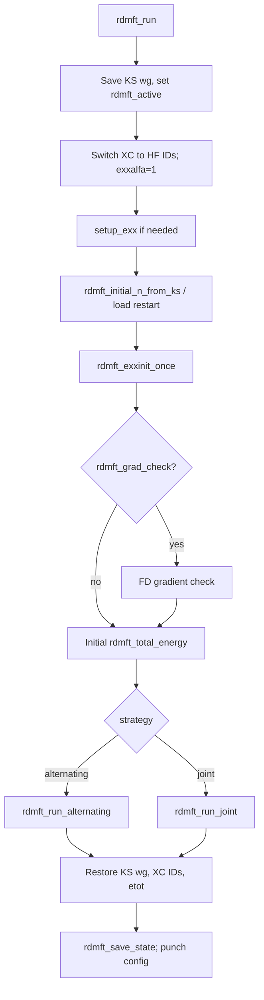
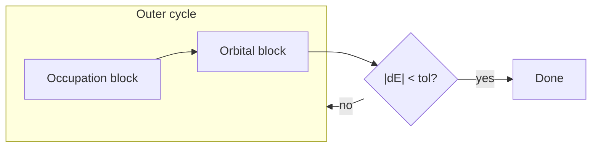

# RDMFT implementation in Quantum ESPRESSO PWscf

This document describes how Reduced Density Matrix Functional Theory (RDMFT) is implemented in `PW/src/rdmft/`. It is the software-engineering companion to [`rdmft_calculation.md`](rdmft_calculation.md), which records the physical model, energy functional, and optimization theory for a methods section. User-facing run instructions and keyword tables also appear in [`../README.md`](../README.md).

**Document map**

| Part | Sections | Content |
|---|---|---|
| I — Integration | 1–2 | PWscf hooks, build layout, control flow |
| II — Core | 3–5 | State variables, energy/gradient pipeline, EXX/ACE wiring |
| III — Solvers | 6–8 | Alternating, joint, occupation and orbital blocks |
| IV — Post-processing | 9–10 | DOS, density plots, restart, k-refinement |
| V — Operations | 11–12 | Parallelism, known gaps, theory↔code index |

---

## 1. Scope and design goals

The RDMFT module is a **post-SCF variational optimizer** embedded in `pw.x`. After a converged Kohn–Sham (or hybrid EXX) calculation it minimizes the RDMFT total energy with respect to:

- natural occupation numbers `rdmft_n(ib, ik)` ∈ [0, 1] (stored per band and k-point);
- natural orbital coefficients `evc(:, ib, ik)` on the plane-wave Stiefel manifold.

Design constraints that shaped the code:

1. **Reuse PWscf EXX-via-ACE** — no standalone Fock implementation; channel weights enter through `wg` / `x_occupation` and the existing `aceinit` / `vexxace_*` path (see Section 5 and [`rdmft_calculation.md` §4](rdmft_calculation.md)).
2. **Mirror ABACUS conventions** — INPUT keyword names, SPG occupation block, Stiefel orbital block, and functional definitions follow `abacus_source/source_lcao/module_rdmft`.
3. **Minimal PW driver patches** — two hook points in `input.f90` and `electrons.f90`; all algorithm code lives under `PW/src/rdmft/`.
4. **Separate expensive post-processing** — DOS (`rdmft_dos.x`) and density cubes (`pp.x`) run outside the optimization loop.

---

## 2. Integration with PWscf

### 2.1 Entry points

| Location | Call | When |
|---|---|---|
| `PW/src/input.f90` | `rdmft_read_input()` | After standard namelists; silent no-op if `&rdmft` absent |
| `PW/src/electrons.f90` | `rdmft_prepare_krefine_skip_scf()` | Before SCF when `do_rdmft` and k-refine keys set |
| `PW/src/electrons.f90` | `rdmft_run()` | After converged SCF, after hybrid EXX loop, and on early-exit paths |

`rdmft_run()` (`rdmft_solver.f90`) is the single top-level driver. It dispatches to `rdmft_run_alternating` or `rdmft_run_joint` based on `rdmft_solver_strategy`.

### 2.2 Lifecycle inside `rdmft_run`



Important side effects during the solve:

- **`rdmft_active = .true.`** — prevents `sum_band` → `weights()` from overwriting `wg` with smeared KS occupations.
- **XC ID switch to `(5,0,0,0,0,0)`** — makes `v_of_rho` return semilocal `V_xc = 0` and `vtxc = 0` for the duration of RDMFT; original IDs restored on exit.
- **`exxalfa = 1.0`** — full exchange in ACE builds.
- **`becp` allocated once** — reused by all `h_psi` calls in the inner loops.

On exit, `wg` and `etot` are restored to their pre-RDMFT KS values so downstream force/stress drivers see the original SCF state.

### 2.3 Build system

All Fortran sources are listed in `PW/CMakeLists.txt` and `PW/src/Makefile`. Objects link into `pw.x`. Additional executables:

| Executable | Source | Role |
|---|---|---|
| `pw.x` | `PW/src/rdmft/*.f90` (linked) | RDMFT optimization |
| `rdmft_dos.x` | `PP/src/rdmft_dos.f90` + shared `rdmft_dos.f90`, `rdmft_brzint.f90`, … | DOS / Mulliken magnetization |
| `pp.x` | uses `rdmft_density.f90`, `rdmft_pp_setup.f90` | RDMFT density cubes (`plot_num` 126–128) |

---

## 3. Module and file layout

### 3.1 Dependency overview

```
rdmft_module          ← global state, INPUT defaults
    ↑
rdmft_input           ← &rdmft namelist reader
rdmft_xc              ← functionals, channel decomposition, ACE drivers
rdmft_energy          ← total energy, grad_n, Riemannian gradient
    ↑
rdmft_occupation      ← proximal projectors, constraints
rdmft_stiefel         ← tangent projection, Cholesky retraction
rdmft_linesearch      ← Armijo, Wolfe, BB, GLL, Zhang–Hager
rdmft_lbfgs           ← L-BFGS history
rdmft_spg             ← SPG occupation inner loop
rdmft_bgd              ← ELK-style box-aware GD (BGD) occupation block
rdmft_ebi             ← EBI erf parameterisation
rdmft_orb_ls          ← orbital Wolfe callback
rdmft_solver          ← rdmft_run, alternating/joint drivers
rdmft_io              ← checkpoint / restart
rdmft_krefine_mod     ← denser-k bootstrap
rdmft_grad_check      ← finite-difference validation
rdmft_dos             ← spectral DOS (also in PP executable)
rdmft_density         ← pp.x density diagnostics
rdmft_pp_setup        ← shared pp.x / rdmft_dos.x bootstrap
rdmft_brzint          ← BZ interpolation for DOS
rdmft_emd             ← electron momentum density (experimental)
rdmft_inner_log       ← optional inner-iteration timing logs
rdmft_occ_eps_log     ← occupation search-direction diagnostics
```

### 3.2 Source file reference

| File | Primary exports | Theory reference |
|---|---|---|
| `rdmft_module.f90` | Control variables, `rdmft_n`, caches | [`rdmft_calculation.md` §10](rdmft_calculation.md) |
| `rdmft_input.f90` | `rdmft_read_input` | §10 |
| `rdmft_xc.f90` | `rdmft_g`, `rdmft_dg`, `rdmft_xc_channel`, ACE/pair paths | §4 |
| `rdmft_energy.f90` | `rdmft_total_energy`, `rdmft_grad_n`, `rdmft_compute_riemannian_gradient` | §3, §9 |
| `rdmft_occupation.f90` | `rdmft_proximal_project_*`, KKT helpers | §5 |
| `rdmft_spg.f90` | `rdmft_spg_occ_block` | §7 |
| `rdmft_bgd.f90` | `rdmft_bgd_occ_block` | README (ELK bgd) |
| `rdmft_ebi.f90` | `rdmft_ebi_occ_block` | README (EBI) |
| `rdmft_stiefel.f90` | `stiefel_project_tangent_*`, `stiefel_retract_*` | §8 |
| `rdmft_solver.f90` | `rdmft_run`, outer loops, orbital blocks | §6–8 |
| `rdmft_linesearch.f90` | Armijo, Wolfe, BB, cubic helpers | §7.4, §8.3 |
| `rdmft_lbfgs.f90` | Two-loop L-BFGS | §7.3, §8.3 |
| `rdmft_orb_ls.f90` | `rdmft_orb_ls_eval` | §8.3 |
| `rdmft_io.f90` | `rdmft_save_state`, `rdmft_load_state` | §10.7 |
| `rdmft_krefine.f90` | k-mesh interpolation bootstrap | §11.8 |
| `rdmft_dos.f90` | TSM probe, spectral binning, PDOS | §11 |
| `rdmft_density.f90` | γ, ρ, coherency diagnostics for `pp.x` | §2.1 |
| `rdmft_grad_check.f90` | FD vs analytic gradients | §10.9 |

---

## 4. Global state and QE arrays

### 4.1 RDMFT-owned arrays

| Symbol | Fortran | Shape | Meaning |
|---|---|---|---|
| $n_{i\mathbf{k}}$ | `rdmft_n` | `(nbnd, nkstot)` | Natural occupations (per-spin in LSDA) |
| $E_{\mathrm{RDMFT}}$ | `rdmft_etot` | scalar | Last evaluated RDMFT total energy |
| ACE xi cache | module flags + `xi` (EXX) | EXX global | Skip rebuild when `rdmft_n` unchanged |

Natural orbitals are **not** duplicated: the optimizer reads and writes PWscf's `evc` in the wavefunction buffer.

### 4.2 PWscf arrays touched during RDMFT

| Array | RDMFT usage |
|---|---|
| `wg(ib, ik)` | Set to `wk(ik) * n_{ib,ik}` (physical) or `wk * w_t(n)` (per ACE channel) |
| `x_occupation` | `wg / wk`; read by `aceinit` / `vexx` for Fock weights |
| `rho`, `vrs`, `vltot` | Rebuilt from RDMFT `wg` via `sum_band` / `v_of_rho` |
| `xi` | ACE compressed exchange vectors (EXX module) |
| `exxbuff` | Real-space EXX buffer; refreshed when orbitals move (`rdmft_exxbuff_stale`) |

**Weight convention** (closed shell, `nspin = 1`): QE folds spin degeneracy into `wk`, so `sum_{ik} wg = nelec` and `rdmft_n` is a per-spin occupation in [0, 1]. For each ACE channel, `rdmft_xc_set_wg_for_channel` sets `wg = wk * w_t(n)` so `x_occupation = w_t(n)`.

### 4.3 Internal flags

| Flag | Set when | Effect |
|---|---|---|
| `rdmft_active` | Start/end of `rdmft_run` | Blocks KS `weights()` overwrite of `wg` |
| `rdmft_exxbuff_stale` | After orbital steps | Triggers `exxinit` refresh before next EXX call |
| `rdmft_fix_magnetization` | LSDA + `tot_magnetization` | Split proximal projection per spin |
| `rdmft_occ_frozen` | Alternating: 2 consecutive small `sum|dn|` | Skips occupation block for rest of run |

---

## 5. Energy and gradient evaluation

### 5.1 Total energy (`rdmft_total_energy`)

Evaluation sequence:

1. **`rdmft_set_wg_from_n('physical')`** — `wg = wk * rdmft_n`.
2. **`rdmft_update_density_and_pot`** — `sum_band` → ρ, Hartree, local potential; returns `ehart`, `etxc`, `vtxc`.
3. **One-body diagonals** — `h_psi` with EXX disabled (`stop_exx`/`start_exx` guards); accumulate `wk * n * h_ii`.
4. **XC channels** — loop `it = 1 … nch`: `rdmft_compute_xc_channel` → channel energy and diagonals.
5. **Extras** — GU on-site diagonal (`rdmft_xc_extra_energy`), HF entropy (`rdmft_temp`).
6. **Assembly** — subtract double-counted Hartree (`-2*ehart`) and semilocal `vtxc`; add Ewald.

For HF at converged KS-HF orbitals with integer `n`, this reproduces the KS-HF total energy to ~10⁻⁹ Ry (regression in `examples/hf_benchmark/`).

### 5.2 Occupation gradient (`rdmft_grad_n`)

Implements the occupation XC derivative of [`rdmft_calculation.md` §9](rdmft_calculation.md). For separable channel functionals the closed-form formula $c_t w_{\mathbf{k}} w_t'(n)\,D_{ii}$ already absorbs both the explicit and implicit chain-rule pieces (the symmetric quadratic form has gradient $D_\alpha = -(Kg)_\alpha$ in one shot), so a separate "response" sum is unnecessary -- this matches the ABACUS reference `rdmft_energy_gradient.cpp::compute` and is what `rdmft_xc_occ_grad_add` evaluates. $D_{ii}$ is rebuilt via ACE at every call. (The former cached-coupling fast path — `rdmft_occ_reuse_orbitals` / `rdmft_frozen_fock` — has been removed because it was not `-nk` reproducible on metals.)

```
grad_n(i,k) = wk * h_ii(i,k)
            + sum_t c_t * wk * w_t'(n) * D_ii(t)
            + GU / entropy terms
```

Steps:

1. Refresh ρ and potentials (`rdmft_update_density_and_pot`).
2. One-body diagonals via `h_psi`.
3. For each channel: rebuild ACE at current `n`, get `vx_diag`, call `rdmft_xc_add_occ_gradient`.
4. Optional `only_k` / `ib_only` for single-k TSM probes (DOS).

**Post-step gradient reuse:** every occupation inner block (SPG2 / BGD / EBI) evaluates `rdmft_grad_n` once more after an accepted step (BB pair, KKT report).  Since neither `rdmft_n`, the orbitals, nor the density change between that call and the head of the next inner iteration, the blocks cache the post-step gradient (and, for SPG2, the `g1` / KKT residuals) and skip the loop-head recomputation — one full gradient evaluation (one-body `h_psi` sweep + per-channel exchange build) saved per inner iteration.  The skip decision is uniform across MPI ranks, so all collectives inside `rdmft_grad_n` are skipped consistently.

### 5.3 Orbital gradient (`rdmft_compute_riemannian_gradient`)

1. **Hoist** — sum all channel `V_x^{(t)}|ψ⟩` in one pass over channels (avoids O(N_k³) redundant `aceinit`).
2. **Per k** — `rdmft_apply_h_one_psi` for `H|ψ⟩`; form ambient gradient `G`; Stiefel project → `G_R`.
3. **Optional preconditioning** — level-shift scaling + re-projection (`rdmft_orb_precond`).
4. **MPI** — `mp_sum` over band group and k-point pools for global `‖G_R‖`.

The joint solver chain-rules `grad_n` into `grad_p` via `n = cos²(p)`; orbital part uses the same `G_R` machinery.

### 5.4 EXX/ACE channel call chain

End-to-end path for separable channel `it` (`rdmft_xc_compute_exchange_channels`):

```
rdmft_xc_set_wg_for_channel(it)
  → rdmft_xc_refresh_x_occupation()     ! x_occupation, x_nbnd_occ
  → rdmft_xc_reinit_exxbuff()           ! if support grew
  → aceinit(.FALSE., e_t)               ! build xi(:,:,ik)
  → vexxace_k / vexxace_gamma           ! V_x|ψ⟩, diagonals
```

Special paths:

| Path | Trigger | Routine |
|---|---|---|
| Pair (`bow`) | `rdmft_functional = 'bow'` | `rdmft_xc_compute_exchange_pair` |
| Single-k probe | `only_k`, TSM, some `block_k` steps | `aceinit_k` or direct `vexx` |
| Xi cache hit | Same `rdmft_n` within tolerance | Skip `aceinit`, reuse `xi` |
| Cholesky fallback | `ZPOTRF INFO ≠ 0` in `aceupdate_k` | Eigendecomposition pseudo-inverse |

---

## 6. Solver drivers

### 6.1 Alternating strategy (default)

`rdmft_run_alternating` loops up to `rdmft_outer_maxiter`:



**Occupation block** — selected by `rdmft_occ_optimizer`:

| Optimizer | Module | Method |
|---|---|---|
| `spg2` (default) | `rdmft_spg.f90` | Canonical SPG2 (BMR Alg. 2.2; `sd` is a synonym) |
| `cg` | `rdmft_spg.f90` | SPG2 + PR-CG direction |
| `lbfgs` | `rdmft_spg.f90` + `rdmft_lbfgs.f90` | SPG2 + L-BFGS direction |
| `bgd` | `rdmft_bgd.f90` | ELK `rdmvaryn` reduced gradient + Armijo line search (`0.75` backtrack) |
| `ebi` | `rdmft_ebi.f90` | EBI@GD erf parameterisation (Yao *et al.* 2022) |

**Orbital block** — `rdmft_orbital_step` dispatches on `rdmft_orb_strategy`:

| Strategy | Routine | Manifold step |
|---|---|---|
| `joint` (default) | `rdmft_orbital_step_joint` | Product Stiefel; one global line search |
| `block_k` | `rdmft_orbital_step_block_k` | Gauss–Seidel per k; global energy in LS |

**Occupation freeze:** after each occupation block, track `sum|n_out - n_prev|`. Two consecutive values below `rdmft_occ_tol` set `rdmft_occ_frozen = .true.` permanently.

Block order controlled by `rdmft_block_order` (`occ_orb` or `orb_occ`).

### 6.2 Joint strategy

`rdmft_run_joint` packs `(p, evc_flat)` on the product manifold `{ℝ^{N_occ}} × ∏_k St(nbnd, npwx)`:

1. Map `n = cos²(p)`; weighted L2 project for electron count.
2. Evaluate `(grad_n, G_R)`; chain-rule to `grad_p`.
3. Build packed direction (SD / PR-CG / L-BFGS via `rdmft_joint_optimizer`).
4. Check descent slope; fallback to steepest descent if needed.
5. **Single Armijo** line search: update `p` linearly, retract each `C^k`.
6. Re-project occupations with `rdmft_proximal_project_occ`.

Joint uses Armijo only (no strong Wolfe on the packed variable).

**SPG joint variant** (`rdmft_joint_optimizer = 'spg'`, driver `rdmft_run_joint_spg`) replaces the `cos²(p)` occupation block with the canonical SPG2 projected-gradient step in native `n`-space (feasible chord `d_n = P_w(n₀ − αₙ gₙ) − n₀`, BMR spectral `αₙ` via `rdmft_spg_spectral_alpha`) and drives the orbitals with a Stiefel PR-CG step; both are coupled by one Armijo line search (`n(λ) = n₀ + λ d_n`, `C^k(λ) = R_{C^k}(λ d_C^k)`, first trial `λ = 1`). Convergence: `max(‖g₁‖∞, ‖G_C‖) ≤ tol` or `|dE| < rdmft_energy_tol`. This avoids the vanishing `cos²` Jacobian at the box boundaries. See §6.2.1 of `rdmft_calculation.md`.

---

## 7. Occupation block internals

### 7.1 SPG2 loop (`rdmft_spg_occ_block`)

Each inner iteration ([`rdmft_calculation.md` §7.2](rdmft_calculation.md); projectors and chord in §5.3):

1. `rdmft_grad_n` → $\mathbf{g}$; early exit if $\|g_1\|_\infty$ below `rdmft_occ_grad_tol`.
2. Build search direction `grad_dir` and preimage $\mathbf{u}_k$ (SD, PR-CG, or L-BFGS; optional ELK scale).
3. Spectral steplength $\alpha_k$ (`rdmft_spg_spectral_alpha`); chord $\mathbf{d} = P_w(\mathbf{n}_0 - \alpha_k \mathbf{u}_k) - \mathbf{n}_0$.
4. Line search on $\mathbf{n}(\lambda) = \mathbf{n}_0 + \lambda \mathbf{d}$ via `rdmft_spg_ls_eval` (default monotone Armijo; $\lambda_0=1$).
5. Stop on `sum|Δn| < rdmft_occ_tol` or line-search failure.

Projectors in `rdmft_occupation.f90`:

- **`rdmft_proximal_project_uniform_core`** — auxiliary $P_u$ (not used by SPG).
- **`rdmft_proximal_project_occ`** — Euclidean $P_w$ (SPG, joint init, cleanup).

### 7.2 Alternative occupation optimizers

**BGD (`rdmft_bgd.f90`):** Port of ELK `rdmvaryn.f90`. Builds charge-conserving reduced gradient γ with chemical potential κ; line search along `n(τ) = n₀ + τγ` without projection (feasible segment). Base step `rdmft_bgd_tau`.

**EBI (`rdmft_ebi.f90`):** Parameterises `n = ½(erf(x + μ) + 1)`; bisection on μ preserves electron count. Gradient descent on unconstrained `x`.

---

## 8. Orbital block internals

### 8.1 Stiefel geometry (`rdmft_stiefel.f90`)

For norm-conserving PP (overlap = I):

- **Tangent projection:** `G_R = G - C sym(C†G)`.
- **Retraction:** Cholesky polar map on `C + α ξ`.
- **Γ-only variants** use QE's gamma-trick inner products.

Noncollinear runs use `lda = npwx * npol`; the same formulas sum over spinor components.

### 8.2 Inner loop (`rdmft_orbital_step_*`)

Per inner iteration:

1. Snapshot `evc`; compute `G_R` and `‖G_R‖`.
2. Build tangent direction ξ (SD / PR-CG / L-BFGS on preconditioned gradient).
3. Descent check on `∑_k ⟨G_R, ξ⟩_S`.
4. Propose α₀ (BB / quadratic / fixed).
5. Wolfe or Armijo via `rdmft_orb_ls_eval` (evaluates global `E(α)`, returns slope).
6. Accept retracted orbitals; set `rdmft_exxbuff_stale = .true.`.

Convergence: `‖G_R‖ < rdmft_orb_grad_tol` (all k in `block_k`).

---

## 9. Post-processing

### 9.1 DOS (`rdmft_dos.x`)

Two-step workflow ([`rdmft_calculation.md` §11](rdmft_calculation.md)):

1. **`pw.x`** saves `{outdir}/{prefix}.rdmft.save` (occupations) and `{outdir}/{prefix}.save/` (orbitals).
2. **`rdmft_dos.x`** reads `&inputrdmftdos`, loads PWscf state, runs TSM probes.

TSM energy for band `(i, k)`: set `n_{ik} = 0.5`, evaluate `∂E/∂n_{ik}` via `rdmft_grad_n(only_k=k, ib_only=i)` (stored in `rdmft_diag_tsm`). Cost O(N_b × N_k) ACE rebuilds; `only_k` reduces each probe to a single-k build.

Spectral modes:

- **`elk`** (default) — one δ-peak per state at TSM energy.
- **`sharma`** — two-branch PRL Eq. (7) with RDMFT chemical potential μ.

Implementation: `rdmft_dos.f90` (linked into both `pw.x` helpers and `PP/src/rdmft_dos.f90` driver), `rdmft_brzint.f90` for BZ integration.

### 9.2 Density plots (`pp.x`)

`rdmft_density.f90` builds γ from saved **physical** occupations `wk * n` (not channel weights):

| `plot_num` | Output |
|---|---|
| 126 | ρ(r) = γ(r,r) |
| 127 | Coherency slice h(r₀,r) (not XC hole) |
| 128 | On-site diagnostic ρ − ρ² |

Bootstrap: `rdmft_pp_setup.f90` (`rdmft_pp_bootstrap` module).

### 9.3 Restart and k-refinement

**Restart:** `rdmft_io.f90` writes ASCII `{prefix}.rdmft.save`; orbitals via `punch('config')`. Resume with `rdmft_restart = .true.`, `startingwfc = 'file'`, `electron_maxstep = 0`.

**K-refinement:** `rdmft_krefine.f90` interpolates `(n, C)` from coarse save onto finer MP mesh when `rdmft_source_prefix` / `rdmft_source_outdir` are set, then optional fixed-n orbital polish (`rdmft_krefine_orbital_polish`).

---

## 10. Logging and validation

| Feature | Control | Module |
|---|---|---|
| Summary per outer/inner iter | `rdmft_verbose ≥ 1` | `rdmft_solver.f90` |
| Per-trial line search | `rdmft_verbose ≥ 2` | `rdmft_spg.f90`, `rdmft_orb_ls.f90` |
| Inner block wall times | `rdmft_verbose ≥ 1` | `rdmft_inner_log.f90` |
| Occupation ε diagnostics | always when inner log open | `rdmft_occ_eps_log.f90` |
| FD gradient check | `rdmft_grad_check = .true.` | `rdmft_grad_check.f90` |

Gradient check runs once before the main loop: central FD on occupations, forward FD along Stiefel retraction for orbitals.

---

## 11. Parallelism

Three axes (see also [`../README.md`](../README.md)):

1. **Plane-wave MPI (`-np`)** — G-vector split; band-group reductions in energy/gradient kernels.
2. **K-point pools (`-npool` / `-nk`)** — k-list partition; **all** control reductions (`energy`, `φ'`, `‖G_R‖`, proximal bisection, SPG slopes) run on every rank across `inter_pool_comm`.
3. **OpenMP** — threaded BLAS/FFTW and QE OpenMP loops in `aceinit`/`vexx`.

Critical implementation details for pools:

- Slice `wg(1:nbnd, 1:nks)` when saving/restoring (global shape is `(nbnd, nkstot)`).
- `poolcollect` on `x_occupation` and `rdmft_n` before EXX calls.
- Exchange energy assembly uses explicit k-slice conformability.

Recommended: `rdmft_orb_strategy = 'block_k'` when using multiple pools.

---

## 12. Known gaps and limitations

| Item | Status |
|---|---|
| GU orbital gradient ∂J/∂C | Not implemented; occupation FD passes, orbital FD may fail |
| Frozen-Fock ∂V_x/∂n | Omitted by design (§9.2 of calculation doc) |
| Occupation coupling fast path | Removed (`rdmft_occ_reuse_orbitals` / `rdmft_frozen_fock` deleted): not `-nk` reproducible on metals; solver always uses the per-trial ACE path |
| `bow` functional | Exact pair path; expensive O(N_k² n_q N_b) |
| USPP/PAW multi-k | Less tested than NC |
| Spin-polarised `pp.x` plots | Not yet supported |
| Noncollinear Mulliken M_z | DOS total only; PDOS/Mz skipped |

---

## 13. Theory ↔ code index

Quick map from [`rdmft_calculation.md`](rdmft_calculation.md) sections to primary routines:

| Theory § | Topic | Code entry points |
|---|---|---|
| §2 | 1-RDM, ρ | `rdmft_set_wg_from_n`, `rdmft_update_density_and_pot` |
| §3 | Total energy | `rdmft_total_energy` |
| §4.1 | Power regularisation | `rdmft_g`, `rdmft_dg` in `rdmft_xc.f90` |
| §4.3 | Channel decomposition | `rdmft_xc_channel`, `rdmft_xc_n_channels` |
| §4.6 | ACE workflow | `rdmft_xc_compute_exchange_channels`, `aceinit`, `vexxace_*` |
| §5 | Occupation constraints | `rdmft_proximal_project_uniform_core`, `rdmft_proximal_project_occ` |
| §6 | Solver strategies | `rdmft_run_alternating`, `rdmft_run_joint` |
| §7 | SPG occupation | `rdmft_spg_occ_block` |
| §8 | Stiefel orbitals | `stiefel_*`, `rdmft_orbital_step_*` |
| §9 | Analytic gradients | `rdmft_grad_n`, `rdmft_compute_riemannian_gradient` |
| §10 | INPUT keywords | `rdmft_input.f90`, `rdmft_module.f90` defaults |
| §11 | DOS | `rdmft_compute_dos`, `rdmft_compute_tsm_*` in `rdmft_dos.f90` |

---

## 14. Related documentation

- [`rdmft_calculation.md`](rdmft_calculation.md) — physical model and algorithms (manuscript-oriented)
- [`../README.md`](../README.md) — build, run, keywords, benchmarks, examples
- `abacus_source/source_lcao/module_rdmft/doc/` — reference derivation and ELK algorithm notes
- `examples/` — worked inputs (H₂, Fe DOS, multi-k charged systems, HF benchmarks)
