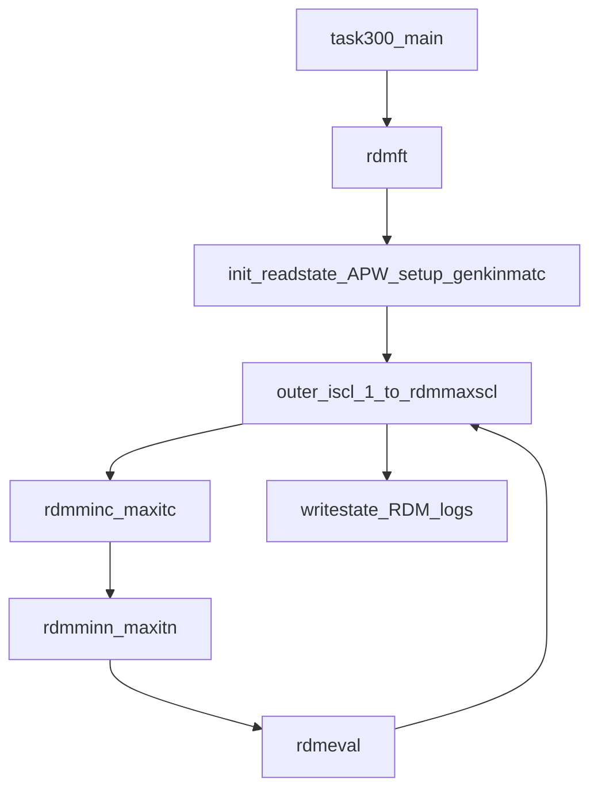

# How ELK runs RDMFT (algorithm summary)

This note summarizes the **one-body reduced density matrix functional theory (RDMFT)** driver in the [ELK](https://elk.sourceforge.io/) code. ELK is not part of the ABACUS repository; the description below is based on the public mirror [qsnake/elk](https://github.com/qsnake/elk) (`src/*.f90`), which aligns with the subroutine reference in the ELK manual ([elk.pdf](https://elk.sourceforge.io/elk.pdf)).

**Math rendering:** Display equations use `$$ ... $$` and inline math uses `$ ... $` so they render in GitHub, VS Code, and most common Markdown previews.

## Entry point

- **Task 300** in `main.f90` invokes `call rdmft` (RDMFT ground-state calculation).
- The main driver is [`rdmft.f90`](https://github.com/qsnake/elk/blob/master/src/rdmft.f90).

## Variables: what is optimized

RDMFT in ELK uses the **second-variational** representation of the LAPW method:

| Quantity | Role |
|----------|------|
| `evecsv` | Unitary mixing coefficients (“natural-orbital” rotation) in the second-variation basis, **per reduced k-point** (`nstsv × nstsv` complex). |
| `occsv` | **Fractional** occupation numbers per band and k-point (`nstsv × nkpt`), with maximum `occmax` (1 or 2 for spin). |

These are read and written through `getevecsv` / `putevecsv` and `getoccsv` / `putoccsv`.

### Basis: same second-variation space as Kohn–Sham

**Yes, in the only sense ELK implements:** each RDMFT “natural orbital” is an **orthonormal linear combination of the same second-variational states** used in the preparatory Kohn–Sham run—**not** an expansion in a larger Hilbert space.

[`rhomag.f90`](https://github.com/qsnake/elk/blob/master/src/rhomag.f90) loads **first-variational** coefficients `evecfv` and the **`nstsv × nstsv`** matrix `evecsv` and passes them to `rhomagk`—the **same** pipeline as ground-state KS. So valence wavefunctions are still built from the LAPW linearized + local-orbital **first-variation** set, mixed by `evecsv`. The RDMFT loop **optimizes that unitary mixing** (and Gram–Schmidt keeps columns orthonormal) while **`nstsv` is fixed** by the prior calculation.

**Practical reading:** after a converged KS job, **`EVECSV.OUT`** holds the **same** second-variational unitary the KS ground state used (its columns are the KS valence eigenvectors in that representation); RDMFT then searches for another **orthonormal** set of columns—**natural orbitals in that fixed subspace**—by updating `evecsv`. Enlarging the NO span would require **more bands / a new ground-state window** and regenerating `EVECSV.OUT` / `OCCSV.OUT`, not a keyword inside task **300** alone.

## Initial occupations (`occsv`)

**At the start of RDMFT**, [`rdmft.f90`](https://github.com/qsnake/elk/blob/master/src/rdmft.f90) does **not** compute occupations from scratch. It loads them from the unformatted direct-access file **`OCCSV.OUT`** (in code: `'OCCSV'//trim(filext)`), one record per reduced **k**-point, via [`getoccsv.f90`](https://github.com/qsnake/elk/blob/master/src/getoccsv.f90). The file must **already exist** and match the current k-mesh and `nstsv` (ELK aborts if stored k-vectors or `nstsv` disagree).

**Typical workflow:** run a **self-consistent Kohn–Sham ground state** first (e.g. task **0** / [`gndstate.f90`](https://github.com/qsnake/elk/blob/master/src/gndstate.f90)). In the KS loop, after the second-variational eigenvalues `evalsv` are available, ELK calls [`occupy.f90`](https://github.com/qsnake/elk/blob/master/src/occupy.f90) to fix the **Fermi energy** `efermi` and set `occsv`, then writes the result with [`putoccsv.f90`](https://github.com/qsnake/elk/blob/master/src/putoccsv.f90). That produces the **`OCCSV.OUT`** that task **300** reads as the **initial RDMFT occupations** (usually a smeared KS metal) or as a restart from a previous RDMFT/GW step.

**Kohn–Sham occupations inside `occupy`:** ELK finds `efermi` by bisection so the k-weighted sum of occupations equals the target valence charge `chgval`. For each band $i$ and k-point $k$,

$$
n_{ik} = n_{\max}\,\theta_{\mathrm{smear}}\!\Bigl(\texttt{stype},\;\bigl(e_{\mathrm{F}}-\varepsilon_{ik}\bigr)\,\frac{1}{\texttt{swidth}}\Bigr),
$$

where $\varepsilon_{ik}$ are the **Kohn–Sham** `evalsv`, $n_{\max}=$ `occmax`, and $\theta_{\mathrm{smear}}$ is ELK’s smearing step (`stheta`) selected by input **`stype`** (e.g. step, Gaussian, Fermi–Dirac) with width **`swidth`**; see `occupy` and the ELK input manual. Optional **`autoswidth`** can adjust the width during the KS loop.

**Other sources of `OCCSV.OUT`:** the ELK manual notes that task **640** (GW density matrix / natural orbitals) can **overwrite** `EVECSV.OUT` and `OCCSV.OUT` for follow-up calculations.

**After RDMFT starts:** [`rdmvaryn.f90`](https://github.com/qsnake/elk/blob/master/src/rdmvaryn.f90) may **shift and clip** `occsv` on each occupation step so the k-weighted total matches `chgval` and $0\le n_{ik}\le n_{\max}$ before applying the projected gradient—this is an **update**, not the original file initialization.

## Total energy

[`rdmenergy.f90`](https://github.com/qsnake/elk/blob/master/src/rdmenergy.f90) assembles:

1. **Coulomb energy** `engyvcl`: core–electron contribution from core densities and the Coulomb potential; valence part from **diagonal** matrix elements `vclmat(ist,ist,ik)` weighted by `wkpt(ik) * occsv(ist,ik)`.
2. **Kinetic energy** `engykn`: fixed core kinetic `engykncr` plus valence contribution from `dkdc` (derivative of kinetic energy w.r.t. `evecsv`, see `rdmdkdc`) contracted with `evecsv`.
3. **Madelung** term `engymad` (nuclear–electron and related cell contributions as in standard ELK).
4. **Exchange–correlation** `engyx` from [`rdmengyxc.f90`](https://github.com/qsnake/elk/blob/master/src/rdmengyxc.f90).

**Total:**

$$
E_{\mathrm{tot}} = \tfrac{1}{2}\,E_{\mathrm{Coul}} + E_{\mathrm{Mad}} + E_{\mathrm{kin}} + E_{\mathrm{xc}}.
$$

If **`rdmtemp > 0`**, ELK adds a **finite-temperature free-energy** contribution: it calls [`rdmentropy.f90`](https://github.com/qsnake/elk/blob/master/src/rdmentropy.f90) and subtracts `rdmtemp * rdmentrpy` from the total. The **entropy** accumulated in code (before the overall $k_B$ factor) is the **negative** of the sum printed in the file header comment—see the explicit expression below.

## Key formulas (as in ELK source)

Indices: reduced **k** (`ik`), band / second-variation index **i** (`ist`), k-weights $w_k \equiv$ `wkpt(ik)`, occupations $n_{ik} \equiv$ `occsv(ist,ik)`, maximum occupancy $n_{\max} \equiv$ `occmax` (1 or 2). The Coulomb matrix is $V^{\mathrm{cl}}_{ij}(k)$ from `vclmat`; nonlocal exchange integrals are $K_{ij}(k,k')$ from `vnlijji` (ELK’s layout matches the nested loops in `rdmengyxc`).

### Valence kinetic and Coulomb (diagonal-in-natural-orbital form)

Let $C_{pi}(k)$ be the second-variation coefficients (`evecsv(p,ist)`), and $K^{(T)}_{i}(k)$ the column vectors `dkdc(:,ist,ik)` from `rdmdkdc` (kinetic contribution to $\partial E/\partial C^*$). Then [`rdmenergy.f90`](https://github.com/qsnake/elk/blob/master/src/rdmenergy.f90) adds

$$
T_{\mathrm{val}} = \sum_{k} w_k \sum_i n_{ik}\,
\operatorname{Re}\!\Bigl[\sum_p C^*_{pi}(k)\, K^{(T)}_{pi}(k)\Bigr],
$$

$$
J_{\mathrm{val}} = \sum_{k} w_k \sum_i n_{ik}\, V^{\mathrm{cl}}_{ii}(k),
$$

together with the **core** Coulomb and kinetic pieces (`rhocr`, `vclmt`, `engykncr`) and the **Madelung** term `engymad` as in standard ELK.

### Total energy and finite-temperature free energy

With `engyx` the RDMFT XC energy from `rdmengyxc`, ELK forms

$$
E = \tfrac{1}{2} E_{\mathrm{Coul}} + E_{\mathrm{Mad}} + E_{\mathrm{kin}} + \texttt{engyx},
$$

where $E_{\mathrm{Coul}}$ includes both core and valence Coulomb counting (`engyvcl`). If **`rdmtemp > 0`**, [`rdmentropy.f90`](https://github.com/qsnake/elk/blob/master/src/rdmentropy.f90) sets (occupations clamped away from $0$ and $n_{\max}$ by `epsocc`)

$$
\texttt{rdmentrpy} = k_B \sum_{k} w_k \sum_i
\Bigl[
- n_{ik}\log\!\frac{n_{ik}}{n_{\max}}
- (n_{\max}-n_{ik})\log\!\Bigl(1-\frac{n_{ik}}{n_{\max}}\Bigr)
\Bigr],
$$

and the minimized quantity becomes the **free energy**

$$
\mathcal{F} = E - \texttt{rdmtemp}\times \texttt{rdmentrpy}.
$$

### RDMFT XC energy (`rdmengyxc`)

All cases accumulate $\texttt{engyx} \mathrel{+}= -\,t_2\,K_{j i}$ with the appropriate $t_2$ (using ELK’s band indices $(ist2,ist1)$ and k-pair bookkeeping; $jk$ maps the partner k-point).

**Type 1 (HF-type, `rdmxctype = 1`):** with $t_1 = \dfrac{1}{2\,n_{\max}}$,

$$
E_{\mathrm{x}}^{(1)} =
- t_1 \sum_{k,k',i,j} w_{k'}\, n_{jk'}\, n_{ik}\, K_{ji}(k',k).
$$

**Type 2 (power functional, `rdmxctype = 2`):** let $\alpha =$ `rdmalpha`. For **non-spin-polarized** systems $t_1 = (1/4)^{\alpha}$; for **spin-polarized** $t_1 = 1/2$. For each quadruple $(k_1,k,i,j)$ in ELK’s loops, with $t_3 = n_{jk_1} n_{ik}$:

- if **same k** ($k=k_1$ up to `epslat`) **and** $i=j$: $t_2 = \dfrac{1}{2\,n_{\max}}\, w_k\, t_3$;
- **otherwise:** $t_2 = t_1\, w_k\, (t_3)^{\alpha}$.

Then $E_{\mathrm{x}}^{(2)} = -\sum t_2\, K_{ji}(\cdots)$ over the same index routing as the source.

### Derivatives used in the minimization

**Coefficients** ([`rdmdedc.f90`](https://github.com/qsnake/elk/blob/master/src/rdmdedc.f90)): with $V^{\mathrm{cl}}(k)$ the Coulomb matrix `vclmat(:,:,ik)` and $K^{(T)}$ as above, for each column $i$

$$
\frac{\partial E}{\partial C^*_{pi}(k)}
= n_{ik}\,\Bigl[K^{(T)}_{pi}(k) + \sum_q V^{\mathrm{cl}}_{pq}(k)\, C_{qi}(k)\Bigr]
+ \Bigl(\frac{\partial E_{\mathrm{xc}}}{\partial C^*}\Bigr)_{pi},
$$

where the last term is filled by `rdmdexcdc`.

**Occupations** ([`rdmdedn.f90`](https://github.com/qsnake/elk/blob/master/src/rdmdedn.f90)): ELK stores **`dedn`** as the **negative** of $\partial \mathcal{F}/\partial n$ (free energy if `rdmtemp>0`). The kinetic+Coulomb diagonal part is

$$
\texttt{dedn}_{ik} \;+=\; - \operatorname{Re}\!\bigl[(C^\dagger K^{(T)})_{ii}(k)\bigr] - V^{\mathrm{cl}}_{ii}(k),
$$

then `rdmdexcdn` and, when $T>0$, `rdmdtsdn` **add** their pieces into `dedn`.

**Steepest step on coefficients** ([`rdmvaryc.f90`](https://github.com/qsnake/elk/blob/master/src/rdmvaryc.f90)): per $k$,

$$
C \leftarrow C - \tau_c\, \frac{\partial E}{\partial C^*},
$$

followed by column **Gram–Schmidt** orthonormalization; $\tau_c =$ `taurdmc`.

**Occupation search direction** ([`rdmvaryn.f90`](https://github.com/qsnake/elk/blob/master/src/rdmvaryn.f90)): ELK sets $g_i = \texttt{dedn}_i - \kappa$ with $\texttt{dedn}_i = -\partial \mathcal{F}/\partial n_i$ from [`rdmdedn.f90`](https://github.com/qsnake/elk/blob/master/src/rdmdedn.f90), and chooses $\kappa$ so $\sum_k w_k \sum_i \gamma_i = 0$. Since $\texttt{dedn} = -\partial\mathcal{F}/\partial n$, an unconstrained move along $\texttt{dedn}$ is a descent direction for $\mathcal{F}$. Then

$$
\gamma_i =
\begin{cases}
g_i\,(n_{\max} - n_i), & g_i > 0,\\[4pt]
g_i\, n_i, & g_i \le 0.
\end{cases}
$$

After optional scaling of $\gamma$, ELK picks $\tau_n \le$ `taurdmn` by backtracking so $0 \le n_i + \tau_n \gamma_i \le n_{\max}$.

### RDMFT “eigenvalues” for output ([`rdmeval.f90`](https://github.com/qsnake/elk/blob/master/src/rdmeval.f90))

For each $(k,i)$, ELK sets temporarily $n_{ik} \to n_{\max}/2$, calls `rdmdedn`, and sets

$$
\varepsilon_{ik} = \texttt{evalsv}_{ik} = -\texttt{dedn}_{ik}
= \frac{\partial \mathcal{F}}{\partial n_{ik}}
\quad\text{at } n_{ik} = n_{\max}/2
$$

(with other occupations unchanged), i.e. the **occupation derivative of the free energy** at the probe filling.

## RDMFT exchange–correlation functionals (`rdmxctype`)

Implemented in [`rdmengyxc.f90`](https://github.com/qsnake/elk/blob/master/src/rdmengyxc.f90) (nonlocal exchange integrals `vnlijji`):

| `rdmxctype` | Meaning |
|-------------|---------|
| **0** | No XC contribution (`engyx = 0`). |
| **1** | **Hartree–Fock-type** coupling: occupations enter bilinearly in the exchange sum (prefactor includes `0.5/occmax`). |
| **2** | **Power functional**: mixes an on-site (diagonal-in-band, same-k) HF-like term with off-site terms where the occupation prefactor scales as $(n\,n')^{\texttt{rdmalpha}}$ (details and spin-polarized prefactors are in the source loops over `ik1`, `ik2`, `ist1`, `ist2`). |

The module [`modrdm.f90`](https://github.com/qsnake/elk/blob/master/src/modrdm.f90) also declares **`rdmbeta`** (hybrid mixing). The mirrored `rdmengyxc` shown above only branches on types **0–2**; newer official ELK releases may add further `rdmxctype` values—check your ELK version’s `rdmengyxc.f90`.

## Outer self-consistent structure (`rdmft.f90`)

After standard initialization (`init0`, `init1`, `init2`), `readstate`, core and radial/APW setup, and `genkinmatc`, ELK reads initial **`occsv`** from **`OCCSV.OUT`** via `getoccsv` (see **Initial occupations** above) and opens log files (`RDM_INFO.OUT`, `RDMN_ENERGY.OUT`, `RDMC_ENERGY.OUT`, etc.).

**Main loop** over **`iscl = 1 .. rdmmaxscl`**:

1. **`rdmminc`** — `maxitc` iterations minimizing the energy w.r.t. **`evecsv`** (steepest descent; see below).
2. **`rdmminn`** — `maxitn` iterations minimizing w.r.t. **`occsv`** (steepest descent; see below).
3. **`rdmeval`** — computes **RDMFT eigenvalues** `evalsv` for output (see below).

Each outer cycle can write energies and charge; after all cycles, ELK writes **`STATE.OUT`** via `writestate`.

Within the inner loops, ELK repeatedly rebuilds the **density** (`rhomag`) and **Coulomb potential** (`potcoul`, `genvmat`), so the **Hartree** piece is updated self-consistently with the current natural orbitals and occupations. This is **not** a Kohn–Sham eigenvalue self-consistency loop: the code optimizes `evecsv` and `occsv` directly while refreshing $V_H$ from the induced density.

## Orbital minimization (`rdmminc` / `rdmvaryc`)

[`rdmminc.f90`](https://github.com/qsnake/elk/blob/master/src/rdmminc.f90), for each `it = 1 .. maxitc`:

1. `rhomag` → `potcoul` → `genvmat` (Coulomb matrix `vclmat`).
2. `rdmdkdc` — fills `dkdc`, the derivative of kinetic energy w.r.t. `evecsv`.
3. Optional I/O of nonlocal matrix elements.
4. On the MPI master: [`rdmvaryc.f90`](https://github.com/qsnake/elk/blob/master/src/rdmvaryc.f90):
   - `rdmdedc` — total **∂E/∂evecsv** (kinetic + Coulomb + XC via `rdmdexcdc`).
   - One steepest-descent step: `evecsv ← evecsv - taurdmc * dedc`.
   - **Gram–Schmidt** orthonormalization of columns of `evecsv` per k-point.
   - `putevecsv` writes updated coefficients.
5. `rdmenergy` evaluates the energy (logged to `RDMC_ENERGY.OUT`).

## Occupation minimization (`rdmminn` / `rdmvaryn`)

[`rdmminn.f90`](https://github.com/qsnake/elk/blob/master/src/rdmminn.f90), for each `it = 1 .. maxitn`:

1. Rebuild density and Coulomb matrices (`rhomag`, `potcoul`, `genvmat`) as needed.
2. On the MPI master: [`rdmvaryn.f90`](https://github.com/qsnake/elk/blob/master/src/rdmvaryn.f90):
   - Adjust **`occsv`** so the **k-weighted sum matches** `chgval` (target valence charge), then **clip** to `[0, occmax]` and redistribute charge to restore feasibility.
   - Call [`rdmdedn.f90`](https://github.com/qsnake/elk/blob/master/src/rdmdedn.f90) for derivatives w.r.t. occupations; add [`rdmdexcdn.f90`](https://github.com/qsnake/elk/blob/master/src/rdmdexcdn.f90); if `rdmtemp > 0`, add entropic derivatives [`rdmdtsdn.f90`](https://github.com/qsnake/elk/blob/master/src/rdmdtsdn.f90).
   - Build a constrained search direction **`gamma`** from shifted gradients (see the **Key formulas** section: $g_i = \texttt{dedn}_i - \kappa$; ELK’s comments sometimes write $\partial E/\partial n_i$; with **nonzero `rdmtemp`**, `rdmdedn` includes the entropy piece, i.e. **free energy** $\mathcal{F}$). The scalar $\kappa$ is chosen iteratively so the k-weighted sum of $\gamma$ vanishes (charge-neutral tangent).
   - Optionally **normalize** $\gamma$; choose step length **`tau`** starting from **`taurdmn`** and **backtrack** (factor 0.75) so all occupations remain in `[0, occmax]`.
   - Update `occsv` and `putoccsv`; `mpi_bcast` broadcasts occupations.
3. `rdmenergy` and logging to `RDMN_ENERGY.OUT`.

### Sign convention for `rdmdedn`

The header of [`rdmdedn.f90`](https://github.com/qsnake/elk/blob/master/src/rdmdedn.f90) states that **`dedn` is the negative** of the derivative of the **total free energy** with respect to occupation numbers (kinetic+Coulomb terms enter with an explicit minus before the diagonal pieces; XC and entropy routines **add** their contributions into `dedn`).

## RDMFT “eigenvalues” (`rdmeval`)

[`rdmeval.f90`](https://github.com/qsnake/elk/blob/master/src/rdmeval.f90) sets, for each `(ik, ist)`:

1. Save the current `occsv(ist,ik)`.
2. Temporarily set **`occsv(ist,ik) = occmax / 2`**.
3. Call `rdmdedn(dedn)`.
4. Set **`evalsv(ist,ik) = -dedn(ist,ik)`** and restore the occupation.

So **`evalsv` equals $\partial \mathcal{F}/\partial n_i$** in the same convention as `rdmdedn` (i.e. **minus** the stored `dedn`), evaluated at the **probe occupation** $n_i = n_{\max}/2$ for that state, with all other occupations left at their current values—matching the ELK manual’s description of RDMFT eigenvalues.

## RDM-related module parameters

Declared in [`modrdm.f90`](https://github.com/qsnake/elk/blob/master/src/modrdm.f90) and read from **`INPUT`** in [`readinput.f90`](https://github.com/qsnake/elk/blob/master/src/readinput.f90) under the same names, e.g. **`rdmxctype`**, **`rdmmaxscl`**, **`taurdmn`**, **`taurdmc`**, **`rdmalpha`**, **`rdmbeta`**, **`rdmtemp`** (plus inner iteration limits such as **`maxitn`** / **`maxitc`** in your ELK version). These control the RDMFT minimisation and functional; they **do not** supply the **initial** `occsv`, which still comes from **`OCCSV.OUT`** as in **Initial occupations** above. See the ELK manual for full syntax.

| Variable | Meaning |
|----------|---------|
| `taurdmn` | Base step for occupation updates (`rdmvaryn`). |
| `taurdmc` | Step for coefficient updates (`rdmvaryc`). |
| `rdmxctype` | XC functional selector (0 / 1 / 2 in the mirrored code). |
| `rdmmaxscl` | Number of **outer** RDMFT cycles (`iscl` loop). |
| `maxitn` | Inner iterations for occupations (`rdmminn`). |
| `maxitc` | Inner iterations for coefficients (`rdmminc`). |
| `rdmalpha` | Exponent for the power functional (`rdmxctype = 2`). |
| `rdmbeta` | Reserved for hybrid / extended functionals in ELK (see your release). |
| `rdmtemp` | Electronic temperature; enables entropy and `rdmdtsdn`. |

## References

- ELK project: [https://elk.sourceforge.io/](https://elk.sourceforge.io/) (manual `elk.pdf`, task **300**).
- Source mirror used for this summary: [https://github.com/qsnake/elk](https://github.com/qsnake/elk) (`src/rdmft.f90`, `gndstate.f90`, `occupy.f90`, `getoccsv.f90`, `putoccsv.f90`, `rdmminc.f90`, `rdmminn.f90`, `rdmenergy.f90`, `rdmengyxc.f90`, `rdmdedc.f90`, `rdmdedn.f90`, `rdmvaryc.f90`, `rdmvaryn.f90`, `rdmeval.f90`, `modrdm.f90`).
